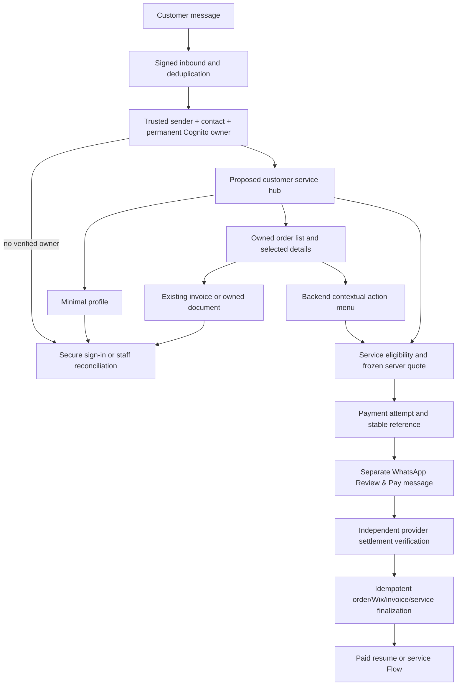

# WhatsApp customer service architecture — 9 October 2026

Status: **PARTIALLY COMPLETE**. This is the current-state reconciliation and proposed implementation specification. Security repairs are implemented separately; the complete hub, selected-order actions and customer invoice resend are pending.

## Architecture decision

Most routine customer interactions can move to WhatsApp, while secure web access remains necessary for identity/recovery, sensitive profile edits, complex documents and accessible fallback. The entire customer-service experience cannot presently be certified as native WhatsApp: the hub is absent from the observed Flow inventory, some service Flows remain drafts, native purchase gates are closed, and no owner-paid full journey has been verified.

Three approaches were evaluated. A website-only continuation preserves existing capabilities but leaves routine service fragmented. A complete immediate native replacement removes needed privacy and recovery safeguards before account support is proven. The recommended hybrid approach keeps authoritative services and the website, adds a thin verified WhatsApp adapter, and releases actions individually after their contracts pass.

Meta's [official Postman workspace](https://www.postman.com/meta/whatsapp-business-platform/overview) confirms Cloud API messaging and structured Flows for interactions such as booking, browsing and feedback. It does not establish this account's payment/picker eligibility. Current primary component/payment pages could not be fetched successfully during verification; detailed current picker limits and in-Flow payment capabilities are **NOT VERIFIED**. Existing source and published assets use a separate order-details/Review & Pay message followed by provider verification and a paid service Flow. Preserve that sequence; do not describe payment as embedded inside a Flow.

## Current components and trust boundaries

| Component | Current behavior | Boundary / remaining work |
|---|---|---|
| inbound-whatsapp92 | Signed ingress, contact context, dispatch to customer commands and service handlers | Preserve signature, deduplication and trusted sender/contact derivation. Public HTTP-shaped invocations cannot forge the internal customer-command route. |
| flows/customer_commands.py | Customer ID and owned order history, ten rows/page, bounded pagination | Requires a nonempty permanent Cognito subject, exactly one enabled verified account and matching sender. No general profile/order-detail/invoice menu exists. |
| customer-orders | Website owned order partition and profile summary | Customer partition originates from the server session. Personal fields require permanent owner; no public ID or phone is an authorization credential. |
| customer-profile / checkout | Verified account profile saves and payment prefill | Exact owner on existing rows and conditional owner check at write. Ownerless/foreign contact requires reconciliation; email proof does not replace permanent ownership. |
| paid catalog service checkout | Submit Request/Vault quote and payment session | Source supports only the closed set of catalog services. Stock, provider readiness, site contract and feature gates must pass independently. |
| payment_attempt / finalization | Separate attempt, monotonic paid precedence, conditional order identity, Wix/cart completion state | Provider-confirmed capture and exact integer INR amount; downstream failure cannot reset paid state or create another charge. |
| customer-invoice / invoice-engine | Read existing owned invoice assets; staff/internal rendering and guarded delivery | Native customer adapter remains to build. A delivery operation must resolve the existing invoice and recipient; it must not expose staff force-send or creation. |
| secure-files32 / service-requests4 | Permanent ownership and private access guards | Legacy files do not auto-bind. Grants/revocations and recipient identity must remain independently validated. |

## Hub and Flow reuse

No WD_Customer_Service_Hub_v1 or WD_Orders_v1 appears in the observed 25-Flow inventory, and the reviewed source contains no complete equivalent hub. Before any external creation, repeat the full paginated inventory and inspect Flow JSON, endpoint routing and invocation paths; name alone cannot establish equivalence. Candidate names are design proposals, not created assets.

Reuse paid Submit Request1107164111921876 and published Review1578178897413815. Retain draft Amendment3678132465672138, Drop Documents1211063631104445 and the six existing design drafts; do not create duplicates or publish them prematurely. The hub would offer My Profile, My Orders, Create Request, Vault, Shipments, Review and Support. Backend eligibility controls availability; unavailable actions give a clear secure fallback.

Flow state must reference a short-lived server-issued opaque session bound to the trusted contact/permanent customer, action and expiry. Browser/Flow fields cannot choose customer identity, price, recipient or original-order ownership. Decrypt/verify the existing endpoint contract, reject replay/expired tokens, re-read ownership on every selected resource, and never put raw Cognito subjects, provider IDs or secrets into customer-visible choices.

## My Profile

Website fields observed: name, first/last name, email plus verification flag, verified session phone, structured delivery address and public customer UUID. Show only the minimal verified summary in WhatsApp; mask email/phone where appropriate and expose full address only after explicit customer intent. Keep website email proof and complex address editing until a verified native edit contract exists. Keep raw Cognito sub, contact database keys, verification tokens, consent internals and provider IDs private. Public customer UUID is an identifier, never a bearer credential.

Do not transfer an old contact or expose its fields because a current phone matches. Staff must reconcile the actual existing account with independent evidence before linking a legacy row. Preserve public customer UUID during a legitimate link/edit; do not remint it or duplicate the contact.

## My Orders and contextual actions

Existing native commands are read-only customer ID/history text responses. A selected-order adapter is pending. List and detail queries must use the permanent customer's canonical order partition; a public order number is merely a selection. Return public number/date, products/services where the permitted detail store provides them, total/currency, payment/order/service/shipment status and invoice availability. The current list projection cannot be assumed to contain purchased product snapshots.

| Action | Backend eligibility |
|---|---|
| View details | Order belongs to permanent customer; malformed/foreign identifier yields uniform refusal |
| Get invoice / receipt | Existing eligible order and authoritative invoice asset; no financial creation |
| Resend invoice | Same owned invoice and server-derived verified recipient; explicit delivery operation with its own deduplication/result |
| Pay balance | Positive authoritative balance and permitted distinct intent; suppress for captured/fully paid order |
| Create Request | Original A owned; eligible paid service B priced server-side; P proves B; resulting R references A |
| Request amendment | Owned eligible request/order; workflow permits amendment and paid service contract is ready |
| Upload documents | Owned request with valid entitlement; secure ingestion and allowed type/size |
| Open Vault | Owned active file and valid entitlement; no phone-only adoption; revoked file refused |
| Track shipment | Owned shipment association, server tracking state |
| Leave review | Correct completed milestone, not already submitted/invited automatically |
| Support | Minimal verified context, no privileged financial/configuration actions |

## Create Request: four separate records

**A** is the existing original order the customer needs help with. **B** is a new Submit Request service order, created only after verified service settlement. **P** is the payment attempt/payment proving B was purchased. **R** is the actual support/service request, which references A and B/P separately. For example, order1001 is A, service order1010 is B and REQ-123 is R about1001. A request does not reuse A's payment or turn its public number into a payment reference.

The backend verifies A, freezes the eligible service quote, reuses or creates the logical attempt P, and invites details only once paid. Interrupted paid details reopen without payment. Persist A→B→P→R binding and staff reconciliation when any step fails. The full selected-order native implementation and live contract remain pending.

## Invoice and receipt integrity

A quote is an offer; a payment request/order-details message asks for payment; a pro-forma document follows separate accounting rules; a final/tax invoice is the authoritative financial document; a receipt evidences settlement. Do not label every pre-payment message an invoice.

Website my-invoice performs an owned-order lookup, resolves InvoicesTable by reference, reads InvoiceAssetsTable and returns a short-lived existing asset URL. It never generates a second invoice. The engine uses a deterministic payment/reference financial identity and a delivery claim. It can render an absent asset for an existing invoice without creating another financial invoice.

Current staff/internal send supports an explicit force option and a default delivery claim. A new customer resend action must not pass arbitrary phone or expose staff force semantics. Add a separately idempotent resend request, resolve the existing invoice, bind the verified recipient, respect window/template rules, persist message and delivery status, and allow a definite failed delivery to retry. A stale CLAIMED or ambiguous send requires reconciliation rather than assuming delivered. Payment remains PAID when rendering, delivery or Flow invitation fails. No invoice or message was created/sent during this audit.

## Implementation and test gates

1. Complete explicit permanent contact reconciliation and confirm the current profile ownership deployment.
2. Implement the thin owned-detail/action adapter and durable hub session, reusing current identity/order/invoice/service modules. Review exact permission additions; no wildcard role broadening.
3. Add existing-invoice retrieval/resend delivery jobs, selected-order A/B/P/R binding and paid resume. Test definite failure separately from unknown delivery.
4. Validate draft Flow JSON and endpoint routing against current primary Meta capabilities/account support; preserve secure document fallback.
5. Reconcile intended catalog1457045652952851 versus live sync1607047307067517, stock availability, Wix contract and approved template semantics. Obtain provider access evidence before changing assets or gates.
6. Run own/foreign/missing-owner, replay, expiry, pagination, double-tap, duplicate/delayed webhook, all downstream failures and completed review suppression tests. Deploy exact packages with concurrency guards.
7. Owner QA on the nominated customer ending0044 completes a real personally approved payment and verifies canonical order, Wix, invoice, service/entitlement, workspace and review. Keep release closed until that succeeds.

This specification is reviewable and deliberately distinguishes source evidence from live/provider/customer evidence. No new hub was externally created or published.
