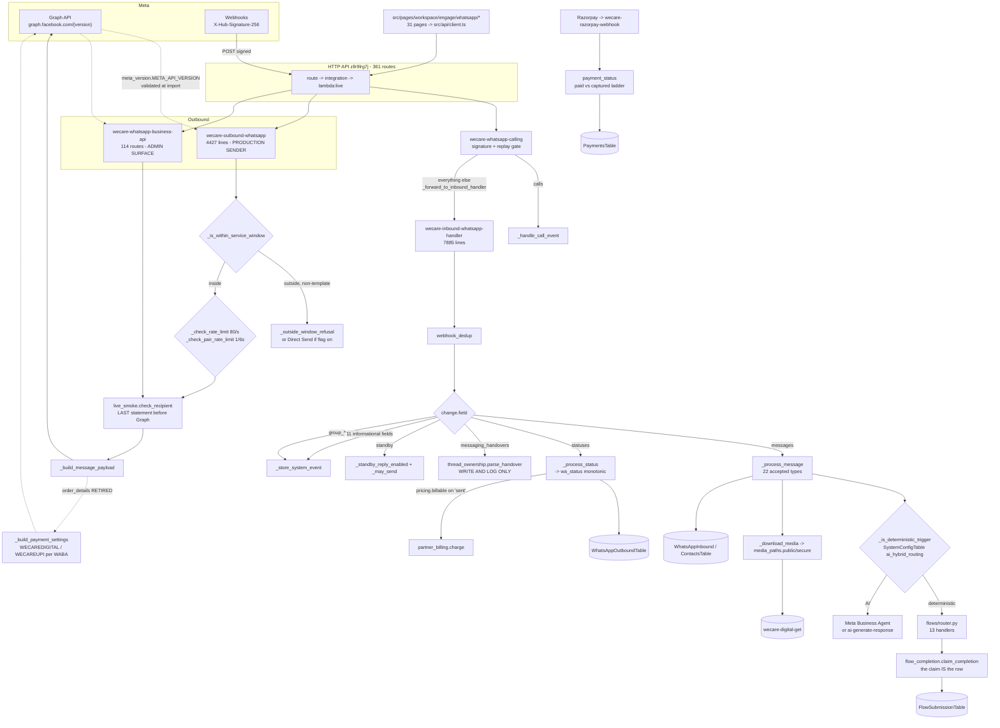

# WhatsApp Business Platform — coverage audit against the wecare-store repository

**Generated** 2026-10-07 · **Branch** `stack` · **HEAD** `cb505edf` · **Mode** read-only research
**Audited against** the WhatsApp Business Platform documentation tree rooted at
[developers.facebook.com/docs/whatsapp/cloud-api](https://developers.facebook.com/docs/whatsapp/cloud-api/)
(Cloud API, Business Management API, MM API for WhatsApp, Meta Business Agent).
Meta documentation is paraphrased throughout; links are given for attribution.
Content was rephrased for compliance with licensing restrictions.

---

## 1. Executive summary

This repository is not an early-stage WhatsApp integration. It is a near-complete
implementation of the WhatsApp Business Platform surface, including several areas most
integrations never reach: Groups (full CRUD, invite links, join-request approval),
Conversation Routing with a `messaging_handovers` parser, the Calling API including SIP,
WhatsApp Flows with endpoint data-exchange encryption, Direct Send, the MM API marketing
send, Meta Business Agent configuration, and India payments with two per-WABA payment
configurations.

The measured surface:

| Count | What |
|---:|---|
| **114** | distinct route paths in `messaging/whatsapp-business-api/handler.py` |
| **~29** | messaging-family Lambda functions, of which 13 are WhatsApp-specific |
| **31** | dashboard pages under `src/pages/workspace/engage/whatsapp/` |
| **15** | committed Flow JSON definitions plus 13 Python flow handlers |
| **~250** | WhatsApp-related exported functions in `src/api/client.ts` |
| **265** | files in `tests/`, ~37 of them WhatsApp/payment/template/flow-specific |
| **84 / 114** | spec tasks still open in `.kiro/specs/whatsapp-wix-commerce/tasks.md` |

At-a-glance completion, weighted by sub-feature count rather than lines of code. These
percentages are judgement applied to the status table in §2, not a metric emitted by a
tool:

| Area | Completion | Shape |
|---|---:|---|
| A. Getting started & accounts | **~90%** | complete, both WABAs live; two-step PIN is the hole |
| B. Messaging (Cloud API) | **~92%** | every documented service message type is reachable |
| C. Message templates | **~85%** | carousel/OTP/TTL/presets done; LTO and library-create absent |
| D. WhatsApp Flows | **~95%** | the strongest area in the repo; full lifecycle + crypto endpoint |
| E. Calling API | **~85%** | SIP, call hours, voicemail, codecs; recording/transcription absent |
| F. Groups | **~90%** | full management and messaging; webhooks parsed but not acted on |
| G. Webhooks | **~95%** | 20 of 22 documented fields named; HMAC + replay + monotonic status |
| H. Commerce / payments | **~70%** backend, **retired** in flow | built and proven, then superseded by a website-only ruling |
| I. MM API for WhatsApp | **~40%** | send + onboarding status only; no conversion metrics loop |
| J. Meta Business Agent | **~80%** | config/knowledge/connectors/eval done; thread control defective |
| K. Management & analytics | **~85%** | Meta analytics proxied; local aggregation; no pricing-analytics UI |
| L. Platform / infra | **~90%** | one Graph version source, 80/s + 1-per-6s limits, lazy secrets |

**The single most important finding is not a gap in coverage. It is that the most
complete capability in the repository is deliberately switched off.** In-WhatsApp payment
— `order_details` interactive messages, two per-WABA payment configurations, UPI and
payment-gateway modes, order status templates, payment lookup and refund — is fully
implemented and pinned by tests, and was then **retired from the active purchase flow** by
an owner ruling on 2026-10-01 in favour of website-only checkout. `tests/test_inbound_whatsapp_payment_superseded.py`
exists specifically to fail if the captured-payment branch is reinstated. So any reading of
"payments: complete" is wrong in both directions: the code is complete, and the capability
is not in service.

The second finding: the gaps that remain are overwhelmingly **owner-gated, not
engineering-gated**. Credential loads, provider rotations, QA-recipient nomination and
live-send authorisation account for more of the open spec tasks than missing code does.

---

## 2. Master status table

Legend: ✅ Complete · 🟡 Partial / in progress · 🔵 Backend-only (no UI) · 🟣 Frontend-only
(UI with no backend) · ⛔ Not implemented · ➖ Not required / deliberately declined

Paths are relative to `/Users/wecaredigital/wecare-store`. Backend paths omit the
`amplify/functions/` prefix where the column would otherwise wrap; frontend paths omit `src/`.

### A. Getting started & accounts

| Sub-feature | Status | Backend evidence | Frontend evidence | Doc |
|---|---|---|---|---|
| Business portfolio / WABA model (two WABAs) | ✅ | `shared/lambda_utils/direct_send.py` `META_PHONE_TO_WABA`; `messaging/meta-analytics/handler.py:32-37` (`WABA1_ID`, `WABA2_ID`, `PHONE1_META_ID`, `PHONE2_META_ID`) | `pages/workspace/engage/whatsapp/waba-dashboard.tsx`, `my-account.tsx` | [About the platform](https://developers.facebook.com/docs/whatsapp/cloud-api/) |
| List / inspect WABAs | ✅ | `messaging/waba-management/handler.py` routes `/waba/`, `/waba/events` | `api/client.ts` `listWABAs`, `getWABADetails` | [WABA API](https://developers.facebook.com/docs/whatsapp/business-management-api) |
| Business phone numbers — list, settings | ✅ | `messaging/whatsapp-business-api/handler.py` `_get_phone_settings:2858`, `_update_phone_settings:2870` | `whatsapp/settings.tsx` | [Phone numbers](https://developers.facebook.com/docs/whatsapp/cloud-api/phone-numbers) |
| Register phone number for Cloud API | 🔵 | `messaging/partner-onboarding/handler.py` `_register_phone:163` (`POST /{phone_id}/register`); `waba-management` `/register-phone` | — | [Register a phone number](https://developers.facebook.com/docs/whatsapp/cloud-api/phone-numbers) |
| Request / verify phone verification code | 🔵 | `messaging/waba-management/handler.py` routes `/request-otp`, `/verify-otp` | — | [Phone number verification](https://developers.facebook.com/docs/whatsapp/business-management-api) |
| Migrate number between WABAs | 🟡 | `messaging/waba-management/handler.py` route `/migrate` | `whatsapp/migration.tsx` | [Migrate numbers](https://developers.facebook.com/docs/whatsapp/business-management-api) |
| Two-step verification PIN | ⛔ | PIN is **accepted** as input by `partner-onboarding` `_register_phone` but there is no set/change endpoint. No `two_step` or `/settings/two_step` call anywhere | — | [Two-step verification](https://developers.facebook.com/docs/whatsapp/cloud-api/phone-numbers) |
| Display names / name-update webhook | 🟡 | `phone_number_name_update` named in the field list at `messaging/inbound-whatsapp-handler/handler.py:1364-1371` and in `whatsapp-calling/handler.py:621-628`; stored as a system event, no decision taken | `whatsapp/business-profile.tsx` | [Display names](https://developers.facebook.com/docs/whatsapp/cloud-api) |
| Business profile (about, address, email, verticals) | ✅ | `whatsapp-business-api` `_get_business_profile:277`, `_update_business_profile:296` | `whatsapp/business-profile.tsx`; `api/client.ts` `getBusinessProfile`, `updateBusinessProfile` | [Business profiles](https://developers.facebook.com/docs/whatsapp/business-management-api) |
| WhatsApp username (claim / suggest / delete) | ✅ | `whatsapp-business-api` `_get_username:2891`, `_get_username_suggestions:2899`, `_validate_wa_username:2910`, `_claim_username:2933`, `_delete_username:2981` | `pages/workspace/dashboard/waba-usernames.tsx` | [WhatsApp accounts](https://developers.facebook.com/docs/whatsapp/business-management-api) |
| Business-scoped user IDs (BSUID) | ✅ | `outbound-whatsapp/handler.py` BSUID recipient support in `_build_message_payload` (~line 3074); `whatsapp-business-api` `_is_valid_bsuid:3130`, `_delete_contact_book:3139`, `_get_parent_bsuid_accounts:3177` | `whatsapp/bsuid.tsx` | [Business-scoped user IDs](https://developers.facebook.com/docs/whatsapp/business-management-api) |
| Assigned users / permission tasks | ✅ | `whatsapp-business-api` `_list_assigned_users:430`, `_add_assigned_user:453`, `_remove_assigned_user:469`; `shared/lambda_utils/whatsapp_types.py` `PERMISSION_TASKS:31` | `whatsapp/connected-accounts.tsx` | [Assigned Users API](https://developers.facebook.com/docs/whatsapp/business-management-api) |
| Assigned WABAs (per user) | ✅ | `whatsapp-business-api` `_list_assigned_wabas:501` | `api/client.ts` `listAssignedWabas` | [Assigned WABAs API](https://developers.facebook.com/docs/whatsapp/business-management-api) |
| QR codes & message links | ✅ | `whatsapp-business-api` `_create_qr_code:867`, `_get_qr_code:845`, `_delete_qr_code:857`, `_is_valid_qr_id:840` | `api/client.ts` `listQrCodes`, `createQrCode`, `deleteQrCode` | [QR codes and message links](https://developers.facebook.com/docs/whatsapp/business-management-api) |
| Official Business Account status | ⛔ | No read of the OBA status edge. The `oba` grep hits are unrelated (`invoice`, `secure-files`) | — | [Official Business Accounts](https://developers.facebook.com/docs/whatsapp/business-management-api) |
| Embedded Signup / partner onboarding | 🟡 | `messaging/partner-onboarding/handler.py` — `_exchange_code:137`, `_share_credit_line:144`, `_subscribe_app:156`, `_register_phone:163`, `_store_token:196`, `_persist_tenant:215`; `messaging/partner-token-refresh` | `whatsapp/embedded-signup.tsx` (53 lines — thin), `whatsapp/tech-partner.tsx` | [Embedded Signup](https://developers.facebook.com/docs/whatsapp/embedded-signup) |
| Credit line sharing (solution partner) | 🔵 | `partner-onboarding` `_share_credit_line:144` using `META_EXTENDED_CREDIT_ID` | — | [Credit lines](https://developers.facebook.com/docs/whatsapp/business-management-api) |
| Partner prepaid wallet billing | 🔵 | `inbound-whatsapp-handler/handler.py:3416-3443` charges on the `sent` status when `pricing.billable`; `shared/lambda_utils/partner_billing.py` | — | [Pricing](https://developers.facebook.com/docs/whatsapp/pricing) |
| Coexistence (`smb_app_state_sync`, `smb_message_echoes`) | ⛔ | Zero references anywhere in `amplify/` | — | [Onboard Business app users](https://developers.facebook.com/docs/whatsapp/embedded-signup) |
| Multi-Partner Solutions | ⛔ | `partner_solutions` webhook field: zero references | — | [Multi-Partner Solutions](https://developers.facebook.com/docs/whatsapp/business-management-api) |

### B. Messaging (Cloud API)

| Sub-feature | Status | Backend evidence | Frontend evidence | Doc |
|---|---|---|---|---|
| Text message (+ `preview_url` link preview) | ✅ | `outbound-whatsapp` `_build_message_payload:3030`; `whatsapp-business-api` `_send_text:2116`; `_check_link_preview:1548` with SSRF guard `_is_ssrf_safe_url:1517` | `whatsapp/send-test.tsx`, `whatsapp/inbox.tsx` | [Text messages](https://developers.facebook.com/docs/whatsapp/cloud-api/reference/messages) |
| Media — image, video, audio, document, sticker | ✅ | `outbound-whatsapp` `_upload_media:2524`, `_wa_media_max_size:2382`, `_WA_MEDIA_MAX_SIZES:2373`, `_validate_media_size:4252`, `_get_content_type:4199`; `whatsapp-business-api` `_send_media_msg:2136` | `api/client.ts` `uploadMediaForSend`, `getMediaUploadUrl` | [Media](https://developers.facebook.com/docs/whatsapp/cloud-api/reference/messages) |
| Reaction | ✅ | `outbound-whatsapp` `_handle_reaction_send:1053`, `_post_reaction_direct:149`; auto 👍 via `_auto_thumb_enabled:130` / `AUTO_THUMB_EMOJI:124` | `api/client.ts` `sendWhatsAppReaction` | [Reaction](https://developers.facebook.com/docs/whatsapp/cloud-api/reference/messages) |
| Location (send) | ✅ | `whatsapp-business-api` `_send_location_msg:2220` | `components/LocationSendComposer.tsx`, `components/ContactLocation.tsx` | [Location](https://developers.facebook.com/docs/whatsapp/cloud-api/reference/messages) |
| Location request message | ✅ | `whatsapp-business-api` route `/location`; location request interactive built in `_send_location_msg` path | `components/LocationSendComposer.tsx` | [Location request](https://developers.facebook.com/docs/whatsapp/cloud-api/reference/messages) |
| Contacts (vCard) | ✅ | `whatsapp-business-api` `_send_contacts_msg:2212`; inbound parse `inbound-whatsapp-handler/handler.py:1622-1641`, `:1997-2033` | `components/ContactMessageComposer.tsx`, `components/ContactCardBubble.tsx` | [Contacts](https://developers.facebook.com/docs/whatsapp/cloud-api/reference/messages) |
| Interactive — reply buttons | ✅ | `outbound-whatsapp` `_handle_interactive_send:1550` | `whatsapp/send-test.tsx`; `api/client.ts` `sendWhatsAppInteractive` | [Reply buttons](https://developers.facebook.com/docs/whatsapp/cloud-api/reference/messages) |
| Interactive — list message | ✅ | `whatsapp-business-api` route `/interactive-list`; `api/client.ts` `sendInteractiveList` | `whatsapp/interactive-lists.tsx` | [List buttons](https://developers.facebook.com/docs/whatsapp/cloud-api/messages/interactive-list-messages) |
| Interactive — CTA URL button | ✅ | `cta_url` handled in `outbound-whatsapp` `_build_message_payload` and `whatsapp-business-api` interactive route | `whatsapp/send-test.tsx` | [URL button](https://developers.facebook.com/docs/whatsapp/cloud-api/reference/messages) |
| Single-Product Message (SPM) | ✅ | `whatsapp-business-api` `_send_product_msg:2234` — `interactive.type = 'product'` | `api/client.ts` `sendWhatsAppCatalogProduct`; `whatsapp/catalog-builder.tsx` | [Single-product messages](https://developers.facebook.com/docs/whatsapp/catalogs) |
| Multi-Product Message (MPM) | ✅ | `whatsapp-business-api` `_send_product_msg:2234` — `interactive.type = 'product_list'` with `sections` | `whatsapp/catalog-builder.tsx` | [Multi-product messages](https://developers.facebook.com/docs/whatsapp/catalogs) |
| Catalog message ("View catalog") | ✅ | `whatsapp-business-api` `_send_product_msg:2234` — `interactive.type = 'catalog_message'`, optional `thumbnail_product_retailer_id` | `whatsapp/catalog-builder.tsx` | [Catalog messages](https://developers.facebook.com/docs/whatsapp/catalogs) |
| Product carousel message | ⛔ | Zero references to `product_carousel` | — | [Product carousel messages](https://developers.facebook.com/docs/whatsapp/catalogs) |
| Flow message (`interactive.type = flow`) | ✅ | `whatsapp-business-api` `_send_flow_msg:2169`; `outbound-whatsapp` `_infer_flow_key_from_template:108`, `_TEMPLATE_FLOW_KEYS:102` | `whatsapp/flow-hub.tsx`, `flows.tsx`; `api/client.ts` `sendTestFlow` | [Flow messages](https://developers.facebook.com/docs/whatsapp/cloud-api/messages/interactive-flow-messages) |
| Address message | ✅ | Inbound parsed as `nfm_reply` with `name='address_message'` — `inbound-whatsapp-handler/handler.py:1917-1940` | `components/AddressMessageComposer.tsx` | [Address](https://developers.facebook.com/docs/whatsapp/cloud-api/reference/messages) |
| `request_contact_info` interactive | ✅ | `whatsapp-business-api` `_send_request_contact_info:2157`; route `/request-contact-info` | `api/client.ts` `sendRequestContactInfo` | [Interactive](https://developers.facebook.com/docs/whatsapp/cloud-api/reference/messages) |
| `order_details` interactive (payment) | 🟡 retired | `outbound-whatsapp` `_build_message_payload` order_details branch (~3083-3350), `_build_payment_settings:443`; `_handle_order_status_send:1141` | `whatsapp/send-test.tsx`; `api/client.ts` `sendWhatsAppPaymentMessage` | [Order details templates](https://developers.facebook.com/docs/whatsapp/payments-india) |
| Contextual reply (`context.message_id`) | ✅ | `outbound-whatsapp` `_get_latest_inbound_wamid:4302`; context threading in `_build_message_payload` | `whatsapp/inbox.tsx` | [Contextual replies](https://developers.facebook.com/docs/whatsapp/cloud-api/guides) |
| Typing indicator | ✅ | `outbound-whatsapp` `_send_typing_indicator:4355`; `inbound-whatsapp-handler` `_send_direct_api_typing:805` | `api/client.ts` `sendTypingIndicator` | [Typing indicators](https://developers.facebook.com/docs/whatsapp/cloud-api/guides) |
| Read receipt / mark-as-read | ✅ | `inbound-whatsapp-handler` `_send_direct_api_read_receipt:756`; `handler.py:7197-7210` (`status: read`) | implicit in `whatsapp/inbox.tsx` | [Read receipts](https://developers.facebook.com/docs/whatsapp/cloud-api/guides) |
| Media upload (Graph multipart) | ✅ | `whatsapp-business-api` `_graph_media_multipart:1783`, `_upload_media:1832`, `_validate_media:1764`, `_media_category:1751` | `api/client.ts` `uploadWaMedia` | [Media Upload API](https://developers.facebook.com/docs/whatsapp/cloud-api/reference) |
| Resumable upload (chunked) | ✅ | `whatsapp-business-api` `_resumable_session:1918`, `_resumable_chunk:1956`, `_meta_resumable_upload:1992`, `_resumable_finish:2034` | `api/client.ts` `startResumableMediaSession`, `finishResumableMedia` | [Resumable Upload](https://developers.facebook.com/docs/whatsapp/cloud-api/reference) |
| Media retrieve / delete | ✅ | `whatsapp-business-api` `_get_media:1873`, `_delete_media:1908`, `_mask_media_url:1775` | `api/client.ts` `getWaMedia`, `deleteWaMedia` | [Media Download API](https://developers.facebook.com/docs/whatsapp/cloud-api/reference) |
| Inbound media download → S3 | ✅ | `inbound-whatsapp-handler` `_download_media` called at `handler.py:1649-1676`; keys composed via `shared/lambda_utils/media_paths.py` | `whatsapp/inbox.tsx` renders them | [Media](https://developers.facebook.com/docs/whatsapp/cloud-api/reference) |
| Direct Send (template-less utility/auth) | 🟡 flag-off | `shared/lambda_utils/direct_send.py` (218 lines, the single source for flag/WABA map/TTL/error classifier); `whatsapp-business-api` `_direct_send:998`; `DIRECT_SEND_ENABLED_WABAS` enabled on both WABAs at commit `586b4636` | `api/client.ts` `directSend`, `listGeneratedTemplates` | [Direct Send](https://developers.facebook.com/docs/whatsapp/cloud-api) |
| Generated-template listing (Direct Send) | ✅ | `whatsapp-business-api` `_list_generated_templates:1150` | `api/client.ts` `listGeneratedTemplates` | [View generated templates](https://developers.facebook.com/docs/whatsapp/cloud-api) |
| Block / unblock users | ✅ | `whatsapp-business-api` `_block_users:3083`, `_unblock_users:3098`, `_get_blocked_users:3113`, `_normalize_block_users:3062`, `_resolve_block_phone_id:3048`; `outbound-whatsapp` `_block_users_api:342` | `api/client.ts` `blockUsers`, `unblockUsers`, `getBlockedUsers` | [Blocking users](https://developers.facebook.com/docs/whatsapp/cloud-api) |
| Conversation types / 24h service window | ✅ | `outbound-whatsapp` `CUSTOMER_SERVICE_WINDOW_HOURS:385`, `_is_within_service_window:3874`, `_outside_window_refusal:3854` | `whatsapp/inbox.tsx` window state | [Conversation types](https://developers.facebook.com/docs/whatsapp/conversation-types) |
| Scheduled / broadcast sending | ✅ | `messaging/scheduled-messages/handler.py` (497 lines); `whatsapp-business-api` `_list_schedules:528`, `_create_schedule:543` | `whatsapp/campaign.tsx`, `engage/broadcast/index.tsx`, `engage/scheduled/index.tsx` | [Schedules API](https://developers.facebook.com/docs/whatsapp/business-management-api) |
| Edit / revoke inbound message | 🟡 | `inbound-whatsapp-handler/modules/content.py` `_revoke:306`, `_edit`, dispatch map at `:458`; accepted types at `handler.py:1565-1571`. A TODO at `handler.py:1516-1519` records that a revoke is stored as its own row and does not mark the message it deletes | — | [edit / revoke messages](https://developers.facebook.com/docs/whatsapp/cloud-api/webhooks) |
| Unsupported-message recovery | ✅ | `inbound-whatsapp-handler/handler.py:1509-1563` probes `image/video/audio/document/sticker` then falls back to `text` | `test/InboxUnsupportedAndContactCard.test.tsx` | [unsupported messages](https://developers.facebook.com/docs/whatsapp/cloud-api/webhooks) |

### C. Message templates (Business Management API)

| Sub-feature | Status | Backend evidence | Frontend evidence | Doc |
|---|---|---|---|---|
| List templates | ✅ | `messaging/whatsapp-template-management/handler.py` `_list_templates:247` (`fields=name,status,category,language,components,id`) | `whatsapp/templates.tsx` (2180 lines) | [Management](https://developers.facebook.com/docs/whatsapp/business-management-api/message-templates) |
| Get template detail | ✅ | `whatsapp-template-management` `_get_template_details:280` | `whatsapp/templates.tsx` | [Components](https://developers.facebook.com/docs/whatsapp/business-management-api/message-templates) |
| Create template | ✅ | `whatsapp-template-management` `_create_template:388` | `whatsapp/template-builder.tsx` | [Management](https://developers.facebook.com/docs/whatsapp/business-management-api/message-templates) |
| Update / delete template | ✅ | `_update_template:542`, `_delete_template:571` (deletes by name) | `whatsapp/templates.tsx` | [Management](https://developers.facebook.com/docs/whatsapp/business-management-api/message-templates) |
| Categories (MARKETING / UTILITY / AUTHENTICATION) | ✅ | `shared/lambda_utils/whatsapp_types.py` `TEMPLATE_CATEGORIES:14` | `whatsapp/template-builder.tsx` | [Categorization](https://developers.facebook.com/docs/whatsapp/business-management-api/message-templates) |
| Header formats (TEXT/IMAGE/VIDEO/GIF/DOCUMENT/LOCATION) | ✅ | `whatsapp_types.py` `HEADER_FORMATS:16`; location header built in `outbound-whatsapp` `_build_message_payload` (~3423-3440) | `whatsapp/template-builder.tsx` | [Media message headers](https://developers.facebook.com/docs/whatsapp/cloud-api) |
| Button types (11 kinds incl. MPM/SPM/CATALOG/FLOW/VOICE_CALL/REQUEST_CONTACT_INFO) | ✅ | `whatsapp_types.py` `BUTTON_TYPES:18-21`; validated by `whatsapp-business-api` `_validate_template_buttons:1614` and `whatsapp-template-management` `_validate_template_button_group:322` | `whatsapp/template-builder.tsx` | [Components](https://developers.facebook.com/docs/whatsapp/business-management-api/message-templates) |
| Carousel template (create + card media) | ✅ | `whatsapp-template-management` `_create_carousel_template:910` (min 2 cards, emits `{'type':'CAROUSEL','cards':[...]}` at `:948`), `_upload_carousel_media:874` with a same-WABA upload fix at `:893` | `api/client.ts` `createCarouselTemplate`, `uploadCarouselCardMedia`, `sendCarouselTemplateMessage` | [Media card carousel templates](https://developers.facebook.com/docs/whatsapp/cloud-api) |
| Authentication template / OTP | ✅ | `outbound-whatsapp` OTP branch at `handler.py:3482-3512`: `sub_type: 'url'` with the code parameter, and `sub_type: 'copy_code'` with `coupon_code` at `:3509`; also `auth/customer-whatsapp-auth/handler.py:392` | `components/OTPTemplateUI.tsx` | [Authentication templates](https://developers.facebook.com/docs/whatsapp/cloud-api) |
| One-tap autofill / zero-tap authentication | ⛔ | No `autofill`, `one_tap` or `zero_tap` in any template construction path. The copy-code button is the only OTP delivery mechanism implemented | — | [One-tap autofill](https://developers.facebook.com/docs/whatsapp/cloud-api) · [Zero-tap](https://developers.facebook.com/docs/whatsapp/cloud-api) |
| Keyboard suggestions (auth) | ⛔ | Zero references | — | [Keyboard suggestions](https://developers.facebook.com/docs/whatsapp/cloud-api) |
| Coupon-code template | 🟡 | The `copy_code` button sub-type is implemented, but it is driven by the OTP path (`outbound-whatsapp:3509`). The commerce coupon engine (`whatsapp-business-api:4797-4897`) is a Wix coupon lookup, not a Meta coupon-code template | `whatsapp/template-builder.tsx` (button type available) | [Coupon code templates](https://developers.facebook.com/docs/whatsapp/cloud-api) |
| Limited-time-offer (LTO) template | ⛔ | Zero references to `limited_time_offer` / `LTO` in `amplify/` | — | [Limited-time-offer templates](https://developers.facebook.com/docs/whatsapp/cloud-api) |
| Location templates | ✅ | `LOCATION` in `HEADER_FORMATS:16`; send-time coordinates in `outbound-whatsapp` `_build_message_payload` (~3423) | `whatsapp/template-builder.tsx` | [Location templates](https://developers.facebook.com/docs/whatsapp/cloud-api) |
| Template TTL (`message_send_ttl_seconds`) | ✅ | `shared/lambda_utils/template_ttl.py` (162 lines) with per-category bounds; `whatsapp_types.py` `TTL_BOUNDS:24-28`, `TTL_NEG1_ALLOWED:29`; `whatsapp-business-api` `_validate_ttl:1605`, `_get_ttl_rules:1656`, `_update_template_ttl:1698`; `whatsapp-template-management` `_validate_template_ttl:304` | `api/client.ts` `getTemplateTtlRules`, `validateTemplateTtl`, `updateTemplateTtl` | [Configure time-to-live](https://developers.facebook.com/docs/whatsapp/cloud-api) |
| Template validation (pre-submit) | ✅ | `whatsapp-template-management` `_validate_template_definition:355`, `_validate_template_route:415`; `shared/lambda_utils/template_validation.py` | `api/client.ts` `validateTemplateDefinition` | [Components](https://developers.facebook.com/docs/whatsapp/business-management-api/message-templates) |
| Template presets (local library) | ✅ | `shared/lambda_utils/template_presets.py`; `whatsapp-template-management` `_list_presets:427`, `_get_preset:437` | `api/client.ts` `listTemplatePresets`, `getTemplatePreset` | — (repo-local concept) |
| Meta template library — browse | ➖ | `whatsapp-template-management` `_list_template_library:266` returns an explicit note at `:273` that Graph has no equivalent and Business Suite must be used. Honest refusal, not a gap | `api/client.ts` `listTemplateLibrary` | [Library](https://developers.facebook.com/docs/whatsapp/business-management-api/message-templates) |
| Create template from library | ➖ | `_create_from_library:531` returns a documented "not supported via Graph API" response at `:535` | `api/client.ts` `createTemplateFromLibrary` | [Library](https://developers.facebook.com/docs/whatsapp/business-management-api/message-templates) |
| Send test template | ✅ | `whatsapp-template-management` `_send_test_template:480`; route `/send-test` | `whatsapp/send-test.tsx`; `api/client.ts` `sendTestTemplateMessage` | [Previews](https://developers.facebook.com/docs/whatsapp/cloud-api) |
| Refresh a single template from Meta | ✅ | `_refresh_template:450` | `api/client.ts` `refreshTemplate` | [Management](https://developers.facebook.com/docs/whatsapp/business-management-api/message-templates) |
| Template status / quality / category webhooks | ✅ | `inbound-whatsapp-handler/handler.py:1234-1244` (`message_template_status_update`), plus `message_template_quality_update`, `message_template_components_update`, `template_category_update` in the field list at `:1364-1371` | `whatsapp/templates.tsx` status column | [message_template_status_update](https://developers.facebook.com/docs/whatsapp/cloud-api/webhooks) |
| Template analytics (Meta) | ✅ | `messaging/meta-analytics/handler.py` — `GET /{waba_id}/template_analytics` (documented at `:8`, `:12`) | `engage/analytics/index.tsx` | [Template analytics](https://developers.facebook.com/docs/whatsapp/business-management-api) |
| Template analytics (local aggregation) | ✅ | `messaging/template-analytics/handler.py` `_get_analytics_summary:78`, `_get_template_analytics:172` — aggregated from the outbound table, documented at `:3` | `api/client.ts` `getTemplateAnalytics`, `getTemplateAnalyticsSummary` | — (repo-local) |
| Template pacing / pausing / review | ⛔ | No read of pacing or pause state | — | [Pausing](https://developers.facebook.com/docs/whatsapp/business-management-api/message-templates) |
| Template media (reusable header asset) | ✅ | `whatsapp-template-management` route `/templates/media`, `/templates/send-media` | `api/client.ts` `uploadTemplateMedia`, `uploadReusableHeaderMedia`, `uploadSendMedia`, `listSendMedia`, `deleteSendMedia` | [Media](https://developers.facebook.com/docs/whatsapp/business-management-api/message-templates) |

### D. WhatsApp Flows

| Sub-feature | Status | Backend evidence | Frontend evidence | Doc |
|---|---|---|---|---|
| List / get flow | ✅ | `whatsapp-business-api` `_list_flows:310`, `_get_flow:319` | `whatsapp/flows.tsx`, `flow-hub.tsx` | [Flows](https://developers.facebook.com/docs/whatsapp/flows) |
| Create / update / delete flow | ✅ | `_create_flow:327`, `_update_flow:341`, `_delete_flow:358` | `whatsapp/flow-hub.tsx` | [Flows](https://developers.facebook.com/docs/whatsapp/flows) |
| Publish / deprecate flow | ✅ | `_publish_flow:366`, `_deprecate_flow:376` | `whatsapp/flow-publish.tsx` | [Flows](https://developers.facebook.com/docs/whatsapp/flows) |
| Flow preview URL | ✅ | `_get_flow_preview:385` | `whatsapp/flow-hub.tsx` | [Flows](https://developers.facebook.com/docs/whatsapp/flows) |
| Flow JSON definitions | ✅ | 15 committed definitions under `messaging/whatsapp-business-api/flows/` — `submit-request-flow.json` / `-v2` / `-v3`, `postpay-flow-v1.json`, `postpay-request-flow-v2.json`, `subscribe-flow.json` (947 lines), `profile-flow.json` (502), `appointment-flow-v1.json`, `rx-slot-flow-v1.json`, `track-request-flow-v1.json`, `amend-request-flow-v1.json`, `drop-docs-flow-v1.json`, `leave-review-flow-v1.json`, `enterprise-assist-flow-v1.json`, `order-notes-flow-v1.json` | `whatsapp/flow-hub.tsx` | [Flow JSON](https://developers.facebook.com/docs/whatsapp/flows) |
| Flow endpoint (data exchange) with encryption | ✅ | `whatsapp-business-api` `_get_flow_private_key:3437`, `_decrypt_flow_request:3453` (RSA-OAEP key unwrap + AES-GCM), `_encrypt_flow_response:3477`; routed by `flows/router.py:232` | — (server-side by design) | [Flow endpoint](https://developers.facebook.com/docs/whatsapp/flows) |
| Per-flow Python handlers | ✅ | 13 handlers: `flows/submit_request.py` (250), `orders.py` (329), `subscribe.py` (290), `postpay.py` (184), `amend_request.py` (154), `drop_docs.py` (140), `appointment.py` (120), `rx_slot.py` (114), `track_request.py` (116), `leave_review.py` (104), `order_notes.py` (103), `enterprise_assist.py` (88), `generic.py` (63); shared helpers in `flows/common.py` (480) | — | [Flow endpoint](https://developers.facebook.com/docs/whatsapp/flows) |
| Flow completion webhook (idempotent) | ✅ | `shared/lambda_utils/flow_completion.py` (410 lines) — `claim_completion` is the idempotency claim; its header documents consolidating four unguarded writers down to three guarded ones | `whatsapp/flow-responses.tsx` | [Flow completion](https://developers.facebook.com/docs/whatsapp/flows) |
| Inbound `nfm_reply` handling | ✅ | `inbound-whatsapp-handler/handler.py:1918-1940` | `whatsapp/inbox.tsx` | [interactive messages](https://developers.facebook.com/docs/whatsapp/cloud-api/webhooks) |
| Flow registry + A/B testing | ✅ | `_get_flow_registry:3490`, `_get_flow_registry_by_code:3520`, `_list_flow_registry:3784`, `_upsert_flow_registry:3801`, `_get_ab_test_flow_id:4094` | `api/client.ts` `listFlowRegistry`, `upsertFlowRegistry` | — (repo-local) |
| Flow submissions — list / stats / export / status | ✅ | `_list_flow_submissions:3734`, `_get_flow_submission_stats:4047`, `_update_submission_status:3651`; routes `/flow-submissions/export`, `/flow-submissions/stats` | `whatsapp/flow-responses.tsx` | — (repo-local) |
| Flow asset upload | ✅ | `_upload_flow_asset:3872` | `api/client.ts` `uploadFlowAsset` | [Flows](https://developers.facebook.com/docs/whatsapp/flows) |
| Cross-WABA flow clone / migrate / sync | ✅ | `_migrate_flows:3950`, `_sync_flows:3977`; routes `/flow-clone`, `/flows/migrate`, `/flows/sync` | `api/client.ts` `cloneFlowToWaba`, `migrateFlows`, `syncFlows` | — (repo-local, two-WABA necessity) |
| Flow version health | ✅ | route `/flow-version-health` | `api/client.ts` `checkFlowVersionHealth` | — (repo-local) |
| Flow SLA escalation | ✅ | `_check_sla_and_escalate:4119`; route `/flow-sla-check` | `engage/service-ops/index.tsx` | — (repo-local) |
| Flow customer journey | ✅ | `_get_customer_journey:4180` | `whatsapp/flow-hub.tsx` | — (repo-local) |
| Contact enrichment from flow data | ✅ | `_enrich_contact_from_flow:3579`, `_log_flow_interaction:3618` | `engage/contact-360/index.tsx` | — (repo-local) |
| Flow routing tests | ✅ | `messaging/whatsapp-business-api/tests/test_flow_routing.py` (451 lines); `tests/test_flow_completion.py`, `tests/test_flow_crypto_and_ssrf.py`, `tests/test_flow_data_exchange_failure.py` | — | — |

### E. Calling API

| Sub-feature | Status | Backend evidence | Frontend evidence | Doc |
|---|---|---|---|---|
| Read calling settings | ✅ | `whatsapp-business-api` `_get_calling_settings:2632` with `_redact_sip_credentials:2657` | `whatsapp/calling.tsx` (2199 lines) | [Configure call settings](https://developers.facebook.com/docs/whatsapp/cloud-api/calling) |
| Update calling settings (enable/disable, icon visibility, country restriction) | ✅ | `_update_calling_settings:2753` — `call_icon_visibility`, `status`, `callback_permission_status`, `restrict_to_user_countries`, `call_icons` | `whatsapp/calling.tsx` | [Configure call settings](https://developers.facebook.com/docs/whatsapp/cloud-api/calling) |
| Call hours / weekly operating hours / holiday schedule | ✅ | `_validate_call_hours:2688`; body shape documented at `_update_calling_settings:2753-2770` | `whatsapp/calling.tsx` | [Configure call settings](https://developers.facebook.com/docs/whatsapp/cloud-api/calling) |
| Voicemail configuration | ✅ | `voicemail` branch in `_update_calling_settings` (status, triggers, audio, timeout) | `whatsapp/calling.tsx` | [Configure call settings](https://developers.facebook.com/docs/whatsapp/cloud-api/calling) |
| Callback request | ✅ | `callbackRequest` branch in `_update_calling_settings` | `whatsapp/calling.tsx` | [Configure call settings](https://developers.facebook.com/docs/whatsapp/cloud-api/calling) |
| SIP configuration (servers, SRTP key exchange) | ✅ | `sip` / `srtpKeyExchangeProtocol` branches in `_update_calling_settings`; `whatsapp-calling/handler.py:24-25` documents the Asterisk SIP mode for in-call RTP/SRTP audio | `whatsapp/calling.tsx` | [Session Initiation Protocol](https://developers.facebook.com/docs/whatsapp/cloud-api/calling) |
| Audio codecs (G.711 PCMA/PCMU) | ✅ | `audioCodecs` branch in `_update_calling_settings` | `whatsapp/calling.tsx` | [Configure call settings](https://developers.facebook.com/docs/whatsapp/cloud-api/calling) |
| Inbound call webhook (`connect`) | ✅ | `messaging/whatsapp-calling/handler.py` `_handle_call_event:714`, `connect` branch at `:753-813` capturing `sdp_offer` / `sdp_type` | `engage/voice-in/index.tsx`, `engage/calls` | [Calling webhooks](https://developers.facebook.com/docs/whatsapp/cloud-api/calling) |
| Terminate / reject a call | ✅ | `_terminate_call` routed at `handler.py:306-307` (`POST /whatsapp/reject`, `/whatsapp/hangup`); `terminate` branch at `:815` | `whatsapp/calling.tsx` | [Reference](https://developers.facebook.com/docs/whatsapp/cloud-api/calling) |
| Auto-pickup IVR (pre_accept → accept → audio → terminate) | ✅ | `_auto_pickup_and_play` invoked at `handler.py:813`; the Graph-API mode sequence is documented at `:23` | `engage/voice-in/index.tsx` | [Integration patterns](https://developers.facebook.com/docs/whatsapp/cloud-api/calling) |
| Call permissions | 🟡 | Auto-granted on connect at `handler.py:785-802` rather than requested via a `call_permission_request` message; the legacy `call_permission_response` / `call_permission_status` arm at `:924-925` is explicitly no longer used for gating. Error 138006 is classified at `:71` | `whatsapp/calling.tsx` | [User call permissions](https://developers.facebook.com/docs/whatsapp/cloud-api/calling) |
| Call-permission-request template | ⛔ | `VOICE_CALL` exists as a button type (`whatsapp_types.py:19`) but no call-permission-request template is constructed | — | [Call permission request template](https://developers.facebook.com/docs/whatsapp/cloud-api) |
| Business-initiated (outbound) calls | 🟡 | Error 138012 (100 connected calls / 24h) is classified at `handler.py:74`, implying the path is exercised, but no dedicated outbound-call initiation function was located in this audit — **unverified** | `whatsapp/calling.tsx` has a dial surface | [Business-initiated calls](https://developers.facebook.com/docs/whatsapp/cloud-api/calling) |
| Call error taxonomy | ✅ | `whatsapp-calling/handler.py:67-83` maps 138000, 138006, 138012, 138018, 138020, 138023 and more to message + operator action | `components/wa/MetaErrorPanel.tsx` | [Troubleshooting](https://developers.facebook.com/docs/whatsapp/cloud-api/calling) |
| Post-call actions from Asterisk AGI | ✅ | `_handle_post_call_sip:1094`, dispatched at `handler.py:242-243` | `engage/voice-in/index.tsx` | — (repo-local SIP bridge) |
| SIP TLS cert expiry monitoring | ✅ | `handler.py:948-993` publishes `Wecare/SIP → CertDaysToExpiry`, alarm `wecare-sip-cert-expiry-<host>` | `pages/workspace/dashboard/*` infra views | — (repo-local) |
| Call recording | ⛔ | A `recordingUrl` is accepted from the SIP bridge (`handler.py:1140`) but Meta's call-recording API is not used | — | [Call recording](https://developers.facebook.com/docs/whatsapp/cloud-api/calling) |
| Call transcription | ⛔ | Zero references | — | [Call transcription](https://developers.facebook.com/docs/whatsapp/cloud-api/calling) |
| Call button messages / deep links | ⛔ | Not located | — | [Call button messages and deep links](https://developers.facebook.com/docs/whatsapp/cloud-api/calling) |
| WhatsApp voice (TTS / audio message) | ✅ | `messaging/whatsapp-voice/handler.py` (1066 lines) | `api/client.ts` `sendWhatsAppTTS`, `sendWhatsAppAudioMessage`, `listWhatsAppVoiceLogs`; `engage/voice/index.tsx` | [Audio](https://developers.facebook.com/docs/whatsapp/cloud-api/reference/messages) |

### F. Groups

| Sub-feature | Status | Backend evidence | Frontend evidence | Doc |
|---|---|---|---|---|
| List groups | ✅ | `whatsapp-business-api` `_list_groups:2380` | `whatsapp/groups.tsx`; `api/client.ts` `listGroups` | [Group management](https://developers.facebook.com/docs/whatsapp/cloud-api/groups) |
| Get group detail | ✅ | `_get_group:2397` | `whatsapp/groups.tsx` `viewDetail` | [Group management](https://developers.facebook.com/docs/whatsapp/cloud-api/groups) |
| Create group (subject, description, join-approval mode) | ✅ | `_create_group:2407`; `whatsapp_types.py` `JOIN_APPROVAL_MODES:40`, `GROUP_SUBJECT_MAX:47`, `GROUP_DESCRIPTION_MAX:48` | `whatsapp/groups.tsx` `handleCreate` | [Group management](https://developers.facebook.com/docs/whatsapp/cloud-api/groups) |
| Update group settings (messaging permission, member visibility) | ✅ | `_update_group:2425` | `whatsapp/groups.tsx`; `api/client.ts` `updateGroupSettings` | [Group management](https://developers.facebook.com/docs/whatsapp/cloud-api/groups) |
| Delete group | ✅ | `_delete_group:2448` | `whatsapp/groups.tsx` (guarded by `useConfirmDanger`) | [Group management](https://developers.facebook.com/docs/whatsapp/cloud-api/groups) |
| Manage participants | ✅ | `_manage_group_participants:2456` | `whatsapp/groups.tsx`; `api/client.ts` `manageGroupParticipants` | [Groups Participants API](https://developers.facebook.com/docs/whatsapp/cloud-api/groups) |
| Group messaging (text / image / document / template) | ✅ | `_send_group_message:2471` | `whatsapp/groups.tsx` `msgType` state (text / image / document) | [Group messaging](https://developers.facebook.com/docs/whatsapp/cloud-api/groups) |
| Group image | ✅ | `_set_group_image:2529` | `whatsapp/groups.tsx`; `api/client.ts` `setGroupImage` | [Group management](https://developers.facebook.com/docs/whatsapp/cloud-api/groups) |
| Invite link — get / reset | ✅ | `_get_group_invite_link:2576`, `_reset_group_invite_link:2585` | `whatsapp/groups.tsx`; `api/client.ts` `getGroupInviteLink`, `resetGroupInviteLink` | [Groups Invite Link API](https://developers.facebook.com/docs/whatsapp/cloud-api/groups) |
| Join requests — list / approve / reject | ✅ | `_get_group_join_requests:2594`, `_approve_group_join_requests:2603`, `_reject_group_join_requests:2616` | `whatsapp/groups.tsx`; `api/client.ts` `getGroupJoinRequests`, `approveGroupJoinRequests`, `rejectGroupJoinRequests` | [Groups Join Requests API](https://developers.facebook.com/docs/whatsapp/cloud-api/groups) |
| Group webhooks (participant change, approval request, lifecycle, settings) | 🟡 | All four named in `inbound-whatsapp-handler/handler.py:1315-1356` (`group_participant_change:1315`, `group_membership_approval_request:1326`, `group_lifecycle_update:1337`, `group_settings_update:1348`). Each stores a system event; none drives an automated reaction | `whatsapp/groups.tsx` re-fetches on demand | [Webhooks](https://developers.facebook.com/docs/whatsapp/cloud-api/groups) |
| Inbound group messages | 🟡 | `group messages` is a documented webhook; the inbound accepted-type list at `handler.py:1565-1571` does not name a group discriminator, so group-origin attribution on an inbound message is **unverified** | `whatsapp/inbox.tsx` | [group messages](https://developers.facebook.com/docs/whatsapp/cloud-api/webhooks) |

### G. Webhooks

| Sub-feature | Status | Backend evidence | Frontend evidence | Doc |
|---|---|---|---|---|
| `GET` verification (`hub.verify_token`) | ✅ | `whatsapp-calling/handler.py` `_verify_webhook:319` | `whatsapp/webhooks.tsx` | [Create a webhook endpoint](https://developers.facebook.com/docs/whatsapp/cloud-api/webhooks) |
| `X-Hub-Signature-256` HMAC over the raw body | ✅ | `shared/lambda_utils/meta_signature.py` (101 lines) — raw-bytes HMAC-SHA256, constant-time compare, tries both app secrets because two apps publish into this account. Consumed by `inbound-whatsapp-handler` and `whatsapp-business-api`; `whatsapp-calling` has its own `_verify_webhook_signature:347` which **never fails open** (`:371`) | — | [Create a webhook endpoint](https://developers.facebook.com/docs/whatsapp/cloud-api/webhooks) |
| Replay protection (timestamp window) | ✅ | `whatsapp-calling/handler.py` `_validate_webhook_timestamp:537`, `_timestamp_verdict:435`, `_iter_webhook_timestamps:462`; 5-minute rejection at `:573-576` | — | [Webhooks](https://developers.facebook.com/docs/whatsapp/cloud-api/webhooks) |
| Webhook deduplication | ✅ | `shared/lambda_utils/webhook_dedup.py` | — | [Webhooks](https://developers.facebook.com/docs/whatsapp/cloud-api/webhooks) |
| Inbound `messages` — all documented types | ✅ | `inbound-whatsapp-handler` `_process_message:1462`; accepted-type allow-list at `:1565-1571` covering text, image, video, audio, document, sticker, location, contacts, reaction, interactive, button, order, system, request_welcome, ephemeral, referral, ad_click, product, product_inquiry, poll, edit, revoke | `whatsapp/inbox.tsx` | [messages](https://developers.facebook.com/docs/whatsapp/cloud-api/webhooks) |
| `statuses` — sent / delivered / read / failed | ✅ | `_process_status:3445`; `failed` at `:3550`; monotonic ordering in `shared/lambda_utils/wa_status.py`, whose header records that an unconditional `SET #status` let a late `sent` overwrite `read` | `whatsapp/inbox.tsx` tick states | [status messages](https://developers.facebook.com/docs/whatsapp/cloud-api/webhooks) |
| Status `pricing` / `billable` / `category` | ✅ | `handler.py:3421-3443` reads `pricing.billable` and `pricing.category`, charges once on `sent`, with idempotency noted at `:3428` | `engage/cost/index.tsx` | [Pricing](https://developers.facebook.com/docs/whatsapp/pricing) |
| `messaging_handovers` (Conversation Routing) | ✅ | Arm at `handler.py:964`; parsed by `shared/lambda_utils/thread_ownership.py` (530 lines), which documents that Meta exposes no ownership API and that three payload shapes are in evidence from the audit ring buffer. **Deliberately takes no decision** — write and log only | `engage/meta-agent/index.tsx` | [Thread control](https://developers.facebook.com/docs/whatsapp/cloud-api/conversation-routing) |
| `standby` (standby partner) | ✅ | Arm at `handler.py:1026-1114`; suppression gate `_standby_reply_enabled:421` + `_may_send:452`. `STANDBY_REPLY_ENABLED=false` activated at commit `9fe5ebff`; pinned by `tests/test_standby_produces_no_sends.py` (57 tests) | — | [Standby partners](https://developers.facebook.com/docs/whatsapp/cloud-api/conversation-routing) |
| `calls` | ✅ | `whatsapp-calling/handler.py` `_handle_call_event:714`; forwarded to the inbound handler by `_forward_to_inbound_handler:657` | `engage/voice-in/index.tsx` | [Calling webhooks](https://developers.facebook.com/docs/whatsapp/cloud-api/calling) |
| `message_template_status_update` | ✅ | `handler.py:1234-1244` | `whatsapp/templates.tsx` | [message_template_status_update](https://developers.facebook.com/docs/whatsapp/cloud-api/webhooks) |
| `phone_number_quality_update` | ✅ | `handler.py:1245-1255` | `whatsapp/waba-dashboard.tsx` | [phone_number_quality_update](https://developers.facebook.com/docs/whatsapp/cloud-api/webhooks) |
| `account_update` | ✅ | `handler.py:1256-1266` | `whatsapp/waba-dashboard.tsx` | [account_update](https://developers.facebook.com/docs/whatsapp/cloud-api/webhooks) |
| `user_id_update` | ✅ | `handler.py:1267-1291` | — | [User identity changes](https://developers.facebook.com/docs/whatsapp/cloud-api) |
| `user_preferences` (marketing opt-out) | ✅ | `handler.py:1292-1314` | `engage/settings/index.tsx` | [user_preferences](https://developers.facebook.com/docs/whatsapp/cloud-api/webhooks) |
| `account_alerts`, `account_review_update`, `business_capability_update`, `message_template_quality_update`, `message_template_components_update`, `payment_configuration_update`, `template_category_update`, `security`, `history`, `flows`, `phone_number_name_update` | 🟡 | Named in the field list at `handler.py:1364-1376` and forwarded by `whatsapp-calling/handler.py:621-628`. Each is **stored as a system event** with no field-specific reaction | `whatsapp/waba-dashboard.tsx` event log | [Webhooks reference](https://developers.facebook.com/docs/whatsapp/cloud-api/webhooks) |
| `partner_solutions` | ⛔ | Zero references | — | [partner_solutions](https://developers.facebook.com/docs/whatsapp/cloud-api/webhooks) |
| `smb_app_state_sync`, `smb_message_echoes` | ⛔ | Zero references (coexistence not adopted) | — | [smb_message_echoes](https://developers.facebook.com/docs/whatsapp/cloud-api/webhooks) |
| Webhook subscription management | ✅ | `whatsapp-business-api` `_get_webhook_subscriptions:397`, `_subscribe_webhook:403`, `_unsubscribe_webhook:421` | `whatsapp/webhooks.tsx`; `api/client.ts` `subscribeWebhookFields` | [Subscribed Apps API](https://developers.facebook.com/docs/whatsapp/business-management-api) |
| Override callback URL | ⛔ | Not located | — | [Override the callback URL](https://developers.facebook.com/docs/whatsapp/cloud-api/webhooks) |
| Signature-failure metric / alarm | 🟡 | `webhook_signature_rejected` is logged at `whatsapp-calling/handler.py:283`; spec task 4.4 (`WebhookSignatureFailed` metric + alarm) is still open | — | — |
| Referral capture (click-to-WhatsApp ads) | ✅ | `handler.py:1728-1790` — `source_type`, `source_id`, `source_url`, `headline`, `body`, `ctwa_clid`; works on **any** message type, noted at `:1729-1730` | `whatsapp/ctwa-ads.tsx` | [Ads that click to WhatsApp](https://developers.facebook.com/docs/whatsapp/business-management-api) |
| DLQ inspection / replay | ✅ | `api/client.ts` `listDLQMessages`, `replayDLQMessages` | `engage/logs/index.tsx` | — (repo-local) |

### H. Commerce / payments

> **Read the status column with the §1 caveat in mind.** The code is built and tested; the
> capability was retired from the active purchase flow by the owner's 2026-10-01
> website-only ruling, recorded at `.kiro/specs/whatsapp-wix-commerce/tasks.md:7`.

| Sub-feature | Status | Backend evidence | Frontend evidence | Doc |
|---|---|---|---|---|
| Product catalog — list / create / update / delete | ✅ | `whatsapp-business-api` `_list_catalog_products:597`, `_create_catalog_product:638`, `_update_catalog_product:691`, `_delete_catalog_product:737` | `whatsapp/catalog-builder.tsx`, `commerce/catalog.tsx` | [Upload inventory](https://developers.facebook.com/docs/whatsapp/catalogs) |
| Catalog feeds — list / upsert / trigger fetch | ✅ | `_list_catalog_feeds:748`, `_upsert_catalog_feed:774`, `_trigger_catalog_feed_fetch:818` | `whatsapp/catalog-builder.tsx` | [Upload inventory](https://developers.facebook.com/docs/whatsapp/catalogs) |
| Commerce settings (cart enabled, catalog visible) | ✅ | `_get_commerce_settings:573`, `_update_commerce_settings:582` | `api/client.ts` `getCommerceSettings`, `updateCommerceSettings` | [Set commerce settings](https://developers.facebook.com/docs/whatsapp/catalogs) |
| Catalog → Flow mapping | ✅ | `_get_catalog_flow_map:1169`, `_list_catalog_flow_map:1182`, `_upsert_catalog_flow_map:1186` | `whatsapp/catalog-builder.tsx` | — (repo-local) |
| Inbound cart (`message.type = 'order'`) | ✅ | `inbound-whatsapp-handler/handler.py:1941-1953` converts the catalog cart | `whatsapp/inbox.tsx`, `engage/orders/index.tsx` | [order messages](https://developers.facebook.com/docs/whatsapp/cloud-api/webhooks) |
| `order_details` interactive message | 🟡 retired | `outbound-whatsapp` order_details branch (~`handler.py:3083-3350`): per-item GST, discount, shipping, tax, convenience fee, `quick_pay`, expiration (Meta 300s minimum enforced), `beneficiaries` for physical goods with a documented business-address fallback | `whatsapp/send-test.tsx` | [Order details templates](https://developers.facebook.com/docs/whatsapp/payments-india) |
| Payment configuration resolution (two per-WABA configs) | ✅ | `outbound-whatsapp` `_build_payment_settings:443`, `VALID_PAYMENT_CONFIGS:415`, `DEFAULT_PAYMENT_CONFIG:419` (`WECAREDIGITAL`), `PHONE_PAYMENT_CONFIG:422`, `PHONE_PAYMENT_GATEWAYS:428`. Spec task 9.4 mandates reuse rather than reimplementation | `whatsapp/send-test.tsx` | [Payment gateway](https://developers.facebook.com/docs/whatsapp/payments-india) |
| Payment readiness evaluation | ✅ | `shared/lambda_utils/payment_readiness.py`; `whatsapp-business-api` `_payment_readiness_for:3249`, `_get_payment_config:3284`, `_check_payment_gateway:3309`; `tests/test_payment_readiness.py` | `api/client.ts` `checkPaymentGateways` | [Onboarding APIs](https://developers.facebook.com/docs/whatsapp/payments-india) |
| UPI mode / UPI intent | 🟡 | `payment_type: 'upi'` for payment-link mode; merchant preferred UPI app and a ₹5,00,000 auto-switch to web in the order_details branch (~`handler.py:3270-3295`). Dynamic VPA not implemented | `whatsapp/send-test.tsx` | [UPI Intent](https://developers.facebook.com/docs/whatsapp/payments-india) · [Dynamic VPA](https://developers.facebook.com/docs/whatsapp/payments-india) |
| Payment lookup (Meta) | ✅ | `whatsapp-business-api` `_payment_lookup:3375` | `engage/pay/*` | [Payment gateway](https://developers.facebook.com/docs/whatsapp/payments-india) |
| Payment refund (Meta) | 🔵 | `_payment_refund:3391`. Refund execution is a standing prohibition per `.kiro/steering/01-standing-authorization.md` | — | [Payment gateway](https://developers.facebook.com/docs/whatsapp/payments-india) |
| `order_status` template / message | ✅ | `outbound-whatsapp` `_handle_order_status_send:1141` | `engage/orders/index.tsx` | [Order status templates](https://developers.facebook.com/docs/whatsapp/payments-india) |
| Checkout button template | ➖ | Deliberately declined with a recorded reason: the order_details branch notes that shipping-address collection is a checkout-button-template feature requiring the checkout endpoint beta and does **not** work with interactive order_details, so `beneficiaries` is always supplied instead | `whatsapp/send-test.tsx` | [Checkout button templates](https://developers.facebook.com/docs/whatsapp/payments-india) |
| Razorpay webhook (the only gateway) | ✅ | `payments/razorpay-webhook/handler.py` (2445 lines); credential `wecare/razorpay/api` read lazily per request | `engage/pay/*` | — (gateway side) |
| Payment status vocabulary (paid vs captured) | ✅ | `shared/lambda_utils/payment_status.py` (416 lines); enforced at decision points by `tests/test_payment_vocabulary_at_decision_points.py`, which walks the **AST** so explanatory comments containing the banned literal do not trip it | — | — (repo-local discipline) |
| `reference_id` discipline | ✅ | `outbound-whatsapp` `_sanitize_reference_id:2921`, `REFERENCE_ID_MAX_LENGTH:40` from `order_keys.META_REFERENCE_ID_MAX_LENGTH`; resolve-before-generate via `REFERENCE#<metaReferenceId>` | — | — (repo-local discipline) |
| In-WhatsApp capture branch | ➖ retired | `tests/test_inbound_whatsapp_payment_superseded.py` drives the real `_process_payment_status` with a forged `captured` event and asserts **no** paid invoice, receipt or order. Written to fail if the branch is reinstated | — | — |
| Invoices / payment links / receipts | ✅ | `payments/invoice-engine/handler.py`, `payments/payments-read/handler.py`; `whatsapp-business-api` routes `/invoices`, `/invoices/send-payment-link` | `engage/pay/*`; `api/client.ts` `createInvoiceFromPayment`, `sendInvoiceWhatsApp`, `sendPaymentLink`, `sendCheckoutTemplate` | [Payment links](https://developers.facebook.com/docs/whatsapp/payments-india) |
| Wix order creation / reconciliation | 🟡 blocked | `shared/lambda_utils/ecommerce/` (`cart_v2.py`, `order_keys.py`, `wix_ecom.py`, `wix_guard.py`); spec Phases 6-13 blocked on the R0 Wix credential gate | `commerce/index.tsx`, `engage/orders/index.tsx` | — |
| Payments Brazil / Rest-of-world | ➖ | India-only business; `.kiro/steering/whatsapp-payments-india-reference.md` fixes MCC 7392, purpose code 03, `INR` only, integer paise | — | [Payments Brazil](https://developers.facebook.com/docs/whatsapp/payments-brazil) |

### I. MM API for WhatsApp (marketing messages)

| Sub-feature | Status | Backend evidence | Frontend evidence | Doc |
|---|---|---|---|---|
| Send a marketing message via MM API | 🔵 | `whatsapp-business-api` `_send_marketing_message:1454`; route `/marketing-message` | `api/client.ts` `sendMarketingMessage` (no dedicated page located) | [Send marketing messages](https://developers.facebook.com/docs/whatsapp/cloud-api) |
| MM onboarding status | ✅ | `_get_mm_onboarding_status:1495`; route `/mm-onboarding-status` | `whatsapp/campaign.tsx` | [Onboarding](https://developers.facebook.com/docs/whatsapp/cloud-api) |
| Conversion metrics (Add to Cart / Checkout / Purchase) | 🟡 | The Conversions API plumbing exists — `_capi_create_dataset:1381`, `_capi_log_event:1389`, `_capi_status:1360`, `_capi_lookup_clid:1313`, `_capi_list_clids:1344`, `_capi_append_log:1327`, `_capi_resolve_waba:1278` — but it is a CAPI dataset feed, not the MM API conversion-metrics read | `whatsapp/conversions-api.tsx` | [Measure conversions](https://developers.facebook.com/docs/whatsapp/cloud-api) |
| Click-event / landing-page-view tracking | 🟡 | `ctwa_clid` captured at `inbound-whatsapp-handler/handler.py:1740-1760`; `messaging/ad-attribution/handler.py` (209 lines) | `whatsapp/ctwa-ads.tsx` | [Track click events](https://developers.facebook.com/docs/whatsapp/cloud-api) |
| Quality-based delivery / creative optimisation | ➖ | Platform-side behaviour, nothing to implement; no opt-in surface located | — | [Features](https://developers.facebook.com/docs/whatsapp/cloud-api) |
| Performance benchmarks / recommendations | ⛔ | Not read | — | [View metrics](https://developers.facebook.com/docs/whatsapp/cloud-api) |
| Max price / enroll in max price | ⛔ | Zero references | — | [Set a max price](https://developers.facebook.com/docs/whatsapp/cloud-api) |
| Ads that click to WhatsApp (creation) | ✅ | `messaging/marketing-ads/handler.py` (451 lines) — `_welcome_message:279` builds `page_welcome_message` with `landing_screen_type: 'welcome_message'` at `:290` | `whatsapp/ctwa-ads.tsx`; `api/client.ts` `marketingAdsApi` | [Ads that click to WhatsApp](https://developers.facebook.com/docs/whatsapp/business-management-api) |
| Welcome message sequences | 🟡 | Ad-side welcome message is built (`marketing-ads:279-315`); conversation-side welcome is repo-local via `SystemConfigTable` `welcome_message` (`ai/ai-generate-response/handler.py:3188-3194`) and `_load_welcome_text` / `_get_welcome_config_key` in the inbound handler | `whatsapp/welcome.tsx` | [Welcome message sequences](https://developers.facebook.com/docs/whatsapp/business-management-api) |

### J. Meta Business Agent

| Sub-feature | Status | Backend evidence | Frontend evidence | Doc |
|---|---|---|---|---|
| Eligibility / onboarding / readiness | ✅ | `messaging/meta-business-agent/handler.py` `_eligibility:252`, `_onboard:217`, `_readiness:241` | `whatsapp/ai-agent.tsx` (668 lines), `engage/meta-agent/index.tsx` | [Meta Business Agent](https://developers.facebook.com/docs/whatsapp/cloud-api) |
| Agent settings get / update, enable / disable | ✅ | `_settings_get:266`, `_settings_update:275`, `_settings_url:261` | `whatsapp/ai-agent.tsx` | [Agent configuration](https://developers.facebook.com/docs/whatsapp/cloud-api) |
| Allowlist management | ✅ | `_allowlist_list:323`, `_allowlist_add:332`, `_allowlist_remove:342`, `_allowlist_url:318` | `whatsapp/ai-agent.tsx` | [Agent configuration](https://developers.facebook.com/docs/whatsapp/cloud-api) |
| Skills CRUD | ✅ | `_skills_get:370`, `_skills_create:389`, `_skills_update:399`, `_skills_delete:410`, `_skill_payload:379` | `whatsapp/ai-agent.tsx` | [Agent configuration](https://developers.facebook.com/docs/whatsapp/cloud-api) |
| Business info knowledge source | ✅ | `_business_info_get:425`, `_business_info_update:434`, `_business_info_reset:445` | `whatsapp/ai-agent.tsx` | [Knowledge management](https://developers.facebook.com/docs/whatsapp/cloud-api) |
| FAQ knowledge source | ✅ | `_faq_list:455`, `_faq_create:464`, `_faq_update:478`, `_faq_delete:493`; `whatsapp-business-api` routes `/faq`, `/faq/` | `engage/faq/index.tsx` | [Knowledge management](https://developers.facebook.com/docs/whatsapp/cloud-api) |
| Website knowledge source | ✅ | `_websites_list:504`, `_websites_add:513`, `_websites_remove:523` | `whatsapp/ai-agent.tsx` | [Knowledge management](https://developers.facebook.com/docs/whatsapp/cloud-api) |
| Custom connectors | ✅ | `_connectors_list:534`, `_list_connectors_raw:543`, `_find_connector:553`, `_connectors_add:565`, `_connectors_remove:588` | `whatsapp/ai-agent.tsx` | [Custom connectors](https://developers.facebook.com/docs/whatsapp/cloud-api) |
| Agent tools | ✅ | `_tools_list:610`, `_tools_add:619`, `_tools_remove:628`, `_agent_tool:145`, `_tool_product_lookup:106` | `whatsapp/ai-agent.tsx` | [Custom connectors](https://developers.facebook.com/docs/whatsapp/cloud-api) |
| Testing / evaluation | ✅ | `agent_test` and `agent_eval` actions dispatched at `handler.py:1054-1057` | `whatsapp/ai-agent.tsx` | [Evaluation and testing](https://developers.facebook.com/docs/whatsapp/cloud-api) |
| Thread control — release | 🟡 defective | `_thread_control:760`. The 2026-10-06 conversation-routing review (`.agents/tasks/conversation-routing-20261006/review.json`, blocking check 6) records it as **untouched and defective**: wrong Graph host, legacy path, retired-premise docstring. Deferred on owner answer O3 | `engage/meta-agent/index.tsx` | [Thread control](https://developers.facebook.com/docs/whatsapp/cloud-api/conversation-routing) |
| Thread control — take | ➖ | `handler.py:764` records that taking control is achieved by simply sending a message, so no API call is needed | — | [Thread control](https://developers.facebook.com/docs/whatsapp/cloud-api/conversation-routing) |
| AI pricing policy / market config | ✅ | `whatsapp-business-api` `_list_ai_policy_markets:2319`, `_upsert_ai_policy_market:2342`, `_delete_ai_policy_market:2364`; `whatsapp_types.py` `PRICING_CATEGORY_AI_ANALYTICS:43` (`AI_BOT`), `PRICING_CATEGORY_AI_WEBHOOK:44` (`general_purpose_ai`) | `whatsapp/cost-controls.tsx` | [AI Providers](https://developers.facebook.com/docs/whatsapp/pricing) |
| Hybrid AI / deterministic routing | ✅ | `inbound-whatsapp-handler` `_is_deterministic_trigger:359`, `_get_routing_config:313`. Exactly one definition survives after a shadowing duplicate was deleted (recorded at `:401`); the live `SystemConfigTable` row `ai_hybrid_routing` matches the code defaults, so `enabled:false` works with no deploy | `whatsapp/ai-agent.tsx`, `whatsapp/auto-response.tsx` | — (repo-local) |
| Bot details | ✅ | `whatsapp-business-api` `_get_bot_details:485`; route `/bot` | `whatsapp/ai-agent.tsx` | [Bot Details API](https://developers.facebook.com/docs/whatsapp/business-management-api) |
| Conversational components (ice breakers, commands, prompts) | ✅ | `whatsapp-business-api` `_configure_conversational_automation:891`, `_get_conversational_automation:927`; `waba-management` route `/conversational-components` | `api/client.ts` `configureConversationalAutomation`, `pushConversationalComponents` | [Conversational components](https://developers.facebook.com/docs/whatsapp/business-management-api) |

### K. Management & analytics

| Sub-feature | Status | Backend evidence | Frontend evidence | Doc |
|---|---|---|---|---|
| Messaging analytics | ✅ | `messaging/meta-analytics/handler.py` — `GET /meta-analytics/messaging` → `GET /{waba_id}/analytics` (`:5`, `:11`) | `engage/analytics/index.tsx` | [Analytics](https://developers.facebook.com/docs/whatsapp/business-management-api) |
| Conversation analytics / pricing breakdown | 🔵 | `GET /meta-analytics/conversation` → `GET /{waba_id}/conversation_analytics` (`:6`, `:12`). No dedicated pricing-analytics UI located | — | [Pricing analytics](https://developers.facebook.com/docs/whatsapp/business-management-api) |
| Template analytics | ✅ | see area C | `engage/analytics/index.tsx` | [Template analytics](https://developers.facebook.com/docs/whatsapp/business-management-api) |
| Phone quality rating + messaging-limit tier | ✅ | `GET /meta-analytics/phone-quality` → `GET /{phone_id}` (`:7`, `:13`) | `whatsapp/waba-dashboard.tsx` | [Quality rating](https://developers.facebook.com/docs/whatsapp/business-management-api) · [Messaging limits](https://developers.facebook.com/docs/whatsapp/business-management-api) |
| Throughput level | ✅ | `whatsapp-business-api` `_get_throughput:947`; route `/throughput` | `api/client.ts` `getThroughput`; `whatsapp/waba-dashboard.tsx` | [Throughput](https://developers.facebook.com/docs/whatsapp/business-management-api) |
| WABA system events / activities | ✅ | `waba-management` routes `/events`, `/waba/events`; `_emit_event:264` in `whatsapp-business-api` | `whatsapp/waba-dashboard.tsx`; `api/client.ts` `getWABASystemEvents` | [WABA Activities API](https://developers.facebook.com/docs/whatsapp/business-management-api) |
| WABA event destinations / SNS subscription | ✅ | `waba-management` routes `/subscribe-sns`, `/tags` | `api/client.ts` `putWABAEventDestinations`, `subscribeWABAToSNS`, `unsubscribeWABAFromSNS`, `getWABASNSSubscriptionStatus` | — (AWS-side) |
| Resource tagging | ✅ | `waba-management` route `/tags` | `api/client.ts` `listWABATags`, `tagWABAResource`, `untagWABAResource` | — (AWS-side) |
| Cost flags / cost controls | ✅ | `shared/lambda_utils/cost_flags.py`; `whatsapp-business-api` `_get_cost_flags:1662`; route `/cost-flags` | `whatsapp/cost-controls.tsx`, `engage/cost/index.tsx` | — (repo-local) |
| Business compliance info | ⛔ | Not located | — | [Business Compliance Information API](https://developers.facebook.com/docs/whatsapp/business-management-api) |
| Business encryption API | ⛔ | Not located | — | [Business Encryption API](https://developers.facebook.com/docs/whatsapp/business-management-api) |
| Health status / API status | ⛔ | No read of the health-status edge | — | [Health status](https://developers.facebook.com/docs/whatsapp/cloud-api) |
| Instagram account linkage | ✅ | `whatsapp-business-api` `_get_instagram_accounts:2994`, `_get_waba_instagram_link:3005` | `whatsapp/connected-accounts.tsx` | — (Meta Business adjacency) |

### L. Platform / infrastructure concerns

| Sub-feature | Status | Backend evidence | Frontend evidence | Doc |
|---|---|---|---|---|
| Graph API version — single source | ✅ | `shared/lambda_utils/meta_version.py` validates at import and raises `MetaVersionError`; replaced 11 module-scope declarations and 5 URL literals; agreement with `config/vendor-versions.json` `metaGraphApiVersion` asserted by `tests/test_meta_version.py`, `test_meta_version_sources.py`, `test_meta_graph_base_is_validated.py` | `config/constants.ts` | [Graph API versioning](https://developers.facebook.com/docs/graph-api) |
| Throughput cap (80 msg/s) | ✅ | `outbound-whatsapp` `RATE_LIMIT_PER_SECOND = 80:400`, `_check_rate_limit:3895`; `shared/lambda_utils/rate_limit.py` documents the single-partition-key schema of `stack-wecare-digital-RateLimitTable` | — | [Throughput](https://developers.facebook.com/docs/whatsapp/business-management-api) |
| Per-user cap (1 msg / 6 s, error 131056) | ✅ | `outbound-whatsapp` `_check_pair_rate_limit:3928`, `_record_pair_rate_violation:3979` | — | [About the platform](https://developers.facebook.com/docs/whatsapp/cloud-api/) |
| Meta error taxonomy | ✅ | `outbound-whatsapp` `META_MESSAGE_ERRORS:548`, `ROUTING_OWNERSHIP_ERRORS:601` (2494191, 138038); `shared/lambda_utils/graph_errors.py` | `components/wa/MetaErrorPanel.tsx`; `test/DirectSendErrorBlurb.test.ts` | [Error codes](https://developers.facebook.com/docs/whatsapp/cloud-api) |
| Access tokens / permissions | ✅ | Secret `wecare/meta-system-user-token` (name only); `shared/lambda_utils/meta_client.py` `_creds:88`, `_use_waba2:85`, `build_appsecret_proof:104`; `shared/lambda_utils/appsecret.py`; `messaging/partner-token-refresh` | — | [Access tokens](https://developers.facebook.com/docs/whatsapp/cloud-api) · [Permissions](https://developers.facebook.com/docs/whatsapp/cloud-api) |
| Lazy per-request secret loading | ✅ | Required by spec task 18.4; fixed 2026-09-19 in `payments/razorpay-webhook`, `ecommerce/wix-store`, `messaging/outbound-sms`; verified by `scripts/verify_razorpay_secret_path.py` | — | — |
| Graph pagination | ✅ | `meta_client.py` `paginate:222`; `shared/lambda_utils/pagination.py` | — | [Graph API](https://developers.facebook.com/docs/graph-api) |
| Phone masking in logs | ✅ | `shared/lambda_utils/masking.py` `mask_phone`, used throughout `whatsapp-calling` and the inbound handler | `components/wa/masked.tsx` | [Data privacy & security](https://developers.facebook.com/docs/whatsapp/cloud-api) |
| Live-send lockdown | ✅ | `shared/lambda_utils/live_smoke.py`; `outbound-whatsapp` `_assert_smoke_recipient_allowed:198`; `whatsapp-business-api:1082-1104` places `check_recipient` as the last statement before `_graph_api` | — | — |
| Opt-in / marketing opt-out | ✅ | `user_preferences` webhook at `handler.py:1292-1314`; `shared/lambda_utils/notifications/suppression.py`; `shared/lambda_utils/gdpr.py`, `privacy.py` | `engage/settings/index.tsx` | [Obtaining user opt-in](https://developers.facebook.com/docs/whatsapp/cloud-api) |
| SSRF protection on outbound fetches | ✅ | `whatsapp-business-api` `_is_ssrf_safe_url:1517`; `tests/test_flow_crypto_and_ssrf.py` | — | — |
| Deploy model — publish version, move `live` alias | ✅ | 58 of 65 functions carry a `live` alias; `scripts/snapstart_publish.py` keys on the alias; `scripts/deploy_all_lambdas.py` validates imports against the package and attached layers before upload. SnapStart is `None`/`Off` on every function | — | — |
| Media key contract (public vs gated) | ✅ | `shared/lambda_utils/media_paths.py` — `public()`, `secure()`, `public_url()` returning `""` for a gated key rather than a dead link | — | — |
| Message store / idempotency primitives | ✅ | `shared/lambda_utils/message_store.py`, `idempotency.py`, `webhook_dedup.py`, `contact_key.py`, `identifiers.py` | — | — |

---

## 3. Per-area deep dives

### A. Getting started & accounts — ~90%

Two WABAs are a first-class fact of this codebase rather than a configuration detail.
`messaging/meta-analytics/handler.py:32-37` names `WABA1_ID`, `WABA2_ID`, `PHONE1_META_ID`
and `PHONE2_META_ID` with defaults, and `WABA2_IDS` at `:38` is the set that selects the
second token. `shared/lambda_utils/meta_client.py` makes the same decision structurally:
`_use_waba2:85` and `_creds:88` pick the credential pair from either a WABA id or a phone
id, so a caller that knows only one of the two still resolves correctly.
`shared/lambda_utils/direct_send.py` holds `META_PHONE_TO_WABA`, which
`outbound-whatsapp/handler.py:87` imports rather than redeclaring — the module's own header
states that its reason for existing is that two senders must not disagree.

Account assets are well covered. Business profile, username (with validation at
`_validate_wa_username:2910`), QR codes, assigned users with the ten permission tasks in
`whatsapp_types.py:31-34`, BSUID contact-book deletion and parent BSUID account discovery
all have both a backend function and an API client entry.

**The notable hole is two-step verification.** `partner-onboarding` accepts a PIN and
forwards it to `POST /{phone_id}/register` at `_register_phone:163`, and skips registration
cleanly when no PIN is supplied (`:167`). But there is no endpoint that *sets* or *changes*
the two-step PIN. A grep for `two_step` across `amplify/` returns nothing. That matters
because the PIN is what a number migration needs, and `waba-management` exposes a `/migrate`
route that would require it.

Official Business Account status is not read anywhere. Embedded Signup has a complete
backend pipeline — code exchange at `_exchange_code:137`, credit-line sharing at `:144`, app
subscription at `:156`, registration at `:163`, token storage at `:196`, tenant persistence
at `:215` — but `whatsapp/embedded-signup.tsx` is only 53 lines, so the UI is a stub against
a working backend. Coexistence (`smb_app_state_sync`, `smb_message_echoes`) and Multi-Partner
Solutions are entirely absent, which is a reasonable scope decision for a single-business
deployment.

Relevant doc links: [About the platform](https://developers.facebook.com/docs/whatsapp/cloud-api/) ·
[Phone numbers](https://developers.facebook.com/docs/whatsapp/cloud-api/phone-numbers) ·
[Two-step verification](https://developers.facebook.com/docs/whatsapp/cloud-api/phone-numbers) ·
[Business profiles](https://developers.facebook.com/docs/whatsapp/business-management-api) ·
[Business-scoped user IDs](https://developers.facebook.com/docs/whatsapp/business-management-api) ·
[Embedded Signup](https://developers.facebook.com/docs/whatsapp/embedded-signup) ·
[Official Business Accounts](https://developers.facebook.com/docs/whatsapp/business-management-api)

### B. Messaging — ~92%

Every message type Meta documents under Service messages is reachable from this repo, and
the two senders are deliberately different in kind. `messaging/outbound-whatsapp/handler.py`
(4427 lines) is the production sender: it owns the service window, the rate limits, the
message record, the media upload and the payment payloads. `messaging/whatsapp-business-api`
(6440 lines plus 996 in `service_api.py`) is the admin and diagnostic surface, with a
`/messages/send/{type}` dispatcher at `_route_send_message:2279` fanning out to
`_send_text:2116`, `_send_template_msg:2125`, `_send_media_msg:2136`,
`_send_request_contact_info:2157`, `_send_flow_msg:2169`, `_send_contacts_msg:2212`,
`_send_location_msg:2220` and `_send_product_msg:2234`.

`_send_product_msg:2234` is worth singling out because one function covers three documented
catalog message types: a full catalog message with an optional
`thumbnail_product_retailer_id`, a multi-product message when `sections` is supplied, and a
single-product message otherwise. The only catalog message type absent is the product
carousel.

The inbound side is the larger of the two handlers (7885 lines) and is unusually defensive.
`_process_message:1462` has an explicit accepted-type allow-list at `:1565-1571` covering 22
types, and an `unsupported` recovery routine at `:1509-1563` that probes the five media keys
before falling back to `text`. Referral capture at `:1728-1790` attaches click-to-WhatsApp ad
context to *any* message type, which the code notes at `:1729-1730` is deliberate because
Meta does not restrict `referral` to a `referral`-typed message.

Media handling is complete in both directions: Graph multipart upload
(`_graph_media_multipart:1783`), a four-step resumable upload
(`_resumable_session:1918` → `_resumable_chunk:1956` → `_meta_resumable_upload:1992` →
`_resumable_finish:2034`), retrieve, delete, and inbound download to S3 through
`media_paths`. Size validation is per-type via `_WA_MEDIA_MAX_SIZES:2373`.

Typing indicators and read receipts are both implemented. They carry a deliberate, documented
asymmetry recorded by the conversation-routing review: the read receipt and typing indicator
at `inbound-whatsapp-handler/handler.py:2095-2131` are left **ungated** by the standby
suppression flag, with a `TODO(conversation-routing)` naming the open question, while the
reaction immediately beside them **is** gated.

Direct Send is the newest capability. `shared/lambda_utils/direct_send.py` exists because
Phase 1 put the knowledge in one function and, per its own header, got three of its four
facts wrong. `DIRECT_SEND_ENABLED_WABAS` shipped empty on 2026-10-06 so the request body was
byte-identical to before, and was then enabled for both WABAs at commit `586b4636` with owner
authorisation.

Relevant doc links: [Send messages](https://developers.facebook.com/docs/whatsapp/cloud-api/guides/send-messages) ·
[Messages reference](https://developers.facebook.com/docs/whatsapp/cloud-api/reference/messages) ·
[List messages](https://developers.facebook.com/docs/whatsapp/cloud-api/messages/interactive-list-messages) ·
[Flow messages](https://developers.facebook.com/docs/whatsapp/cloud-api/messages/interactive-flow-messages) ·
[Conversation types](https://developers.facebook.com/docs/whatsapp/conversation-types) ·
[Read receipts](https://developers.facebook.com/docs/whatsapp/cloud-api/guides) ·
[Typing indicators](https://developers.facebook.com/docs/whatsapp/cloud-api/guides) ·
[Catalogs](https://developers.facebook.com/docs/whatsapp/catalogs) ·
[Direct Send](https://developers.facebook.com/docs/whatsapp/cloud-api)

### C. Message templates — ~85%

Two functions split the work and the split is clean. `whatsapp-template-management`
(989 lines) owns the Meta Graph lifecycle: list, get, create, update, delete, carousel
creation, carousel card media, validation, TTL, presets, refresh and send-test.
`whatsapp-templates` (788 lines) and `template-analytics` (236 lines) own the local view.

Three things stand out as better than typical.

First, **TTL is consolidated rather than duplicated**. `shared/lambda_utils/template_ttl.py`
states in its docstring that it is the single source of truth so handlers stop
re-implementing the bounds, and `whatsapp_types.py:24-29` carries the same bounds as data
(`AUTHENTICATION` 30-900, `UTILITY` 30-43200, `MARKETING` 43200-2592000, with `-1` allowed
only for the first two). `tests/test_template_ttl.py` pins it.

Second, **the two Meta template-library endpoints return honest refusals rather than
silence**. `_list_template_library:266` returns a note at `:273` saying the library is not
listable via Graph and Business Suite must be used; `_create_from_library:531` says the same
at `:535`. Marking these ⛔ would misread them: the API genuinely does not offer the
operation, and the code says so where a caller will see it.

Third, **carousel creation handles a two-WABA trap**. `_upload_carousel_media:874` notes at
`:893` that the card media must be uploaded through a phone belonging to the *same* WABA as
the template — exactly the class of error the payments steering warns about for payment
configuration names.

The real gaps here are the marketing-template variants: limited-time-offer templates have
zero references, and the authentication-template conveniences (one-tap autofill, zero-tap,
keyboard suggestions) are absent. OTP delivery works, but only through the `copy_code`
button at `outbound-whatsapp/handler.py:3509`. Template pacing and pausing state is not read.

Relevant doc links: [Template fundamentals](https://developers.facebook.com/docs/whatsapp/business-management-api/message-templates) ·
[Components](https://developers.facebook.com/docs/whatsapp/business-management-api/message-templates) ·
[Categorization](https://developers.facebook.com/docs/whatsapp/business-management-api/message-templates) ·
[Library](https://developers.facebook.com/docs/whatsapp/business-management-api/message-templates) ·
[Authentication templates](https://developers.facebook.com/docs/whatsapp/cloud-api) ·
[One-tap autofill](https://developers.facebook.com/docs/whatsapp/cloud-api) ·
[Limited-time-offer templates](https://developers.facebook.com/docs/whatsapp/cloud-api) ·
[Media card carousel templates](https://developers.facebook.com/docs/whatsapp/cloud-api) ·
[Configure time-to-live](https://developers.facebook.com/docs/whatsapp/cloud-api) ·
[Quality rating](https://developers.facebook.com/docs/whatsapp/business-management-api/message-templates)

### D. WhatsApp Flows — ~95%

This is the most complete area in the repository, and it goes well past what Meta's docs
require.

The Graph lifecycle is all present: `_list_flows:310`, `_get_flow:319`, `_create_flow:327`,
`_update_flow:341`, `_delete_flow:358`, `_publish_flow:366`, `_deprecate_flow:376`,
`_get_flow_preview:385`.

The data-exchange endpoint is implemented with real cryptography rather than a passthrough.
`_get_flow_private_key:3437` loads the key, `_decrypt_flow_request:3453` unwraps the AES key
with RSA-OAEP and decrypts the AES-GCM payload, and `_encrypt_flow_response:3477` re-encrypts
the reply with the same key and IV. `flows/router.py` (232 lines) dispatches to 13 per-flow
Python handlers, with `flows/common.py` (480 lines) holding the shared pieces.

Fifteen Flow JSON definitions are committed, including versioned families
(`submit-request-flow.json`, `-v2`, `-v3`; `postpay-flow-v1.json` and
`postpay-request-flow-v2.json`), which means a Flow revision is reviewable in git rather than
only in WhatsApp Manager.

Completion is idempotent by construction. `shared/lambda_utils/flow_completion.py` (410
lines) documents the measured starting state — four separate writers into
`FlowSubmissionTable` across two Lambdas, writing two row shapes, only two of them guarded —
and consolidates them onto a `claim_completion` call where the claim *is* the row.

Beyond the spec: a flow registry with A/B assignment (`_get_ab_test_flow_id:4094`),
submission listing, stats and export, cross-WABA clone/migrate/sync
(`_migrate_flows:3950`, `_sync_flows:3977`), version health, SLA escalation
(`_check_sla_and_escalate:4119`), customer-journey reconstruction
(`_get_customer_journey:4180`) and contact enrichment from submitted form data
(`_enrich_contact_from_flow:3579`). Seven dashboard pages cover it: `flow-hub.tsx`,
`flows.tsx`, `flow-publish.tsx`, `flow-responses.tsx`, plus `interactive-lists.tsx`,
`template-builder.tsx` and `send-test.tsx` adjacent to it.

The only soft spot is that the per-flow Python handlers and the committed JSON are coupled by
naming convention rather than by a checked contract; `_check_flow_version_health` exists, but
whether it validates handler-to-JSON agreement is **unverified** from this audit.

Relevant doc links: [Flows](https://developers.facebook.com/docs/whatsapp/flows) ·
[Flow JSON](https://developers.facebook.com/docs/whatsapp/flows) ·
[Flow endpoint](https://developers.facebook.com/docs/whatsapp/flows) ·
[Flow messages](https://developers.facebook.com/docs/whatsapp/cloud-api/messages/interactive-flow-messages)

### E. Calling API — ~85%

Settings coverage is close to exhaustive. `_update_calling_settings:2753` documents its
accepted body at `:2756-2771` and maps every field Meta's configure-call-settings page lists:
icon visibility, country restriction, per-country call icons (accepting either a list or the
full object), G.711 codecs, call hours with weekly operating hours and a holiday schedule,
voicemail, callback request, SIP servers, SRTP key exchange, status and callback permission
status. `_validate_call_hours:2688` validates before sending, and
`_redact_sip_credentials:2657` keeps SIP credentials out of the read path's response.

`messaging/whatsapp-calling/handler.py` (2554 lines) handles the runtime. Its header at
`:23-25` documents two modes: a Graph-API mode doing
`pre_accept` with SDP → `accept` → send audio → `terminate`, and a SIP mode via Asterisk for
true in-call RTP/SRTP audio. `_handle_call_event:714` parses `connect` at `:753-813`,
capturing the SDP offer and type, and `terminate` at `:815`. Auto-pickup IVR fires at `:813`.
`_handle_post_call_sip:1094` receives post-call actions from the Asterisk AGI and writes a
unified-timeline breadcrumb at `:1128-1143`.

The error taxonomy at `:67-83` is operator-facing rather than decorative: each code carries a
message and the action to take (138000 → enable calling on the number, 138006 → send a
`call_permission_request` first, 138012 → daily outbound limit, 138018 → configure SIP or
subscribe to the `calls` field, 138020 → relay unreachable, 138023 → accepted but no media).

**Call permissions diverge from the documented model.** Rather than sending a
`call_permission_request` message and waiting, the handler auto-grants permission as GRANTED
on `connect` at `:785-802`, and the legacy `call_permission_response` / `call_permission_status`
arm at `:924-925` explicitly says it is no longer used for gating. That is a defensible
simplification for user-initiated calls, but it means the error-138006 action printed at `:71`
describes a path the code does not take, and business-initiated calls to a user who has not
granted permission would still fail.

Call recording and transcription are not adopted. A `recordingUrl` is accepted from the SIP
bridge at `:1140` but Meta's recording API is unused. Call button messages and deep links are
absent, as is any `call_permission_request` template construction despite `VOICE_CALL` being a
declared button type.

Relevant doc links: [Calling overview](https://developers.facebook.com/docs/whatsapp/cloud-api/calling) ·
[Configure call settings](https://developers.facebook.com/docs/whatsapp/cloud-api/calling) ·
[Business-initiated calls](https://developers.facebook.com/docs/whatsapp/cloud-api/calling) ·
[User call permissions](https://developers.facebook.com/docs/whatsapp/cloud-api/calling) ·
[Session Initiation Protocol](https://developers.facebook.com/docs/whatsapp/cloud-api/calling) ·
[Call recording](https://developers.facebook.com/docs/whatsapp/cloud-api/calling) ·
[Call transcription](https://developers.facebook.com/docs/whatsapp/cloud-api/calling) ·
[Calling reference](https://developers.facebook.com/docs/whatsapp/cloud-api/calling)

### F. Groups — ~90%

Groups is implemented end to end, which is unusual: it is a recent Cloud API addition and
most integrations skip it. Fifteen functions span `_list_groups:2380` through
`_reject_group_join_requests:2616`, covering management, participants, messaging, image,
invite links and join-request approval. `whatsapp_types.py` carries the constraints as data
(`JOIN_APPROVAL_MODES:40`, `GROUP_SUBJECT_MAX:47` = 128, `GROUP_DESCRIPTION_MAX:48` = 2048).

The frontend is a real operator surface, not a stub. `whatsapp/groups.tsx` (337 lines)
documents the platform limits in its header — 512 participants per group, 10K groups per
phone, invite-only, the privacy fields `messaging_permission` and `member_visibility` — lets
the operator switch WABA, and guards deletion with `useConfirmDanger`. Message sending
supports text, image and document.

The gap is reactive rather than functional. All four group webhooks are named in the inbound
handler (`group_participant_change:1315`, `group_membership_approval_request:1326`,
`group_lifecycle_update:1337`, `group_settings_update:1348`) but each one stores a system
event and stops. So a membership approval request arrives, is recorded, and waits for an
operator to open the page — there is no automated approval path driven by the webhook, even
though `_approve_group_join_requests:2603` exists to serve one.

Separately, whether an inbound message can be attributed to a group is **unverified**: the
accepted-type list at `handler.py:1565-1571` does not name a group discriminator, and this
audit did not locate group-origin handling on the inbound path.

Relevant doc links: [Groups overview](https://developers.facebook.com/docs/whatsapp/cloud-api/groups) ·
[Group management](https://developers.facebook.com/docs/whatsapp/cloud-api/groups) ·
[Group messaging](https://developers.facebook.com/docs/whatsapp/cloud-api/groups) ·
[Groups webhooks](https://developers.facebook.com/docs/whatsapp/cloud-api/groups) ·
[Groups error codes](https://developers.facebook.com/docs/whatsapp/cloud-api/groups)

### G. Webhooks — ~95%

Of the 22 webhook fields in Meta's reference nav, 20 are named somewhere in this codebase.
Only `partner_solutions`, `smb_app_state_sync` and `smb_message_echoes` are entirely absent,
all three tied to partner or coexistence models this deployment does not use.

Security is the strongest part. `shared/lambda_utils/meta_signature.py` verifies
`X-Hub-Signature-256` over the **raw bytes** before any JSON parsing or reserialisation, and
tries both app secrets in turn with a constant-time comparison because two apps publish into
this account. `whatsapp-calling/handler.py:371` records that it must never fail open, and
`:259` records the incident that taught it — a signature check that rejected every inbound
message and call webhook, 532 times with a 401.

Replay protection is separate from signature verification and is non-trivial:
`_validate_webhook_timestamp:537` with `_timestamp_verdict:435` and
`_iter_webhook_timestamps:462`, rejecting anything older than five minutes at `:573-576`.
`:537-541` records a deliberate decision — some payload shapes carry no timestamp, and
rejecting those would drop legitimate traffic, so absence cannot be treated as failure.

Status handling is the other standout. `shared/lambda_utils/wa_status.py` exists because an
unconditional `SET #status = :status` let a late-arriving `sent` overwrite `read` and a
redelivered `failed` overwrite `delivered`. It enforces monotonic ordering, and its header
notes that deduplicating the status path by wamid alone would be wrong since one wamid
legitimately produces four status events. Status `pricing` is consumed for partner wallet
billing at `handler.py:3421-3443`, charging once on the `sent` transition with an explicit
idempotency note.

`messaging_handovers` has a dedicated 530-line parser,
`shared/lambda_utils/thread_ownership.py`, whose header records that Meta exposes no ownership
API and that an integration must *derive* ownership from four signals. It handles three
payload shapes observed in the audit ring buffer, records which arm matched, never raises, and
— stated explicitly at the call site — takes no decision.

The eleven informational fields (`account_alerts`, `account_review_update`,
`business_capability_update`, `message_template_quality_update`,
`message_template_components_update`, `payment_configuration_update`,
`template_category_update`, `security`, `history`, `flows`, `phone_number_name_update`) are
subscribed and stored but not reacted to. That is a reasonable default; the one worth
revisiting is `payment_configuration_update`, since a configuration going inactive is exactly
the condition `payment_readiness` exists to catch.

Relevant doc links: [Webhooks overview](https://developers.facebook.com/docs/whatsapp/cloud-api/webhooks) ·
[Create a webhook endpoint](https://developers.facebook.com/docs/whatsapp/cloud-api/webhooks) ·
[Webhooks reference](https://developers.facebook.com/docs/whatsapp/cloud-api/webhooks) ·
[status messages](https://developers.facebook.com/docs/whatsapp/cloud-api/webhooks) ·
[messaging_handovers](https://developers.facebook.com/docs/whatsapp/cloud-api/webhooks) ·
[standby](https://developers.facebook.com/docs/whatsapp/cloud-api/webhooks) ·
[Conversation Routing](https://developers.facebook.com/docs/whatsapp/cloud-api/conversation-routing)

### H. Commerce / payments — ~70% built, retired in flow

The honest summary: this is the most heavily engineered area in the repository and it is not
in service.

What is built. The `order_details` interactive branch in `outbound-whatsapp` is roughly 270
lines and handles per-item GST at configurable rates, discount and delivery as mandatory
fields shown even at zero, a convenience fee with its own GST, `quick_pay` to collapse the
two-step review, order expiration with Meta's 300-second minimum enforced, merchant preferred
UPI app, a ₹5,00,000 UPI ceiling that auto-switches to web, and `beneficiaries` for physical
goods with a documented business-address fallback. `_build_payment_settings:443` resolves
which of the two per-WABA configuration names to send, backed by `VALID_PAYMENT_CONFIGS:415`,
`PHONE_PAYMENT_CONFIG:422` and `PHONE_PAYMENT_GATEWAYS:428`.

Three disciplines protect it, each with a test that enforces the property rather than a
spelling:

- **`payment_status.py`** (416 lines) owns the paid-vs-captured vocabulary across three
  tables and the monotonic ladder. `tests/test_payment_vocabulary_at_decision_points.py`
  bans the raw literal `captured` at decision points and walks the **AST** to do it, so the
  comments explaining the rule do not trip the gate. Four handlers previously compared raw
  strings; three were failing in the dangerous direction, including a paid invoice being
  cancellable.
- **`reference_id`** is generated by us, stable across retries, and indexed as
  `REFERENCE#<metaReferenceId>` so a replayed Meta event resolves to the existing order
  instead of minting a second. `_sanitize_reference_id:2921` enforces the Meta length bound
  pulled from `order_keys.META_REFERENCE_ID_MAX_LENGTH`.
- **Integer paise.** No float arithmetic on the payment path, so a one-paise rounding
  artefact cannot become a refused order.

What is retired. `.kiro/specs/whatsapp-wix-commerce/tasks.md:7` records the owner's
2026-10-01 website-only ruling: payment is collected on the website via Razorpay Standard
Checkout, the receipt is an authenticated download, and in-WhatsApp payment is removed from
the active purchase flow. `tests/test_inbound_whatsapp_payment_superseded.py` enforces it by
driving the real `_process_payment_status` against an in-memory DynamoDB fake with a forged
`captured` event and asserting that no paid invoice, receipt or order is created — and it is
written to fail if the branch returns.

What is blocked. The production gate at `tasks.md:16-45` records that all four payment
configurations (`WECAREDIGITAL` and `WECAREUPI` on both WABAs, MCC 7392, purpose code 03) were
restored by the owner and reported Active, but that the reading came from the owner's
dashboard rather than a live probe. The Razorpay live key and the Wix admin token are still
owner-pending in Secrets Manager, and both were disclosed in a chat transcript on 2026-09-30,
so they need rotation rather than re-storage. Spec Phases 6 through 13 are blocked on that R0
gate.

Relevant doc links: [Payments India](https://developers.facebook.com/docs/whatsapp/payments-india) ·
[Payment gateway](https://developers.facebook.com/docs/whatsapp/payments-india) ·
[Order details templates](https://developers.facebook.com/docs/whatsapp/payments-india) ·
[Order status templates](https://developers.facebook.com/docs/whatsapp/payments-india) ·
[Checkout button templates](https://developers.facebook.com/docs/whatsapp/payments-india) ·
[UPI Intent](https://developers.facebook.com/docs/whatsapp/payments-india) ·
[Catalogs](https://developers.facebook.com/docs/whatsapp/catalogs) ·
[Set commerce settings](https://developers.facebook.com/docs/whatsapp/catalogs)

### I. MM API for WhatsApp — ~40%

The two endpoints that exist are the send and the onboarding check:
`_send_marketing_message:1454` behind `/marketing-message`, and
`_get_mm_onboarding_status:1495` behind `/mm-onboarding-status`. `api/client.ts` exposes
`sendMarketingMessage`, but this audit found no dedicated dashboard page for it — the closest
is `whatsapp/campaign.tsx`, which reads onboarding status. So the send is effectively
backend-only.

What MM API actually offers beyond Cloud API is optimisation and measurement, and the
measurement half is where the gap sits. There is a working Conversions API feed —
`_capi_create_dataset:1381`, `_capi_log_event:1389`, `_capi_status:1360`,
`_capi_lookup_clid:1313`, `_capi_list_clids:1344` — with a UI at
`whatsapp/conversions-api.tsx`, and `ctwa_clid` is captured off inbound referrals at
`inbound-whatsapp-handler/handler.py:1740-1760` and attributed by
`messaging/ad-attribution/handler.py`. That is the pixel-and-dataset direction. What is not
implemented is reading MM API's own conversion metrics, performance benchmarks and
recommendations back out, so the optimisation loop is open-ended: events go in, nothing comes
back to inform the next campaign.

Max price and price enrolment have zero references.

Ad creation is handled separately and well: `messaging/marketing-ads/handler.py` (451 lines)
builds `page_welcome_message` from a greeting/autofill pair at `_welcome_message:279`, setting
`landing_screen_type: 'welcome_message'` at `:290`, with a UI at `whatsapp/ctwa-ads.tsx`.

Relevant doc links: [MM API overview](https://developers.facebook.com/docs/whatsapp/cloud-api) ·
[Features](https://developers.facebook.com/docs/whatsapp/cloud-api) ·
[Measure conversions](https://developers.facebook.com/docs/whatsapp/cloud-api) ·
[Track click events](https://developers.facebook.com/docs/whatsapp/cloud-api) ·
[View metrics](https://developers.facebook.com/docs/whatsapp/cloud-api) ·
[Set a max price](https://developers.facebook.com/docs/whatsapp/cloud-api) ·
[Ads that click to WhatsApp](https://developers.facebook.com/docs/whatsapp/business-management-api)

### J. Meta Business Agent — ~80%

`messaging/meta-business-agent/handler.py` (1071 lines) covers the documented surface almost
completely: eligibility, onboarding, readiness, settings read/update, enable/disable,
allowlist management, skills CRUD, three knowledge sources (business info, FAQ, websites),
custom connectors, agent tools, and both testing and evaluation actions dispatched at
`:1054-1057`. `whatsapp/ai-agent.tsx` (668 lines) and `engage/meta-agent/index.tsx` are the
operator surfaces, and `SETUP.md` plus `README.md` ship beside the handler.

The repo also runs its own hybrid routing layer in front of the Meta agent.
`inbound-whatsapp-handler` `_is_deterministic_trigger:359` decides whether a message is
handled by our own deterministic flow or handed to the AI, reading
`_get_routing_config:313` from the live `SystemConfigTable` row `ai_hybrid_routing`. The
conversation-routing review verified that the live row matches the code defaults exactly —
four types (`button`, `interactive`, `order`, `nfm_reply`), 28 keywords, empty `contains`,
command prefix `/` — so setting `enabled:false` works as a kill switch with no deploy. That
only became true after a shadowing hard-coded duplicate of the same function was deleted; the
deletion is recorded at `:401` with its consequence, which was that the kill switch had been
unreachable code.

**Thread control is the defect.** `_thread_control:760` is documented as releasing control
back to the Meta agent, and correctly notes at `:764` that taking control needs no API call
because sending a message achieves it. But the 2026-10-06 review
(`.agents/tasks/conversation-routing-20261006/review.json`, blocking check 6) records that the
function was deliberately left untouched and is defective in three ways: the wrong Graph host,
a legacy path, and a docstring written against a retired premise. It is deferred pending owner
answer O3. Since `messaging_handovers` is parsed but takes no decision, and thread control is
the mechanism for acting on a handover, the Conversation Routing loop is observable but not
closeable.

Relevant doc links: [Meta Business Agent](https://developers.facebook.com/docs/whatsapp/cloud-api) ·
[Agent configuration](https://developers.facebook.com/docs/whatsapp/cloud-api) ·
[Knowledge management](https://developers.facebook.com/docs/whatsapp/cloud-api) ·
[Custom connectors](https://developers.facebook.com/docs/whatsapp/cloud-api) ·
[Thread control](https://developers.facebook.com/docs/whatsapp/cloud-api/conversation-routing) ·
[Prepare before enabling Meta Business Agent](https://developers.facebook.com/docs/whatsapp/cloud-api/conversation-routing) ·
[Conversational components](https://developers.facebook.com/docs/whatsapp/business-management-api)

### K. Management & analytics — ~85%

`messaging/meta-analytics/handler.py` is small (196 lines) and precise. Its header at `:4-13`
names four routes and the four Graph edges behind them: `/messaging` → `GET /{waba_id}/analytics`,
`/conversation` → `GET /{waba_id}/conversation_analytics`, `/template` →
`GET /{waba_id}/template_analytics`, `/phone-quality` → `GET /{phone_id}` for quality rating
and messaging-limit tier. It is a thin, correct proxy with per-WABA token selection.

`messaging/template-analytics/handler.py` is a different thing and says so at `:3`: it
aggregates template metrics from the outbound messages table rather than from Meta. Having
both is right — the local one works when Meta's aggregation lags, the Meta one is
authoritative — but a reader should not mistake one for the other.

Throughput is read live via `_get_throughput:947`. WABA system events, SNS event destinations
and resource tagging all have routes in `waba-management` and client functions. Cost controls
have a dedicated flag module (`shared/lambda_utils/cost_flags.py`) and two pages.

What is missing: there is no pricing-analytics UI, so the conversation-analytics route is
backend-only. Business compliance information, the Business Encryption API, and Meta's health
status edge are all unread. Those are low-consequence for a single-business India deployment,
with one caveat — compliance information is an India-relevant edge and worth a second look.

Relevant doc links: [Analytics](https://developers.facebook.com/docs/whatsapp/business-management-api) ·
[Messaging analytics](https://developers.facebook.com/docs/whatsapp/business-management-api) ·
[Pricing analytics](https://developers.facebook.com/docs/whatsapp/business-management-api) ·
[Quality rating](https://developers.facebook.com/docs/whatsapp/business-management-api) ·
[Messaging limits](https://developers.facebook.com/docs/whatsapp/business-management-api) ·
[Throughput](https://developers.facebook.com/docs/whatsapp/business-management-api) ·
[Business Compliance Information API](https://developers.facebook.com/docs/whatsapp/business-management-api) ·
[Health status](https://developers.facebook.com/docs/whatsapp/cloud-api)

### L. Platform / infrastructure — ~90%

Four disciplines here are better than the norm and each was earned by an incident.

**One Graph version.** `shared/lambda_utils/meta_version.py` validates the version at import
and raises `MetaVersionError` on a malformed value, so a bad deploy fails at initialisation
with a stack trace naming the cause rather than producing a confusing Graph 400 at request
time. Its header records what it replaced: eleven module-scope declarations, five of which
read the environment with a hard-coded default and six of which ignored the environment
entirely, plus five version literals embedded in URLs. It also notes that the spec's count
was 7 and 3 and the measured count was 11 and 5 — the numbers were re-derived rather than
carried over. Agreement with `config/vendor-versions.json` is asserted by test rather than
resolved at runtime. A fourth configuration route (`META_GRAPH_BASE` on
`wecare-marketing-ads`) is validated rather than removed.

**Both rate limits, at the right granularity.** `RATE_LIMIT_PER_SECOND = 80` with
`_check_rate_limit:3895` covers per-number throughput; `_check_pair_rate_limit:3928` and
`_record_pair_rate_violation:3979` cover the per-recipient 1-message-per-6-seconds cap that
produces error 131056. Most integrations implement the first and discover the second in
production.

**Lazy secret loading.** Required by spec task 18.4 and fixed on 2026-09-19 in
`payments/razorpay-webhook`, `ecommerce/wix-store` and `messaging/outbound-sms`. The reason is
specific: a module-scope read caches the value for the life of the execution environment, so a
rotation does not take effect until every warm sandbox recycles.
`scripts/verify_razorpay_secret_path.py` re-confirms it.

**The deploy model is enforced rather than documented.** 58 of 65 functions sit behind a `live`
alias that the HTTP API invokes, so `$LATEST` changes do not reach production until a version
is published and the alias moves. `scripts/snapstart_publish.py` discovers its targets by
looking for the alias rather than from a list, which is why the count drifts as aliases are
provisioned. `scripts/deploy_all_lambdas.py` validates before upload that every top-level
import resolves inside the package or an attached layer. SnapStart is `None`/`Off` on every
function, re-measured 2026-09-26.

Phone masking is centralised in `shared/lambda_utils/masking.py`. The live-send lockdown
(`shared/lambda_utils/live_smoke.py`) is a lockdown rather than a permission: switching it on
narrows sending to the QA recipient and halts customer messaging. SSRF protection guards
outbound fetches at `_is_ssrf_safe_url:1517`, tested by `tests/test_flow_crypto_and_ssrf.py`.

Relevant doc links: [Rate limits](https://developers.facebook.com/docs/whatsapp/cloud-api/) ·
[Throughput](https://developers.facebook.com/docs/whatsapp/business-management-api) ·
[Pricing](https://developers.facebook.com/docs/whatsapp/pricing) ·
[Access tokens](https://developers.facebook.com/docs/whatsapp/cloud-api) ·
[Permissions](https://developers.facebook.com/docs/whatsapp/cloud-api) ·
[Error codes](https://developers.facebook.com/docs/whatsapp/cloud-api) ·
[Obtaining user opt-in](https://developers.facebook.com/docs/whatsapp/cloud-api) ·
[Data privacy & security](https://developers.facebook.com/docs/whatsapp/cloud-api)

---

## 4. Gaps

Severity follows the `maintenance-reporting` discipline: `CRITICAL HIGH MEDIUM LOW
INFORMATIONAL`, deliberately not inflated. Priority is `P0` security/production-critical,
`P1` important, `P2` worthwhile, `P3` optional. Nothing here is CRITICAL — there is no
capability gap in this repository that is currently breaking production traffic.

### P0 — security / production critical

**G1. No webhook-signature-failure metric or alarm.**
Severity HIGH. Spec task 4.4 is open. `webhook_signature_rejected` is logged at
`messaging/whatsapp-calling/handler.py:283` but nothing turns it into a CloudWatch metric or
an alarm. Current state: a signature regression is discoverable only by reading logs. Desired
state: a metric filter plus an alarm, exactly as was done for `routing_ownership_rejected`
(three metric filters and alarms were provisioned there, so the pattern is established in
this repo). The 2026-09 incident is the argument — a signature check that rejected every
inbound message and call webhook ran 532 times before anyone noticed. **Backend only.**

**G2. Two-step verification PIN cannot be set or changed.**
Severity MEDIUM. A PIN is accepted and forwarded by `partner-onboarding` `_register_phone:163`,
but there is no endpoint to set or rotate it. Current state: the PIN is whatever was configured
out of band. Desired state: a `waba-management` route wrapping the two-step settings edge.
Impact is latent rather than live, but `waba-management` exposes a `/migrate` route that needs
the PIN, so a migration would stall on a value no code can produce. **Backend, then a field in
`whatsapp/settings.tsx`.**

**G3. `payment_configuration_update` is stored but not acted on.**
Severity MEDIUM. The field is subscribed (`inbound-whatsapp-handler/handler.py:1368`) and
written as a system event, but nothing re-evaluates readiness when it fires. Current state: a
configuration going inactive is discovered on the next send attempt. Desired state: the
webhook invalidates whatever `payment_readiness.evaluate()` caches and raises an alarm. This
is only P0-adjacent because in-WhatsApp payment is currently retired; if it is ever
reinstated, it becomes genuinely P0. **Backend only.**

### P1 — important

**G4. Thread control is defective, so Conversation Routing cannot be closed.**
Severity MEDIUM. `meta-business-agent/handler.py` `_thread_control:760` has the wrong Graph
host, a legacy path and a docstring written against a retired premise, all recorded in
`.agents/tasks/conversation-routing-20261006/review.json`. `messaging_handovers` is parsed by a
530-line module that deliberately takes no decision. Current state: handovers are observable
and unanswerable. Desired state: a correct release call, so the parsed handover can drive an
action. Blocked on owner answer O3. **Backend, with a button in `engage/meta-agent/index.tsx`.**

**G5. Group webhooks drive no automation.**
Severity LOW. All four group fields are stored as system events
(`handler.py:1315`, `:1326`, `:1337`, `:1348`) while `_approve_group_join_requests:2603`
exists unused by them. Current state: a join request waits for an operator to open the page.
Desired state: at minimum a notification on `group_membership_approval_request`; optionally
auto-approval under a flag. **Backend, plus a badge on `whatsapp/groups.tsx`.**

**G6. MM API conversion metrics are never read back.**
Severity MEDIUM. The CAPI feed writes events out (`_capi_log_event:1389`) and `ctwa_clid` is
attributed, but no code reads MM API conversion metrics, benchmarks or recommendations.
Current state: an open-loop optimisation pipeline. Desired state: a periodic read feeding
`engage/analytics`. This is the gap that makes area I 40% rather than 70%. **Backend, then a
panel.**

**G7. Revoke does not resolve to the message it deleted.**
Severity LOW. `inbound-whatsapp-handler/handler.py:1516-1519` documents it: a revoke stores
its own row and does not mark the target. The TODO states the join needs a field Meta does not
supply. Current state: the inbox shows a revoke event beside a message that still looks live.
Desired state: best-effort correlation by sender + timestamp window, with the limitation
stated in the UI. **Backend, then `whatsapp/inbox.tsx`.**

**G8. Embedded Signup UI is a 53-line stub over a complete backend.**
Severity LOW. `partner-onboarding/handler.py` implements the whole pipeline;
`whatsapp/embedded-signup.tsx` does not drive it. Current state: onboarding a partner tenant
requires a direct API call. Desired state: the documented Embedded Signup flow in the page.
**Frontend only** — this is the clearest 🟣-inverse in the repo: backend-only capability with
a shell UI. **Backend done.**

### P2 — worthwhile

**G9. Limited-time-offer templates absent.** Severity LOW. Zero references. Marketing-only
value; relevant if promotional campaigns are planned. **Backend + builder UI.**

**G10. One-tap autofill / zero-tap / keyboard suggestions absent.** Severity LOW. OTP works
through the `copy_code` button (`outbound-whatsapp:3509`), so this is a friction improvement
rather than a functional gap. One-tap requires app-signature registration, which is
post-project per `.kiro/steering/00-current-owner-overrides.md`. **Backend + Android signing.**

**G11. Product carousel message and product carousel templates absent.** Severity LOW. SPM,
MPM and catalog messages are all implemented, so this is an additional presentation of
inventory the repo can already share. **Backend + a send surface.**

**G12. Call permission request is auto-granted rather than requested.** Severity LOW. The
auto-grant at `whatsapp-calling/handler.py:785-802` works for user-initiated calls, but the
error-138006 action printed at `:71` describes a path the code does not take, and a
business-initiated call to a user who never granted permission would fail. Current state:
inconsistent between code and its own error guidance. Desired state: either implement the
`call_permission_request` template or correct `:71`. **Backend only.**

**G13. No pricing-analytics UI.** Severity LOW. `GET /meta-analytics/conversation` exists and
is unexposed. **Frontend only.**

**G14. MM API send has no UI.** Severity LOW. `sendMarketingMessage` exists in `api/client.ts`
with no page driving it. **Frontend only.**

**G15. Template pacing / pausing state not read.** Severity LOW. A paused template will fail
at send with no advance warning in the dashboard. **Backend + a status column.**

### P3 — optional

**G16. Official Business Account status not read.** Severity INFORMATIONAL.
**G17. Business Compliance Information API not used.** Severity LOW — flagged above baseline
because it is an India-relevant edge.
**G18. Business Encryption API not used.** Severity INFORMATIONAL.
**G19. Meta health-status edge not read.** Severity INFORMATIONAL. Would let the dashboard
distinguish a Meta outage from a local fault.
**G20. Webhook callback-URL override not implemented.** Severity INFORMATIONAL.
**G21. Coexistence (`smb_app_state_sync`, `smb_message_echoes`) absent.** Severity
INFORMATIONAL — out of scope for a non-coexistence deployment.
**G22. Multi-Partner Solutions / `partner_solutions` absent.** Severity INFORMATIONAL.
**G23. Call recording and transcription not adopted.** Severity LOW — a `recordingUrl` from
the SIP bridge is accepted at `handler.py:1140`, so recording exists outside Meta's API.
**G24. Call button messages / deep links absent.** Severity LOW.
**G25. Group-origin attribution on inbound messages unverified.** Severity LOW, and the
severity is held low precisely because it is unverified rather than confirmed missing.

### Owner-gated, not engineering gaps

Listed separately because they are not fixable by writing code, and conflating them with the
above would overstate the engineering backlog.

| Item | Blocker | Reference |
|---|---|---|
| Razorpay live key + secret not loaded | owner-only; disclosed in a transcript 2026-09-30, needs rotation not re-storage | `tasks.md:16-45`, `docs/CREDENTIAL-ROTATION-RUNBOOK.md` |
| Wix admin token absent (R0 gate) | owner-only; blocks spec Phases 6-13 | `tasks.md:208-232` |
| `WA_QA_RECIPIENT` unset in production | owner nominated `+918100640044` 2026-09-22; still absent from the live function | `docs/execution/feature-flag-register.md:15` |
| Live payment configurations not re-probed | reported Active from the owner's dashboard, not measured | `tasks.md:20-26` |
| Six credential values in git history | rotation deferred to project close by owner decision | `.kiro/steering/secret-handling.md` |
| `config/lambda-env-manifest.json` ~20 keys / 7 functions stale | the generator refuses to export while `wecare-seo-tools` holds a real credential in an env var | `.agents/tasks/direct-send-api-20261006/review.json` |

---

## 5. Improvements

Things that work today and could be better. Kept separate from gaps on purpose.

### P1

**I1. Pin the Direct Send smoke guard structurally.**
`whatsapp-business-api/handler.py:1082-1104` places `live_smoke.check_recipient` as the last
statement before `_graph_api`, but only behavioural tests cover it. A future branch inserted
above the guard would pass. Follow the AST approach already used by
`tests/test_payment_vocabulary_at_decision_points.py`. Raised as a LOW finding in the
direct-send review.

**I2. Resolve the read-receipt / typing-indicator gating question.**
`inbound-whatsapp-handler/handler.py:2095-2131` leaves both ungated under standby suppression
while the adjacent reaction is gated, with a `TODO(conversation-routing)` naming the open
question and the empirical check that would settle it. The asymmetry is deliberate and pinned
by three tests, but it is an open question rather than a decision.

**I3. Record the Direct Send `category`-on-interactive asymmetry in `direct_send.py`.**
`_direct_send:998` keeps the top-level `category` when buttons promote the payload to
`interactive`, while `outbound-whatsapp._build_message_payload` restricts injection to a text
message with a `to`. Defensible, but `direct_send.py`'s stated purpose is that the two senders
cannot disagree, so the divergence belongs in that file.

**I4. Decide the flag-ON behaviour for a non-Direct-Send send failure.**
`outbound-whatsapp/handler.py:2168-2220` — `classify_error` returns `''` for a code like
131047, so control falls through to generic handling (400 plus a `failed` row) where flag-OFF
produced 403 and no row. Asserted deliberately today; needs a decision before the design's
step 10.

### P2

**I5. Parse JSON instead of substring-matching in the standby test harness.**
`tests/test_standby_produces_no_sends.py:147-152` excludes a request from `gated_sends` when
its body contains both `"status"` and `read` as substrings. A genuinely gated send whose
payload happens to contain the word "read" is silently discounted. Parse the body and test the
field. `test_zero_graph_sends` asserts on raw call lists and is unaffected.

**I6. A suppressed welcome message is permanent.**
`inbound-whatsapp-handler/handler.py:2593` — the send is gated by `_may_send` but the
`welcomeSent` / `welcomeSentAt` write is not, so a contact whose welcome was suppressed never
gets one later. Documented at the site as a deliberate trade against retrying a rejected Graph
send forever, and inert while the flag is true. Worth revisiting when the flag flips.

**I7. Tighten the Direct Send not-onboarded matcher after the first real response.**
`direct_send.classify_error` matches two lowercased tokens (`direct send` + `categor`) taken
from documentation rather than a captured response. Tolerant by design, the full detail is
logged on every 100, and a false negative degrades to the same 403.

**I8. Centralise the convenience-fee rate.**
`outbound-whatsapp/handler.py` notes that three copies exist — its own default,
`src/config/constants.ts` `CONVENIENCE_FEE`, and a literal in
`payments/invoice-engine/handler.py` — and that they disagreed before being aligned at 2.5%.
Three copies that must stay equal will drift again.

**I9. Fail-closed the `_money_amount` non-numeric path.**
The payments steering records a latent defect: a non-numeric price passes through as
`str(value)` and would travel into a Wix payload. Latent only because Wix writes are off.
Given that R6.2 requires failing closed on a one-paise mismatch, a junk price should refuse
rather than propagate.

**I10. Validate handler-to-Flow-JSON agreement.**
15 JSON definitions and 13 Python handlers are coupled by naming convention.
`_check_flow_version_health` exists but whether it validates this pairing is **unverified**.
A startup or CI assertion would catch a renamed screen before a customer hits it.

**I11. Distinguish the two template-analytics sources in the UI.**
`meta-analytics` returns Meta's numbers; `template-analytics` aggregates locally from the
outbound table. Both are correct and they will not agree. Label which is which.

### P3

**I12. Merge the duplicated outside-window condition.** `outbound-whatsapp/handler.py:825-847`
evaluates `if not within_window and not is_template:` twice in a row with nothing between.
Readability only.

**I13. Correct the Direct Send alarm docstring.** `scripts/provision_direct_send_alarms.py:8`
claims the alarms sit in OK with no data; the measured state was `INSUFFICIENT_DATA`, which is
correct until the metric publishes.

**I14. Add `verification.md` to the conversation-routing task folder.** The review brief names
it; only `findings.md`, `plan.md`, `report.md` and the review files exist. Evidence is in
`report.md`, just not under the expected filename.

**I15. Export `DIRECT_SEND_ENABLED_WABAS` into the env manifest.** Blocked on moving
`wecare-seo-tools`' Wix client ids out of env vars and into Secrets Manager, which is
owner-gated credential work.

---

## 6. Future scope

Capabilities Meta documents that this repository has not adopted, with a judgement on effort
and value for this specific business (single India-based operation, two WABAs, website-only
checkout).

| Capability | Effort | Value | Note |
|---|---|---|---|
| **Calling API maturity** — call recording, transcription, call button messages, deep links, a real `call_permission_request` template | Medium | High | The runtime is already there, including SIP. Transcription would feed the existing unified timeline and `engage/voice-in`. The permission inconsistency (G12) should be settled first since it is cheap and currently self-contradictory. |
| **Groups automation** — webhook-driven approval, participant lifecycle reactions | Low | Medium | Every API call needed already exists; only the reaction is missing. The cheapest high-visibility win in the whole list. |
| **MM API full loop** — conversion metrics read-back, benchmarks, recommendations, max price | Medium | Medium | Value is proportional to marketing spend. The CAPI feed and `ctwa_clid` attribution are already in place, so this is the missing return path rather than a new subsystem. |
| **Meta Business Agent thread control** | Low | High | One function to fix (G4), blocked on an owner answer rather than on engineering. Without it the 530-line handover parser cannot act. |
| **Flows expansion** — richer component types, endpoint-driven multi-screen journeys | Low | Medium | The infrastructure is the most complete in the repo; expansion is authoring Flow JSON, not building capability. |
| **Marketing template variants** — LTO, coupon-code templates, product carousel templates | Low-Medium | Medium | Mechanically similar to the carousel implementation already shipped, so the pattern exists. |
| **Authentication template conveniences** — one-tap autofill, zero-tap, keyboard suggestions | Medium | Low-Medium | One-tap needs Android app-signature registration, and native packaging is explicitly post-project. Blocked by scope, not difficulty. |
| **Coexistence** (`smb_app_state_sync`, `smb_message_echoes`) | High | Low | Only relevant if the business starts from a WhatsApp Business app presence. It does not. |
| **Multi-Partner Solutions** | High | Low | Relevant only to a reseller model. `partner-onboarding` already covers the solution-partner pieces that matter. |
| **Payments Brazil / rest-of-world** | High | None today | India-only. `.kiro/steering/whatsapp-payments-india-reference.md` fixes INR, MCC 7392, purpose code 03. |
| **Business Compliance Information API** | Low | Medium | India-relevant. Worth a look ahead of the others in this tier. |
| **Business Encryption API** | Low | Low | Relevant to on-premises; this is Cloud API. |
| **Health status / API status reads** | Low | Low-Medium | Would let the dashboard distinguish a Meta incident from a local fault, which is operationally useful during an outage. |
| **Reinstating in-WhatsApp payment** | — | Owner decision | The code exists and is tested. Reinstatement is a product ruling, not engineering, and `tests/test_inbound_whatsapp_payment_superseded.py` would have to be retired deliberately. |

---

## 7. Doable batch — next steps

Ordered by dependency and by cost-to-value. Each item is small enough to land and verify
independently. Spec task references point at
`.kiro/specs/whatsapp-wix-commerce/tasks.md`. None of these requires an owner credential.

**Batch 1 — close the observability gaps (lines up with spec tasks 4.4, 17.2, 17.3)**

1. **Metric filter + alarm on `webhook_signature_rejected`.** Spec task 4.4. Follow the
   `routing_ownership_rejected` pattern, which already provisioned three filters and alarms.
   Verify by publishing a synthetic log line and confirming the alarm transitions.
2. **Metric + alarm on `smoke_mode_send_blocked` and `smoke_mode_request_blocked`.** Spec task
   17.2. These exist as log events today; if the lockdown is ever enabled by accident, nothing
   currently alarms.
3. **Alarm on `WebhookSignatureFailed` and DLQ depth.** Spec task 17.3. DLQ listing and replay
   already exist in `api/client.ts`; the alarm does not.

**Batch 2 — cheap correctness fixes (no spec task; raised by the 2026-10-06 reviews)**

4. **AST pin on the Direct Send smoke guard** (I1). Mirror
   `tests/test_payment_vocabulary_at_decision_points.py`.
5. **Record the `category`-on-interactive asymmetry in `direct_send.py`** (I3). A docstring
   change in the file whose stated job is preventing sender disagreement.
6. **Parse JSON in the standby harness' `gated_sends`** (I5).
7. **Merge the duplicated outside-window condition** (I12) and **correct the alarm docstring**
   (I13).

**Batch 3 — Groups automation (no spec task; highest visible value per hour)**

8. **React to `group_membership_approval_request`.** The webhook arm at
   `inbound-whatsapp-handler/handler.py:1326` currently only stores an event;
   `_approve_group_join_requests:2603` already exists. Start with a notification and a badge on
   `whatsapp/groups.tsx`, behind a flag, defaulting to notify-only.
9. **Surface pending join-request counts** in the groups list rather than only in the detail
   view.

**Batch 4 — fill two account-management holes**

10. **Two-step verification PIN set/change route** (G2) in `messaging/waba-management`, plus a
    field in `whatsapp/settings.tsx`. Unblocks `/migrate`.
11. **Business Compliance Information read** (G17) on `whatsapp/waba-dashboard.tsx`.
    India-relevant and a read-only addition.

**Batch 5 — frontend-only items with backends already shipped**

12. **Drive Embedded Signup from the UI** (G8). `partner-onboarding` is complete;
    `whatsapp/embedded-signup.tsx` is 53 lines.
13. **Pricing-analytics panel** (G13) on `engage/analytics/index.tsx` consuming the existing
    `GET /meta-analytics/conversation`.
14. **MM API send surface** (G14) for the existing `sendMarketingMessage`.

**Batch 6 — act on payment configuration drift (spec tasks 9.1-9.4, 10.5)**

15. **React to `payment_configuration_update`** (G3): invalidate the readiness cache and
    alarm. Even with in-WhatsApp payment retired, `payment_readiness` is still consulted, and
    this makes a configuration going inactive visible before a send attempt.
16. **Fail closed on a non-numeric `_money_amount`** (I9). Aligns the code with R6.2, which
    already requires failing closed on a one-paise mismatch.

**Batch 7 — blocked on an owner answer, queued behind it**

17. **Fix `_thread_control`** (G4) — wrong host, legacy path, retired docstring. Pending owner
    answer O3. Once landed, `thread_ownership.py`'s parse can finally drive an action.

**Not in the batch, and deliberately so.** Everything requiring a credential load, a
provider rotation, a live-send authorisation or a QA-recipient environment variable is owner
work. Spec tasks 6.x through 13.x are blocked on the R0 Wix credential gate and cannot be
started regardless of engineering capacity.

---

## 8. Design — how the pieces fit together in this repo

### Data flow

### The two-WABA model

Two WhatsApp Business Accounts, each with its own phone number, access token, app secret and
payment configurations. This is not a deployment variant; it is threaded through the code.

- **Credential selection is structural.** `shared/lambda_utils/meta_client.py` `_use_waba2:85`
  and `_creds:88` resolve the pair from *either* a WABA id or a phone id, so a caller holding
  only one identifier still gets the right token. `meta-analytics/handler.py:38` defines
  `WABA2_IDS` as the set `{WABA2_ID, PHONE2_META_ID}` for the same reason.
- **The phone-to-WABA map has one home.** `shared/lambda_utils/direct_send.py`
  `META_PHONE_TO_WABA`, imported by `outbound-whatsapp/handler.py:87`.
- **Signature verification must accept either app.** `meta_signature.py` tries both app secrets
  with a constant-time compare, because a legitimate callback may be signed by either.
- **Payment configuration names are per-WABA and not interchangeable.** The name travels inside
  the `order_details` message, so sending a WABA1 message naming WABA2's configuration fails at
  Meta, not at local validation. `_build_payment_settings:443` is the single resolver, and spec
  task 9.4 mandates reuse rather than reimplementation for exactly this reason.
- **Carousel template media must upload through a same-WABA phone**
  (`whatsapp-template-management/handler.py:893`).
- **Cross-WABA flow tooling exists because of this model**: `_migrate_flows:3950`,
  `_sync_flows:3977`, `/flow-clone`.
- **A masked log is ambiguous between two numbers.** The QA recipient's last four digits are
  `0044`, the same as WABA2's secondary WhatsApp Calling number. All log sites mask to the last
  four, so a `...0044` line must be disambiguated on direction, channel or delivery id — never
  by widening the mask.

### The live-alias deploy model

58 of 65 functions carry a `live` alias, and the HTTP API integrations invoke the alias rather
than `$LATEST`. A code change therefore does not reach production until a version is published
and the alias is moved. `scripts/snapstart_publish.py` automates it and discovers targets by
looking for the alias, so the 58/7 split drifts on its own as aliases are provisioned — the
count is a dated snapshot, the rule is not.

There is a second reason the alias must move, independent of correctness: a function caches
its secrets on first use, so replacing a Secrets Manager value does not change what a warm
sandbox serves. A freshly published version has no warm environments.
`scripts/refresh_secret_consumers.py` exists for that.

SnapStart is `None` / `Off` on every function, re-measured 2026-09-26. The deploy rule is
imposed by the alias, not by SnapStart.

### The `reference_id` discipline

`reference_id` is the join key three subsystems agree on, and four properties make it work:

1. **Generated by us, not Meta.** `REFERENCE#<metaReferenceId>` is a resolve-before-generate
   index, so a replayed Meta event resolves to the order that already exists.
2. **Stable across retries.** A fresh id on retry produces a duplicate paid order, which is the
   one failure this domain must never have.
3. **Not a secret and not a phone number**, so it is logged in full — deliberately, because it
   is the correlation id that lets a log line be traced with no masked field.
4. **Order numbers are separate**, reserved conditionally under `ORDERNO#<number>`.

`_sanitize_reference_id:2921` enforces Meta's length bound from
`order_keys.META_REFERENCE_ID_MAX_LENGTH`. The same content-hash, resolve-before-generate shape
appears in the blog-production S3 layout, where the object key *is* the content hash.

### The `payment_status` discipline

Three tables use three vocabularies for payment state, and `paid` versus `captured` is the
disagreement that matters. `shared/lambda_utils/payment_status.py` maps every measured spelling
onto one ladder and owns monotonic ordering, so a late webhook cannot move an order backwards.

Two boundaries are deliberate and both are pinned by tests:

- **`InvoicesTable.status` is not this vocabulary.** It is a document lifecycle
  (`created` → `sent` → `paid` → `cancelled`), so `inv.get('status') != 'paid'` is correct and
  was left alone. Canonicalising it would collapse two different facts about one row.
- **Only `captured` is banned as a raw literal**, by
  `tests/test_payment_vocabulary_at_decision_points.py`. That catches the dangerous direction —
  `== 'captured'` is the comparison that misses `paid`. Banning `paid` too would break the
  correct lifecycle code above. The gate walks the AST because the comments explaining the rule
  necessarily contain the forbidden literal.

The module always did the mapping; what it lacked until 2026-09-30 was callers. Four handlers
compared raw strings, three of them failing dangerously.

### Status monotonicity

`shared/lambda_utils/wa_status.py` is the same shape of fix one layer up. Meta sends one webhook
per transition with no ordering or exactly-once guarantee, and an unconditional
`SET #status = :status` let a late `sent` overwrite `read` and a redelivered `failed` overwrite
`delivered`. Deduplicating by wamid alone would be wrong on this path, because one wamid
legitimately produces four status events — so the ordering guard is the right primitive, and it
makes duplicates harmless as a side effect.

### Where authorisation actually lives

Every one of the 361 HTTP API routes reports `AuthorizationType=NONE`, and there are zero API
Gateway authorizers. That reads as an open API and is not one: authentication is enforced in
each handler. The controls in force are `require_auth` at the handler level, provider HMAC
verification on webhooks (`meta_signature.py`, `plivo_signature.py`, `sinch_signature.py`),
`shared/lambda_utils/rate_limit.py`, the per-phone OTP probe counter in the Cognito trigger, and
stage/route throttling. WAF was removed by owner decision on 2026-09-28, so there is no per-IP
protection in front of public customer OTP sign-in. Spec task 15.6 asks for per-handler auth
assertions precisely so this is demonstrated rather than inferred from gateway configuration.

---

## 9. Appendix

### A9.1 WhatsApp-related backend functions

Paths relative to `/Users/wecaredigital/wecare-store/amplify/functions/`. Line counts are
`handler.py` unless stated.

| Function directory | Lines | Purpose |
|---|---:|---|
| `messaging/outbound-whatsapp` | 4427 | The production sender. Owns the 24h service window, 80/s and 1-per-6s rate limits, media upload, message records, template/OTP/interactive/order_details payload construction, and `_build_payment_settings`. |
| `messaging/inbound-whatsapp-handler` | 7885 (+465 `modules/content.py`) | Webhook ingestion for every field. 22 accepted message types, unsupported-type recovery, media download to S3, referral/CTWA capture, status processing, standby suppression, handover parsing, deterministic-vs-AI routing. |
| `messaging/whatsapp-business-api` | 6440 (+996 `service_api.py`) | The admin and diagnostic surface. 114 routes spanning flows, groups, catalogs, media, calling settings, usernames, QR codes, blocks, BSUID, CAPI, MM API, Direct Send, payment config/lookup/refund, throughput, schedules, assigned users. |
| `messaging/whatsapp-business-api/flows/` | 13 py + 15 json | Flow endpoint router plus per-flow handlers and committed Flow JSON definitions. |
| `messaging/whatsapp-calling` | 2554 | Calling webhook ingress (signature + replay gate for the whole platform), call event handling, auto-pickup IVR, SIP bridge post-call actions, SIP TLS cert monitoring. Forwards non-call fields to the inbound handler. |
| `messaging/whatsapp-voice` | 1066 | WhatsApp TTS and audio message delivery, voice logs. |
| `messaging/whatsapp-template-management` | 989 | Meta Graph template lifecycle: list, get, create, update, delete, carousel, carousel media, validation, TTL, presets, refresh, send-test. |
| `messaging/whatsapp-templates` | 788 | Local template catalogue and dashboard-facing reads. |
| `messaging/waba-management` | 1146 | WABA reads, phone registration, OTP request/verify, migration, conversational components, event destinations, SNS subscription, tagging. |
| `messaging/meta-business-agent` | 1071 | Meta Business Agent: eligibility, onboarding, settings, allowlist, skills, business info, FAQ, websites, connectors, tools, test, eval, thread control. |
| `messaging/meta-analytics` | 196 | Thin proxy for four Meta analytics edges: messaging, conversation, template, phone quality. |
| `messaging/template-analytics` | 236 | Local aggregation of template metrics from the outbound table. |
| `messaging/partner-onboarding` | 748 | Embedded Signup pipeline: code exchange, credit-line sharing, app subscription, phone registration, token storage, tenant persistence. |
| `messaging/partner-token-refresh` | — | Refreshes partner access tokens. One of the 7 functions with no `live` alias. |
| `messaging/scheduled-messages` | 497 | Scheduled and broadcast sends. |
| `messaging/notification-worker` | — | Notification dispatch; consumes `shared/lambda_utils/notifications/`. |
| `messaging/ad-attribution` | 209 | Click-to-WhatsApp ad attribution from `ctwa_clid`. No `live` alias. |
| `messaging/marketing-ads` | 451 | CTWA ad creation including `page_welcome_message` construction. |
| `payments/razorpay-webhook` | 2445 | The only payment gateway webhook. Reads `wecare/razorpay/api` lazily at request time. |
| `payments/invoice-engine` | — | Invoice and billing-document issuance; WhatsApp receipt delivery. |
| `payments/payments-read` | — | Payment and order read surface. |
| `auth/customer-whatsapp-auth` | — | Phone-keyed `CUSTOM_AUTH` Cognito triggers for customer WhatsApp OTP sign-in. |
| `core/secure-files/whatsapp_delivery.py` | — | Gated-file delivery over WhatsApp. |
| `ai/ai-generate-response` | — | AI reply generation; reads the `welcome_message` config row. |
| `ai/ai-config-management` | — | Owns `welcome_message_config` among other AI config. |

**Shared modules** under `amplify/functions/shared/lambda_utils/`, WhatsApp-relevant:

| Module | Lines | Purpose |
|---|---:|---|
| `meta_client.py` | — | Graph client: per-WABA credential resolution, `appsecret_proof`, multipart upload, download, pagination. |
| `meta_version.py` | — | The single Graph API version, validated at import. |
| `meta_signature.py` | 101 | `X-Hub-Signature-256` over raw bytes, both app secrets, constant-time. |
| `thread_ownership.py` | 530 | `messaging_handovers` parser handling three observed payload shapes; takes no decision. |
| `payment_status.py` | 416 | The paid-vs-captured vocabulary and monotonic ladder. |
| `flow_completion.py` | 410 | One idempotent Flow completion writer; the claim is the row. |
| `direct_send.py` | 218 | Direct Send flag, phone→WABA map, TTL table, error classifier. |
| `template_ttl.py` | 162 | Per-category TTL bounds, validation, humanisation. |
| `rate_limit.py` | 115 | DynamoDB-backed rate limiting; documents the single-partition-key schema. |
| `whatsapp_types.py` | — | Template categories, header formats, 11 button types, TTL bounds, permission tasks, group limits, AI pricing categories. |
| `wa_status.py` | — | Monotonic WhatsApp message-status ordering. |
| `media_paths.py` | — | The S3 key contract: `public()`, `secure()`, `public_url()`. |
| `live_smoke.py` | — | The live-send lockdown (narrows to the QA recipient, not a permission). |
| `webhook_dedup.py` | — | Webhook deduplication. |
| `payment_readiness.py` | — | Live readback of Meta payment configurations. |
| `graph_errors.py` | — | Graph error normalisation. |
| `masking.py` | — | `mask_phone` and friends. |
| `template_validation.py`, `template_presets.py` | — | Pre-submit validation and the local preset library. |
| `wa_internal_event.py`, `system_events.py` | — | Internal event emission and the system-event ring buffer. |
| `partner_billing.py` | — | Prepaid wallet charging off `pricing.billable`. |
| `appsecret.py`, `partner_tokens.py` | — | App-secret proof and partner token storage. |
| `notifications/` | 8 files | `events.py` (business-number registry), `policy.py`, `states.py`, `store.py`, `suppression.py`, `worker.py`, `keys.py`, `service.py`. |
| `ecommerce/` | — | `cart_v2.py`, `order_keys.py`, `wix_ecom.py`, `wix_guard.py`, `customer_receipt.py`, `coupon_store.py` and others. |

### A9.2 Frontend surfaces

31 pages under `src/pages/workspace/engage/whatsapp/`: `ai-agent.tsx` (668),
`auto-response.tsx` (278), `bsuid.tsx` (218), `business-profile.tsx` (190), `calling.tsx`
(2199), `campaign.tsx` (249), `catalog-builder.tsx` (376), `connected-accounts.tsx` (220),
`conversions-api.tsx` (228), `cost-controls.tsx` (110), `ctwa-ads.tsx` (248),
`embedded-signup.tsx` (53), `flow-hub.tsx` (683), `flow-publish.tsx` (124),
`flow-responses.tsx` (382), `flows.tsx` (224), `groups.tsx` (337), `inbox.tsx` (1863),
`index.tsx` (24), `interactive-lists.tsx` (290), `migration.tsx` (256), `my-account.tsx`
(243), `scripts.tsx` (241), `send-test.tsx` (466), `settings.tsx` (205), `tech-partner.tsx`
(174), `template-builder.tsx` (260), `templates.tsx` (2180), `waba-dashboard.tsx` (1027),
`webhooks.tsx` (212), `welcome.tsx` (203).

Adjacent surfaces: `src/pages/workspace/engage/{analytics,broadcast,contact-360,cost,faq,inbox,logs,meta-agent,orders,scheduled,service-ops,settings,voice,voice-in}/`,
`src/pages/workspace/dashboard/{wa-graph-tools,waba-usernames}.tsx`,
`src/pages/workspace/commerce/{index,catalog}.tsx`.

Shared WhatsApp components: `src/components/wa/` — `MetaErrorPanel.tsx`, `badges.tsx`,
`banners.tsx`, `copy.tsx`, `flow.tsx`, `inputs.tsx`, `json.tsx`, `lists.tsx`, `masked.tsx`,
`previews.tsx`, `selectors.tsx`, `useConfirmDanger.ts`. Plus
`src/components/{LocationSendComposer,AddressMessageComposer,ContactMessageComposer,ContactCardBubble,ContactLocation,OTPTemplateUI,SupportWidget,FloatingAgent}.tsx`.

All frontend calls route through `src/api/client.ts` (6969 lines, 342 exported functions, ~250
of them WhatsApp-related).

### A9.3 Meta documentation links crawled

Crawled live on 2026-10-07. The two pages fetched in full
([Cloud API overview](https://developers.facebook.com/docs/whatsapp/cloud-api/) and
[Messages reference](https://developers.facebook.com/docs/whatsapp/cloud-api/reference/messages))
render the complete platform navigation tree, which is the source of the sub-feature list
below. The `/documentation/business-messaging/whatsapp/overview` URL in the original request
JS-renders to near-empty and was not usable as a source, as the brief anticipated.

**Platform and pricing** — [About the platform](https://developers.facebook.com/docs/whatsapp/cloud-api/) ·
[Access tokens](https://developers.facebook.com/docs/whatsapp/cloud-api) ·
[Permissions](https://developers.facebook.com/docs/whatsapp/cloud-api) ·
[Pricing](https://developers.facebook.com/docs/whatsapp/pricing) ·
[Non-template messages](https://developers.facebook.com/docs/whatsapp/pricing) ·
[Authentication-international rates](https://developers.facebook.com/docs/whatsapp/pricing) ·
[AI Providers](https://developers.facebook.com/docs/whatsapp/pricing) ·
[Prepaid billing](https://developers.facebook.com/docs/whatsapp/pricing) ·
[Get started](https://developers.facebook.com/docs/whatsapp/cloud-api/get-started)

**Direct Send** — Overview · Supported features and limits · Send utility and authentication
messages · Business-named templates · Configure message TTL · Supported message types ·
Media message headers · View generated templates · View insights and analytics · Integrity and
content guidelines · [API reference](https://developers.facebook.com/docs/whatsapp/cloud-api)

**Marketing messages (MM API)** — Overview · Get started · Features · Marketing templates
(custom, call permission request, coupon code, limited-time-offer, location, media card
carousel) · Onboarding · Measure conversions · Track click events · Track landing page views ·
View metrics · Deep links · Route template messages by category · Send marketing messages ·
Onboard business customers · Pricing · Set a max price · Enroll in max price · Duplicate a
template · WhatsApp Manager visibility · In-App Signup ·
[root](https://developers.facebook.com/docs/whatsapp/cloud-api)

**Utility and authentication messages** — Utility templates · Call permission request templates
· Location templates · Authenticating users · Error signals · Authentication templates ·
One-tap autofill · Zero-tap · Copy code · Keyboard suggestions · Bulk management · Previews ·
[root](https://developers.facebook.com/docs/whatsapp/cloud-api)

**Service messages** — Overview · Address · Audio · Contacts · Document · Image · Interactive
(URL button, List buttons, Media carousel, Reply buttons) · Location · Location request ·
Reaction · Sticker · Text · Video ·
[Messages reference](https://developers.facebook.com/docs/whatsapp/cloud-api/reference/messages)

**Calling** — Overview · Configure call settings · Business-initiated calls · User call
permissions · User-initiated calls · Call recording · Call transcription · Session Initiation
Protocol · Call button messages and deep links · Integration patterns · Integration examples ·
Reference · Troubleshooting · Calling sandbox account · App Review guidelines · Pricing · FAQ ·
[root](https://developers.facebook.com/docs/whatsapp/cloud-api/calling)

**Groups** — Overview · Get started · Group management · Group messaging · Webhooks · Error
codes · Pricing · FAQ · Groups Invite Link API · Groups Join Requests API · Groups
Participants API · Groups Query API · Groups Management API ·
[root](https://developers.facebook.com/docs/whatsapp/cloud-api/groups)

**Catalogs** — Overview · Get started · Upload inventory · Set commerce settings · Share
products · Receiving responses · Catalog link messages · Catalog messages · Catalog template
messages · Multi-product messages · Multi-product template messages · Product carousel messages
· Product carousel template messages · Single-product messages · Single-product template
messages · [root](https://developers.facebook.com/docs/whatsapp/catalogs)

**Partners / Embedded Signup** — Become a partner / Tech Provider / Solution Partner /
Measurement Partner · App Review · Embedded Signup (Implementation, Cloud API flow, Custom
flows, Pre-filling screens, Pre-verified phone numbers, App-only install, Hosted ES, Automatic
Events, versions v2-v4) · Multi-Partner Solutions · Partner-led business verification · Pixel
tracking · Manage customer assets · Messaging accounts · Phone numbers · Registering phone
numbers via API · System users · Credit lines · Partner webhooks · OBO model deprecation ·
Onboard Business app users (Coexistence) ·
[root](https://developers.facebook.com/docs/whatsapp/embedded-signup)

**Conversation Routing** — Overview · Entry points and routing · Thread lifecycle · Standby
partners · Get started · Prepare before assigning another partner · Prepare before enabling
Meta Business Agent · Thread control · Conversation context · Calling webhooks ·
Troubleshooting ·
[root](https://developers.facebook.com/docs/whatsapp/cloud-api/conversation-routing)

**Webhooks** — Overview · Create a webhook endpoint · Create a test webhook endpoint · Override
the callback URL · Reference: `account_alerts`, `account_review_update`, `account_update`,
`business_capability_update`, `history`, `message_template_components_update`,
`message_template_quality_update`, `message_template_status_update`, `messages` (audio, button,
contacts, document, edit, errors, group, image, interactive, location, order, reaction, revoke,
status, sticker, system, text, unsupported, video), `messaging_handovers`, `partner_solutions`,
`payment_configuration_update`, `phone_number_name_update`, `phone_number_quality_update`,
`security`, `smb_app_state_sync`, `smb_message_echoes`, `standby`, `template_category_update`,
`user_preferences` · [root](https://developers.facebook.com/docs/whatsapp/cloud-api/webhooks)

**Template fundamentals** — Overview · Components · Languages · Categorization · Comparison ·
Library · Archival · Media · Management · Migration · Configure time-to-live · Tap target URL
title override · Quality rating · Review · Pausing · Business portfolio pacing · Template
pacing · Messaging limits · Per-user marketing template limits ·
[root](https://developers.facebook.com/docs/whatsapp/business-management-api/message-templates)

**Messaging features** — Media · Read receipts · Contextual replies · Typing indicators · Link
previews · Throughput ·
[Conversation types](https://developers.facebook.com/docs/whatsapp/conversation-types)

**Account assets** — Business phone numbers · Register a phone number · Two-step verification ·
Conversational components · Business-scoped user IDs · Business profiles · Display names ·
Official Business Accounts · WhatsApp accounts and Messaging accounts · Account model evolution
· Onboarding · Managing messaging accounts · QR codes and message links · Timezone IDs ·
Analytics · Ads that click to WhatsApp · Welcome message sequences ·
[root](https://developers.facebook.com/docs/whatsapp/business-management-api)

**Payments** — Payments India (Overview, Onboarding APIs, UPI Intent, Dynamic VPA, Cashfree,
Billdesk, CCAvenue, Payment links, Enhanced payment links, Payment gateway, Order details
templates, Order status templates, Checkout button templates) · Payments Brazil (Orders, Pix,
Payment links, Boleto, One-click payments, Order details templates, Payment request CTA
templates) · Payments - Rest of the world ·
[root](https://developers.facebook.com/docs/whatsapp/payments-india)

**Data, privacy and policy** — Policy enforcement · Violations · Blocking users · Data privacy
& security · Local storage · No storage · Obtaining user opt-in · User identity changes ·
[root](https://developers.facebook.com/docs/whatsapp/cloud-api)

**Support** — Support · API status page · Health status · Load testing · Experiments · Use an
existing WhatsApp number · [root](https://developers.facebook.com/docs/whatsapp/cloud-api)

**API reference nodes** — Application · Application Connected Client Businesses · Application
Solutions · Solution Creation · Business · Add Phone Numbers · Business Account · Client WABAs ·
Owned WABAs · WABA · Partner Onboarding to MM Lite · Pre-Verified Phone Number Sharing ·
Pre-Verified Phone Numbers · Groups (Invite Link, Join Requests, Participants, Query) · Media ·
Media Download · Message History Events · Assigned WABAs · Incoming Webhook Payload · Account
Number · Assigned Users Management · Conversational Automation · Extended Credits · Message
Template · Phone Number Management · Schedules · Subscribed Apps · WABA Activities · WABA
Solutions List · Migration Intent Details · Bot Details · Block · Business Compliance
Information · Business Encryption · Calling · Commerce Settings · Groups Management · Marketing
Messages API for WhatsApp · Media Upload · Message · Phone Number Deregister · Phone Number
Registration · Phone Number Verification Request Code · Settings · Verify Code · OBA Status ·
WABA Phone Number · Business Profile · Business QR Code · QR Code Management · Business
Solution (Access Token, Accept/Reject/Send Deactivation, Solution Accept/Details/Reject) ·
Changelog · Error codes ·
[root](https://developers.facebook.com/docs/whatsapp/cloud-api/reference/messages)

### A9.4 Repo documents consulted

- `.kiro/specs/whatsapp-wix-commerce/{requirements.md,design.md,tasks.md}` — 30 tasks closed,
  84 open; the production gate at `tasks.md:16-45`; the website-only supersession at `:7`
- `.kiro/steering/whatsapp-payments-india-reference.md`, `secret-handling.md`,
  `lambda-snapstart-deploy.md`, `00-current-owner-overrides.md`, `01-standing-authorization.md`,
  `02-qa-recipient.md`, `blog-production-s3.md`, `aws-agent-rules.md`
- `.agents/tasks/conversation-routing-20261006/{review.json,report.md}` — APPROVED, 9 blocking
  checks PASS, 3 non-blocking findings
- `.agents/tasks/direct-send-api-20261006/{review.json,verification.md}` — APPROVED, 7
  non-blocking findings
- `.agents/tasks/{phase-w-whatsapp-commerce,phase-p-whatsapp-payment-receipt,phase-p2-whatsapp-native-payments,both-waba-feature-audit,inbound-whatsapp-contacts-unsupported,incoming-otp-both-waba}-*`
- `docs/execution/{feature-flag-register.md,change-authority-matrix.md,phase-04d-payment-audit.md,meta-graph-version-audit-20261001.md,PHASE-10.3-CLOSURE.md,aws-inventory-findings.md}`

---

## 10. Verification and what could not be confirmed

### Verified

- The report file exists at
  `/Users/wecaredigital/wecare-store/docs/research/whatsapp-platform-coverage-audit.md`.
- The master status table covers all twelve areas A through L.
- Every function directory named in A9.1 was listed directly from the filesystem; line counts
  are from `wc -l`.
- Every function name cited with a line number was located by grep against the named file at
  HEAD `cb505edf`. Route paths for `whatsapp-business-api` (114) and `waba-management` were
  extracted from the source, not inferred.
- Spot-read for existence: `shared/lambda_utils/media_paths.py`,
  `shared/lambda_utils/webhook_dedup.py`,
  `messaging/whatsapp-business-api/flows/track_request.py`,
  `docs/execution/phase-04d-payment-audit.md` — all present.
- Webhook field coverage was measured by grepping all 22 documented field names across
  `amplify/functions/**/*.py`; `partner_solutions`, `smb_app_state_sync` and
  `smb_message_echoes` returned zero.
- Absences claimed as ⛔ were each confirmed by a zero-result grep across `amplify/`:
  `limited_time_offer` / `LTO`, `product_carousel`, `one_tap` / `zero_tap` / `autofill` (in a
  template context), `keyboard`, `two_step`, `coexistence`, `smb_*`, `partner_solutions`.
- Task counts in `tasks.md`: 30 `- [x]`, 84 `- [ ]`.
- No secret value was read. No `secretsmanager get-secret-value` call was made. Secrets are
  referenced by name only (`wecare/razorpay/api`, `wecare/meta-system-user-token`,
  `wecare/razorpay-webhook`).
- No application code was modified. The only file written is this report.

### Could not be verified

1. **Live AWS state was not re-measured.** Per `.kiro/steering/00-current-owner-overrides.md`,
   dated counts should be re-derived with `scripts/aws_account_inventory.py` before being
   relied on. The 65-function / 58-alias / 361-route figures quoted here come from the
   2026-09-26 snapshot in that steering file, not from a probe taken during this audit.
2. **Meta payment configuration state.** `tasks.md:20-26` records all four configurations as
   Active from the owner's dashboard readout, explicitly not re-probed. A live
   `payment_readiness.evaluate()` is still outstanding.
3. **Business-initiated outbound call initiation.** Error 138012 is classified
   (`whatsapp-calling/handler.py:74`), implying the path exists, but no dedicated initiation
   function was located. Marked 🟡 unverified rather than ✅ or ⛔.
4. **Group-origin attribution on inbound messages.** The accepted-type list at
   `inbound-whatsapp-handler/handler.py:1565-1571` names no group discriminator, and no group
   handling was located on the inbound path. Whether a group message can be attributed is
   unverified.
5. **Whether `_check_flow_version_health` validates handler-to-JSON agreement.** The function
   exists; its assertion set was not read.
6. **Which SES DKIM selector is in use** and similar adjacent-channel facts were out of scope.
7. **Completion percentages in §1 are judgement, not measurement.** They weight the
   sub-feature rows in §2 by count. A different weighting — by traffic, by revenue impact, or
   by lines of code — would produce different numbers.
8. **No test suite was executed.** This was a read-only audit; the gate results quoted for the
   conversation-routing and direct-send tasks are from their committed review artifacts
   (5 failed / 8316 passed against a 5 failed / 8086 passed baseline), not from a run during
   this audit.
9. **Frontend-to-backend wiring was sampled, not exhaustively traced.** `api/client.ts` entries
   and page files were matched by name and by reading `groups.tsx` end to end as a
   representative case. A page could name a client function that no longer resolves to a live
   route, and that would not have been caught.
10. **`whatsapp/embedded-signup.tsx` was judged a stub on line count (53) and the absence of
    client calls**, not by reading it in full.

---

## 11. Resolution pass — 2026-10-07 (post-audit verification)

A follow-up pass re-measured the items §10 left open. **HEAD has since moved from `cb505edf`
to `d69582eb`**, and the working tree was dirty with another session's changes
(`core/secure-files/handler.py`, `aws-inventory.*`, `change-authority-matrix.md`); none of
those were touched, staged, or committed by this pass. Only read-only measurements and this
section were produced. Line numbers cited in §1–§10 were valid at `cb505edf` and may have
drifted by a few lines at `d69582eb`.

### Resolved — live AWS state (was §10.1)

Re-derived with `scripts/aws_account_inventory.py`, **0 collector errors**, 2026-10-07
11:16 UTC. The 2026-09-26 snapshot used in §1 and §8 has drifted upward; the deploy rule is
unchanged but the counts are not:

| Metric | §8 figure (2026-09-26) | Re-measured 2026-10-07 |
|---|---:|---:|
| Lambda functions | 65 | **75** |
| — with a `live` alias | 58 | **68** |
| HTTP API routes | 361 | **376** |
| API Gateway authorizers | 0 | **1** |
| Routes `AuthorizationType=NONE` | 361 | **374** |
| DynamoDB tables | — | 84 |
| CloudWatch alarms | 41 | **73** |
| Secrets (scheduled for deletion) | 6 | **13 scheduled** |
| WAF (regional / CloudFront) | 0 / 0 | 0 / 0 (unchanged) |

The gained authorizer and the gained alarms are the notable moves: the design-section claim
of "zero API Gateway authorizers" is now stale — there is one, though 374 of 376 routes still
report `NONE`, so the handler-level-auth conclusion in §8 stands. Treat the table above as the
current snapshot and still re-derive before relying on it.

### Resolved — business-initiated outbound calls (was §10.3, table area E)

**The 🟡 "unverified" mark was too cautious; this is implemented.** There is a dedicated path,
not just an inferred one:

- Route `POST /whatsapp/outbound` dispatched at `whatsapp-calling/handler.py:308-309` to
  `_outbound_call` (`:1340`).
- `_outbound_call` maps the legacy `action=create` alias to Meta's `connect` (`:1452-1453`)
  and POSTs to `{phone_number_id}/calls` with the SDP offer inside the payload (`:1457-1468`),
  which is exactly Meta's business-initiated-call shape.
- It also implements `send_permission_template` (`:1447`) and `check_permission` via
  `GET {phone_number_id}/call_permissions` (`:1390-1393`).

So area E's "Business-initiated (outbound) calls" row should read ✅, and the error-138012
classification is backed by a real initiation path. This also softens **G12**: a
`call_permission` check and a permission-template send both exist; what remains inconsistent is
only the auto-grant-on-connect behaviour versus the error-138006 guidance text, which is still
worth reconciling.

### Partially resolved — group handling on inbound (was §10.4, table area F)

`group_participant_change` events ARE processed and persisted: `handler.py:7828-7878` iterates
`value.get('groups', ...)`, resolves `group_id`, and upserts a group row (subject, participant
event, `group_event_processed` log). So group *lifecycle* webhooks do more than "store a system
event" for the participant-change field specifically — the audit's area-F note was slightly
understated there.

Inbound group *messages* remain unconfirmed: this is the participant-event path, not the
`messages` path, and the accepted-type list still names no group discriminator. So
**group-origin attribution on an inbound message is still unverified** — the status in the
table is correct.

### Still open and correctly reported

- **§10.2 Meta payment configuration state** — not re-probed. A live `payment_readiness.evaluate()`
  is a live-send-adjacent action and remains owner-gated; the dashboard readout is the only
  evidence.
- **§10.5 `_check_flow_version_health` assertion set** — not read in this pass; still unverified.
- **§10.8 test suite** — not executed in this pass (the tree is dirty with another session's
  work, so a run would not reflect a clean `d69582eb`). The 8316/5 figure remains an artifact
  quote, not a live result.
- **§10.10 `embedded-signup.tsx`** — not re-read; the 53-line / no-client-call judgement stands
  as a judgement.

### What this pass did NOT do, and why

No engineering fix from §7 was applied here. The working tree is dirty with another session's
uncommitted changes, so editing shared source now risks the exact `git commit` cross-session
capture the `multi-session-parallel-agents` steering documents. The doable-batch items (§7)
should be implemented in an isolated worktree by a dedicated workflow, one batch per commit via
`git commit --only <paths>`, not inline from this session while the index belongs to someone
else.
