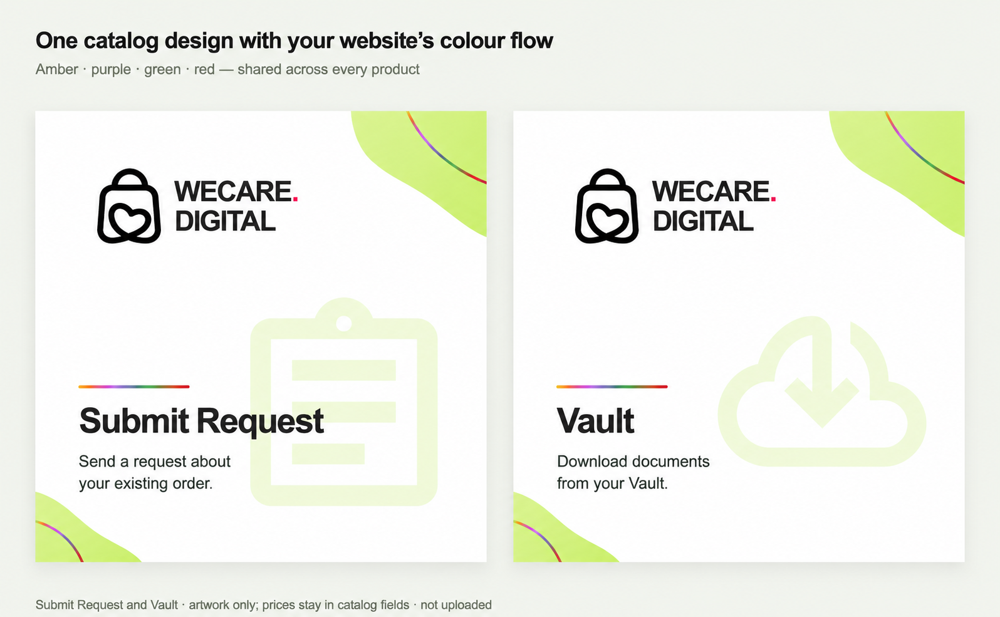

# WhatsApp catalog master design

Owner-selected direction, 8 October 2026: one shared design language for all WECARE.DIGITAL catalog products, with restrained multicolour accents derived from the homepage.

## Shared template

- White canvas; identical lime corner shapes and thin multicolour corner strokes.
- Black brand symbol and wordmark; pink logo dot.
- Identical logo, title, supporting-text and background-icon positions.
- Amber `#f0a818`, purple `#9849e8`, green `#3da35a`, red `#dc2626` in the same accent sequence for every product.
- Pale service icon behind the text. Product prices remain separate catalog fields.

The palette comes from the homepage audience accents in `src/pages/index.tsx`. Only service title, supporting copy and icon change between products.

## Files and status

`comparison.html`, `submit-request.html`, and `vault.html` are self-contained editable design sources with inline SVG icons, on 1024 x 1024 product canvases. They need no external font, image or script requests. Open them locally to inspect or export.

`multicolour-preview.png` is the AI-assisted comparison shown to the owner. It is a visual proposal, not an exact pixel export of the HTML source or an individual production product image.

Submit Request uses Google's outlined Material assignment icon. Vault uses the owner-supplied Google Material cloud-download SVG. Google icon source: https://github.com/google/material-design-icons ; license: Apache-2.0. The WECARE.DIGITAL brand symbol is owner-supplied artwork.

This commit saves the artwork and reusable templates. It does not upload catalog media, change Wix product records, send customer messages, publish Meta Flows, or enable payment/backend features.

Rollback: revert this scoped design commit. No live catalog records need restoration.

`submit-request-4096.png` and `vault-4096.png` are the deterministic 4096 x 4096 exports from the accompanying SVG masters. These are the images prepared for Meta catalog upload. The recreation prompt is in `design-prompt.txt`.
