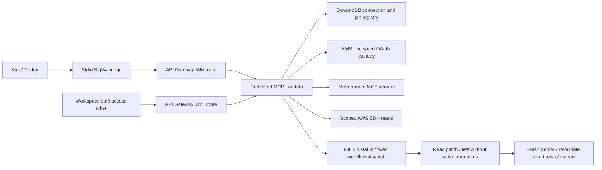

# AWS administrative MCP

The first release was merged through PR 179 and deployed as the dedicated
`wecare-workspace-mcp` stack. Deployment evidence is recorded in
`docs/execution/workspace-mcp-live-20261001.md`. Desktop provider authorizations
and cloud provider authorizations are separate.

## Who calls what

Kiro or Codex runs `scripts/workspace_mcp_proxy.py` as its stdio MCP client. The
bridge uses the existing `wecare-prod` profile to sign requests to the API Gateway
IAM route. The Lambda calls remote MCP servers only with independently authorized
credentials. Its fixed SDK adapters read AWS, GitHub, Wix and Razorpay; Google
Cloud and Ads use separate cloud OAuth grants. GitHub Actions owns supplied-patch
testing and committing.

The reasoning model stays in the client. There is no new Bedrock/OpenAI model,
arbitrary shell tool or unrestricted AWS script runner. Backend infrastructure is
activated separately after merge. An enabled patch job pushes to stack, so the
existing Amplify stack pipeline may then publish the tested frontend changes.



## Authentication

* Staff endpoint: `https://wecare.digital/api/workspace/mcp`.
  API Gateway verifies the existing staff pool issuer and client audience. The
  handler accepts access tokens only, rechecks Cognito revocation and current Admin
  membership, and rejects customer tokens. It does not expose a new native MCP
  OAuth authorization server; direct HTTP use needs a current staff bearer token.
* IAM bridge endpoint:
  `https://zllr9lrg7j.execute-api.us-east-1.amazonaws.com/prod/workspace/mcp-iam`.
  API Gateway verifies SigV4; the handler permits the established `wecare-admin`
  principal only. Existing developer credentials stay in the local profile.
* Provider callback:
  `https://wecare.digital/api/workspace/mcp/oauth/callback`.
  This is the sole public route in the new stack. A ten-minute one-use random state
  binds a provider and caller. A new consent request invalidates the previous one.
  PKCE verifiers and provider tokens are encrypted with principal/provider KMS
  context. Access-token expiry is not DynamoDB TTL: refresh credentials survive it.
  Refresh uses a per-connection lease, rereads the latest credential after acquiring
  it, and releases only its own lease; a delayed caller cannot clear a newer lock.
* IAM and Cognito identities have separate connection namespaces. Authorize through
  the same client identity that will use the connection.

No existing customer pool, staff client configuration, public `/mcp`, certificates,
Amplify rewrite rules or provider credentials are modified by this stack.

## Included tools and limits

| Tool | Behavior |
|---|---|
| `connections_list` | Reports versioned connection configuration and caller-specific OAuth status; never token values |
| `connection_authorize` | Starts cloud OAuth for Meta Social, WhatsApp, Meta Ads, Google Cloud or Google Ads; unsupported client registration fails before opening a broken login |
| `connection_verify` | Records a successful fixed account read, or separately records documentation MCP discovery |
| `provider_read` | Allows selected Meta app reads for app 2238810740192680, or WhatsApp business-list only |
| `aws_status` | Reads account identity and the two MCP live aliases |
| `github_status` | Checks this repository using `wecare/github-pat`, field `token`, resolved inside Lambda |
| `code_job_submit` | Persists a bounded supplied patch and returns a deterministic job ID; workflow dispatch starts disabled |
| `code_job_status` | Reports the caller's job; queries matching workflow runs after dispatch |

Meta Social includes app-list, selected app settings and API usage/deprecation reads.
WhatsApp deliberately stops at business-list: business selection and existing-number
reads belong to the next adapter extension. Sending, onboarding, phone verification,
registration, templates, webhook changes, payments and business changes are absent.
Remote endpoints cannot be supplied by callers. HTTP redirects are refused. JSON
and bounded SSE responses are supported; sessions are established separately per
remote call. Provider content is untrusted data, and credential-named fields are
redacted recursively, including JSON carried in text content.

Wix verification reads site properties. Razorpay verification fetches at most one
order and returns only collection metadata, never customer or order content.
Google Cloud reads only project `wecaredigitalbw`; Google Ads lists accessible
customers using the developer token resolved inside Lambda. Google grants request
offline access and retain encrypted refresh tokens. The Google web client secret
is resolved from `wecare/seo/google-oauth` only inside token exchange/refresh.
Runtime IAM grants name exact secret ARNs. Decryption of the Google Ads secret's
existing CMK is restricted to Secrets Manager and that secret's encryption context.

Plivo and Sinch perform public documentation MCP initialization and tool discovery,
recorded as `documentation_verified`, never live-account access. Sinch remains
RCS-only. Existing desktop connections retain their own authentication.

Meta Social and WhatsApp remote OAuth require a supported MCP client rather
than substituting a business-app Graph token. Their metadata advertises dynamic
registration. The tested
custom cloud registration was rejected with `invalid_client_metadata` and
`Dynamic registration is not available for this client`. The dashboard reports
that restriction. An older business-app token cannot be forwarded as an MCP
credential. Meta Ads uses the existing WECARE app 2238810740192680 after enabling
its Ads MCP use case. The advertised Ads OAuth metadata supports public-client
PKCE (S256, token endpoint auth method none). Its connection check performs
authenticated initialize/tools-list only, recorded as authenticated, not
verified account data. Ad-tool execution remains disabled. Ordinary WhatsApp Graph
authorization saved by the callback is not proof that its MCP is connected.

## Build and review

Use Python 3.12 and the existing repository virtual environment. Install the dedicated
requirements into a fresh scratch directory, never into an unrelated session's venv:

```sh
.venv/bin/python -m pip install --target .scratch/workspace-mcp/dependencies \
  --no-compile -r amplify/functions/ai/workspace-mcp/requirements.txt
.venv/bin/python -m pytest tests/test_workspace_mcp.py tests/test_mcp_server.py
.venv/bin/python scripts/build_workspace_mcp.py \
  --dependencies .scratch/workspace-mcp/dependencies
```

The builder verifies all dependency pins, bundles the SDK rather than relying on
the Lambda runtime's unknown SDK version, and produces a deterministic ZIP plus
SHA-256 deployment manifest. All dependencies are portable pure Python. Native
wheels, unexpected distributions and mismatched pins are refused.

## Activate after the later merge

1. Merge the reviewed feature into `stack`, rerun checks on the exact merged tree,
   rebuild the package and rediscover the current AWS routes/resources. No merge is
   performed as part of this build.
2. Confirm account 775261844268, us-east-1, the existing artifact bucket, alarm topic,
   GitHub OIDC provider and secret ARN. Snapshot current routes, stages, authorizers,
   public MCP live alias and any prior administrative stack outputs. Capture prior
   administrative live version before any later update.
3. With AWS MCP, obtain an upload URL for the manifest's S3 key and upload the exact
   ZIP. Call `ValidateTemplate`, then `CreateChangeSet` for `wecare-workspace-mcp`,
   with the manifest's parameters and `CAPABILITY_NAMED_IAM`. Review the change set:
   additions only for this first release; no unrelated resource replacements.
4. Execute the reviewed change set and wait for `CREATE_COMPLETE`. The standalone
   SDK deployment script produces the same change set when MCP is unavailable. It
   refuses activation from a feature branch. Existing `/api/*` forwarding carries
   the staff endpoint and callback; the SigV4 bridge uses execute-api directly to
   avoid proxy transformations of its signed request.
5. Confirm unauthenticated IAM/staff requests fail, invalid origins fail, valid
   owner bridge `initialize`/`tools/list`/`aws_status` work, and public `/mcp` retains
   its original read-only tools. IAM-level direct Lambda invocation can exercise
   fixture events, but is not evidence of a real staff sign-in.
6. Add the example `wecare-workspace` server to Kiro/Codex alongside existing entries,
   set `disabled` false only after deployment, and run the bridge. The example paths
   point to the primary checkout after merge, not this temporary checkout.
7. Register the exact HTTPS callback above in Meta app 2238810740192680 for
   Meta Ads, enable its Ads MCP use case, and run connection_authorize for
   meta-ads. Complete owner consent and check authenticated tool discovery.
   Meta Social and WhatsApp still need supported MCP client registration;
   until their authorized reads succeed, report them as unverified.
   No system-user Graph token is
   substituted for this MCP OAuth flow. The provider OAuth version in config is
   v26.0, as advertised by Meta's server metadata on 2026-10-01; this does not bump
   the rest of the application's Graph API calls.
8. Verify `github_status`. The runtime secret's field names were checked through
   an asm-exec dynamic reference without printing values. Its actual repository
   and workflow permissions still require the runtime verification.

## Supplied patch jobs

The first-release patch allowlist is eight existing public presentation components
in `patch_policy.py`. It excludes backend handlers, checkout/payment logic,
authentication, tests, workflows, policies and secrets. No deletes, new files,
renames, binary patches or mode changes are permitted. Git diff headers and
`---`/`+++` headers must both match. Input is capped at 32 KiB and bound to an exact
40-character base commit; the artifact identity is a caller/base/content checksum.

The workflow separates AWS-authenticated artifact fetch, tests without write/AWS
credentials, and a fresh commit runner. It reruns the immutable path/checksum/base
validation before committing only those explicit files and pushing non-force to
stack. A moved branch fails; it must be resubmitted and retested against the new
base. The workflow runs typecheck, frontend tests, build, public manifest and export
secret gates. It does not directly deploy backend resources. Ordinary stack CI and
the existing Amplify frontend pipeline follow its push.

The final commit runner uses checkout's managed GitHub authentication. The patch
test runner has no write authentication. Supplied patch paths must resolve inside
the checkout and meet the size bound before reading.

After merge, set repository variable `WORKSPACE_MCP_PATCH_READ_ROLE_ARN` to the stack
output. The role only reads the patch prefix. Confirm workflow dispatch permission
on the runtime GitHub credential, then deliberately enable `CODE_JOBS_ENABLED` in
the IaC and redeploy. Leaving the flag off stores jobs as `dispatch_pending`.
Dispatch ambiguity stays `dispatch_unknown`; it is never reported as success or
blindly retried. Status queries inspect only the latest 100 matching workflow runs;
older runs require an explicit GitHub audit.

## Live activation on 2026-10-01

PR #179 is merged into stack. The CloudFormation stack is deployed successfully,
and the administrative MCP live alias points to version 1. IAM-signed initialization,
eight-tool discovery, registry reads and AWS/GitHub SDK reads passed live checks.
The new server is enabled in local Kiro and Codex configuration; reload each client.
Meta Social and WhatsApp still require separate cloud browser consent. Code-job
dispatch remains disabled. See `execution/workspace-mcp-live-20261001.md` for exact
evidence, remaining verification and the retained proxy path used by local clients.

## Cost, audit and rollback

No provisioned concurrency, always-on compute, NAT gateway, new AI inference or new
certificate is included. Lambda has reserved concurrency 2 (a cap, not paid warmed
instances), 256 MiB memory and a 28-second timeout. DynamoDB uses on-demand billing
and point-in-time recovery. CloudWatch tool audit logs contain only principal hash,
allowlisted tool name and outcome, with 14-day retention. The error alarm uses the
existing human-routed SNS topic. API Gateway already has access logging and stage
throttling. KMS, storage, backup, requests and provider usage can incur charges;
the architecture is not guaranteed free. A dedicated KMS key has a recurring cost.
No WAF or Security Hub is introduced.

For an initial rollout failure, disable the new Kiro/Codex server and keep code jobs
off. Remove only this stack's newly added integrations/routes/authorizer through
its reviewed IaC rollback, subject to destructive-operation rules. Registry/KMS
resources have retain policies. For later code releases, restore the captured prior
live alias version and matching IaC. Never roll back checkout, public `/mcp`, other
provider connections or shared Amplify routing to repair this endpoint.

## Connection persistence and viewing results

Connections are stored server-side under the stable IAM identity or Cognito user
subject, not a browser session identifier. Closing the browser or signing out does
not delete them. Signing in as a different user or using the desktop IAM bridge
selects a different namespace; never copy another user's authorization to bridge it.
Only short-lived OAuth state rows have DynamoDB TTL. Provider access-token expiry
remains separate from registry retention. Automatic refresh retains the existing
verification timestamp and status, rotates the encrypted token payload under the
refresh lease, and records only a non-sensitive refresh-capability flag.

On the dashboard, use Verify/Check connection first, then View data to select the
provider in MCP Playground. Choose a read and Run read; results appear below.
An expired access token means Check renewal, not that the saved grant is lost.
Google offline grants renew on demand while valid. Revocation, changed permissions
or provider refresh-token expiry can still require consent. Meta authorization
errors must be resolved in the approved provider app/client configuration; do not
mark a callback or ordinary Graph token as a verified remote MCP connection.
Plivo/Sinch checks confirm documentation discovery, not a live account.


The Meta Social/WhatsApp cloud flow requires Meta to accept its resource-specific
public MCP client registration. An ordinary WECARE Graph-app login is not a fallback
for this registration. If registration is refused, use the separately authorized
desktop Meta Social/WhatsApp connectors; do not copy their tokens into AWS. See
`execution/mcp-connections-20261007.md` for the live provider response and Ads review
limitations. Connection persistence does not override Meta client acceptance,
permission review, consent or revocation.
