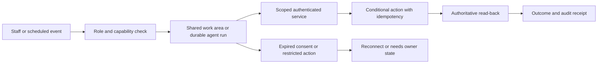
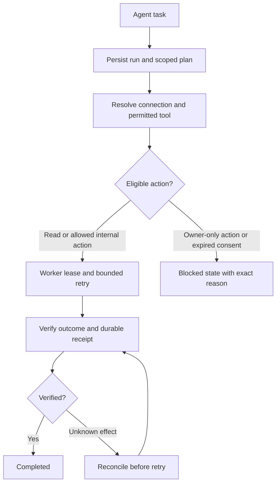

# Workspace rescan, final layout, flows and release gates — 8 October 2026, R2

## Outcome and evidence boundary

This is a fresh review and implementation plan, not a completed redesign or production release. Separate branch `codex/workspace-rescan-20261008-r2` started at production `191fe707b8520cc82d698398d031d040650989a2` and advanced to `b1669cde10585d3958ffc056c26331ba93c5c884` when the VayuLok globe revert landed during the review. The delta touched only two VayuLok frontend files; the backend suite result remains applicable to unchanged backend source, and latest CI independently reproduces it. Earlier reports remain historical evidence and their unresolved lists are superseded below.

Recomputed static import/API inventory across **141 page route patterns: 105 workspace and 36 public**. Current navigation has **108 entries, nine top-level sections and seven Settings groups**. Every configured navigation destination resolves. All **81 handler.py** files parse successfully. Import reachability can include inactive tabs, endpoint matching compares paths across verbs, and dynamic routing needs manual contract checks. These results establish source coverage, not authenticated usability of every page.

Fresh AWS reads in account **775261844268/us-east-1**, captured from **17:21 IST**: **75 Lambda functions, 377 API routes, 77 integrations, 84 DynamoDB tables, 73 metric alarms, 16 log metric filters, 10 queues, seven S3 buckets, zero listed Step Functions state machines, zero RDS instances and zero ECS clusters**. Every API integration Lambda target exists. Route authorization is **375 NONE, one JWT and one AWS_IAM**; NONE alone does not determine handler authentication or signature protection. Both WAF scopes remain empty by owner decision. Initial MCP script exceeded its service limit on seven requests; all seven were retried successfully. This is a scoped resource/configuration inventory, not an all-region IAM/security audit.

Amplify job **1461 SUCCEED** matches **b1669cde**; job1460 matches the earlier191fe707. Deployment success coexists with red CI. Live aliases: workspace MCP10, internal AI38, action group28, catalog-sync4, inbound WhatsApp85, outbound WhatsApp52, checkout32. Staff Cognito remains **OPTIONAL MFA**; customer pool remains **OFF**, with all three WhatsApp custom-auth triggers intact. A particular staff account's challenge behavior requires sign-in verification. The latency alarm was initially ALARM; follow-up read returned OK. Do not infer a continuing outage from that transient snapshot.

AWS Core connection is verified by successful authorized reads. That does not verify Meta Social, WhatsApp Business Tools, Meta Ads, dashboard OAuth or desktop connectors. No customer data, secret values, live sends, calls, financial mutations, consent changes, deployments or infrastructure changes were performed in this review.

## Remove resolved findings from the active list

| Earlier finding | Fresh evidence | Status |
|---|---|---|
| Flow short-reference collision | Full-key comparison after a conditional conflict; deterministic longer fallback; synthetic collision regression passes | Fixed in source. Legacy rows lacking completionKey retain compatibility behavior; this is not a migration of those rows |
| SEO failure blocks retry | Blog existence checked before claim; fenced 30-minute audit lease released in finally | Fixed in source; regression passes |
| Partner caches never expire | Token and mapping cache refresh after five minutes using monotonic time | Fixed in source; regression passes |
| PR243 and PR245 pending | GitHub reports both MERGED | Resolved review state; merge alone does not certify deployed artifacts |
| Gastronomy sync / CodeQL red | Both green on exact b1669cde | Removed from active blockers |
| VayuLok missing AQI test failure | Upstream globe revert; fresh complete frontend suite passes | Resolved on refreshed tree |
| Duplicate Inbox / eight external SEO routes | Shared Inbox wrapper and removed routes remain in current source | Do not schedule duplicate removal again |

## Current findings and practical impact

| Priority | Finding and evidence | Required work |
|---|---|---|
| P1 release gate | Route auth workflow fails its full Python step: `test_crm_customer_login.py:319`, UsernameExists case returns UnsafeWabaStamp. FakeCognito lacks admin_get_user now required by `_existing_stamp` | Update the test contract and cover preserving a present WABA stamp, absent stamp and unreadable stamp. Keep fail-closed behavior; do not delete the production read to satisfy a stale fake |
| P1 release gate | Build and test on b1669cde fails animcheck console assertions for `/grahak-os/` and `/contact/` after HTTP429; pages themselves return200 | Capture failed-request URL, initiator and response metadata. Determine whether external dependency, application request or harness rate is responsible; do not broadly ignore429 |
| P1 publication safeguard | Latest observed Wix catalogue sync run37771020843 at d9e365ce refuses12 removals out of22 products | Compare provider scope and authoritative product inventory before accepting removals. Keep safeguard; no override or publication change performed |
| P2 | Workspace MCP remains live10, last modified6October; frontend contains newer persistence/renewal text | Release exact tested backend artifact with version10 rollback, then verify reconnect/sign-out/read-back. UI copy is not deployed persistence evidence |
| P2 | `client.ts` cancellation/update call `/scheduled/{id}`; live routes are GET/POST/DELETE `/scheduled` only | Align verb, identity and payload with actual handler; test owner scope and confirmed cancellation |
| P2 | Welcome and Auto Response await updateSystemConfig but ignore its false result | Require acknowledged save, preserve draft on failure, read back authoritative value |
| P2 | getAWSBilling substitutes fixed sample usage and $2.40 with a current timestamp on failure; getSystemHealth begins with active/GREEN/zero-DLQ defaults | Render unavailable/stale/disabled distinctly. Do not label guesses as measurements. Keep Cost Explorer polling disabled |
| P2 | Staff requests still lack a dedicated scoped paid-service queue; customer my-requests does not supply a staff-wide management contract | Add staff list/detail/assignment and payment/order lineage; expose it inside Service Ops rather than another standalone sidebar page |
| P2 | Common Inbox requests2000 messages every15seconds; legacy service-api orders scans one page without continuation | Add thread/cursor/summary contracts, bounded refresh and shared cache. Preserve search/filter and record history |
| P2 | Layout active-state logic compares pathname to query-bearing navigation; SEO products use `/product-page/{slug}` while public shop route is `/shop/[slug]` | Normalize path plus filter state; use canonical product URLs and preserve old deep links |
| Architecture | Existing AI has governed READ/refusal, plans and receipts; APPLY tools remain disabled. Bedrock agent remains NOT_PREPARED; no Step Functions state machine listed | Build durable runs, scoped delegation, verified internal actions and recovery. Absence of Step Functions alone does not prove no orchestration; source and runtime evidence jointly establish the incomplete execution path |
| Advisory | braces3.0.3 appears in both lockfiles; root copy dev-only, Amplify copy not marked dev-only; GitHub still lists no patched version | Keep tracking and assess actual pattern-input exposure; no deployed Lambda exploit demonstrated |

Advisory verified against [GitHub GHSA-vfj7-8cjw-p6xm](https://github.com/advisories/GHSA-vfj7-8cjw-p6xm). Newly expanded native WhatsApp payment code requires a renewed checkout/settlement policy and acceptance review during consolidation. The two sampled live handlers have WA_PAYMENTS_DISABLED unset; that alone neither proves end-to-end native payment readiness nor that it is disabled. Do not recycle the old website-only diagram as a complete description of current payment implementation. Keep website checkout and native settlement paths distinct and prevent second charges. This rescan did not enable or exercise either financial path.

## Fewer destinations, preserved capabilities

Target **14 primary destinations**, not fourteen physical route files. Keep detail/editor routes and compatibility redirects. Use one shared shell, capability registry, scoped API and index/detail pattern; backend permissions stay authoritative.

```text
WECARE DIGITAL                      Search / commands | Ask agent | Account
Home                                Needs attention / today's work / recent runs
Inbox                               All channels / Assigned / Unread / Delivery
Contacts                            People / Segments / Contact360
Campaigns                           Drafts / Scheduled / Templates / Insights
Service Ops                         Requests / Orders / Bookings / Documents / Responses
Payments                            Ledger / Invoices / Reconciliation
Catalog                             Products / Collections / Mapping / Sync
Work                                Tasks / Agent runs / Needs owner / History
Content                             Posts / Production / Pages / Supported SEO
Settings                            Your account / Integrations / Channels /
                                    Automation & AI / Platform
```

Platform is Admin-only. Channels preserves WhatsApp Accounts, Identity, Groups, Webhooks, Calling and Embedded Signup. Keep customer-facing AI separate from internal AI. Connectors carry verified scope, last check, renewal/reconnect state and available tools. Permanent means saved authorization with renewal/recovery while the provider permits it, not an irrevocable token.

```text
Every work area
┌─────────────────────────────────────────────────────────────────┐
│ Title · scope · last verified        Search       Create / agent │
├─────────────────────────────────────────────────────────────────┤
│ Local tabs | saved filters | counts with freshness               │
├──────────────────────┬──────────────────────────────────────────┤
│ Cursor-paged queue   │ Selected record / history / linked source │
│ Status · owner · age │ Contextual permitted actions              │
│ Search / selection  │ Verified outcome / error / audit receipt  │
└──────────────────────┴──────────────────────────────────────────┘
Inbox uses conversation + message + contact panes. Mobile shows one
pane at a time. Complex editors keep URLs. Back restores filters and
selection. Hidden tabs stop polling. Empty ≠ forbidden ≠ unavailable.
```

The earlier 105-route migration map remains the destination mapping, with payment acceptance updated for the new native source boundary. Short route wrappers are not missing features when they import a working shared implementation. Remove dead capability only after import, navigation, contract and consumer evidence agrees.

## Delivery phases and flow

| Phase | Deliverable | Exit evidence |
|---|---|---|
| 0 Baseline | Fix stale Cognito test; identify429 origin; verify current deployment and alarm | Required checks green on exact SHA; request-level failure evidence |
| 1 Truthful behavior | Schedule cancellation, save/read-back, unavailable health/billing, canonical URLs; release reviewed MCP persistence | Error/retry/scope fixtures and deployed read-back; rollback recorded |
| 2 Backend contracts | Staff request queue and linkage, paged orders/threads, catalog reconciliation and delivery reads | Verb/payload/actor/pagination tests; no second financial writer |
| 3 Shared navigation | Fourteen-destination shell, role-aware search/menu, shared list/detail/settings | Every capability/deep link mapped; mobile/keyboard/Back parity |
| 4 Consolidation | Domain tabs and editors; preserve checkout and native settlement distinctions | Complete task flows and measured request/latency reduction |
| 5 Internal agent | Durable coordinator, worker scope, MCP renewal, tool policy, eligible internal writes | Duplicate/crash/revoke/injection/receipt-loss recovery; verified outcomes |
| 6 Release/retirement | Shadow then canary, provider QA, monitoring and rollback | Evidence-backed retirement, no deletion by inference |





## Testing executed and testing still required

Full Python at191fe707: **9715 passed, one failed, seven skipped, three xfailed**; latest b1669cde Route auth CI independently reports the same counts/failure. Full refreshed frontend atb1669cde: **1523 passed, eleven skipped**, 113 passed test files and two skipped. Reused installed dependencies, Vitest5.0.2; this was not a fresh npm-ci installation. TypeScript `tsc --noEmit` passed on both snapshots. Syntax parsed81handlers. Static navigation resolution and live integration target existence passed. No local browser export harness or production authenticated end-to-end suite was run; CI supplies the observed browser failures and successful build/deployment evidence.

```text
Exact SHA
  → Python + TypeScript + frontend suite
  → All routes/navigation/imports + API verb/payload contracts
  → Role/record scope + error/empty/stale/expiry UI states
  → Staff save/cancel/request/invoice/catalog journeys
  → Customer OTP/cart/order/document/settlement separation
  → Provider consent/revoke/refresh + owner-approved QA
  → Agent retry/crash/duplicate/receipt/budget/injection tests
  → Canary verification + rollback → retirement evidence
```

Updated test matrix retains expanded tests as planned unless actually run. Passing source tests is not a certification of Meta authorization, real calls, live checkout or autonomous management.

## Cost facts refreshed

Secrets metadata confirms **22 active and13 pending-deletion entries**. Fixed storage run-rate is **$8.80/month before API usage, credits and tax**, using [AWS Secrets Manager pricing](https://aws.amazon.com/secrets-manager/pricing/) at$0.40/secret/month. The webhook-registry secret remains active, so its proposed$0.40/month removal is not counted as saved. Grouping credentials needs shared access/rotation/consumer analysis; no consolidation was performed. The Lightsail micro voice instance still runs, so earlier SIP retirement savings remain proposals. No current invoice/credits calculation was made in this pass; resource pricing estimates are not realized cash savings.

Evidence: `workspace-rescan-summary-20261008-r2.json`, page CSV, updated test matrix, parameterized inventory script. Full raw source graph, sanitized AWS metadata and workflow/test logs are retained under local `outputs/workspace-rescan-20261008-r2/` rather than adding large generated evidence to Git.
