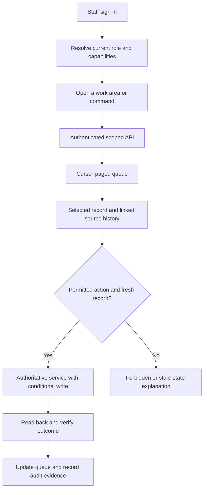
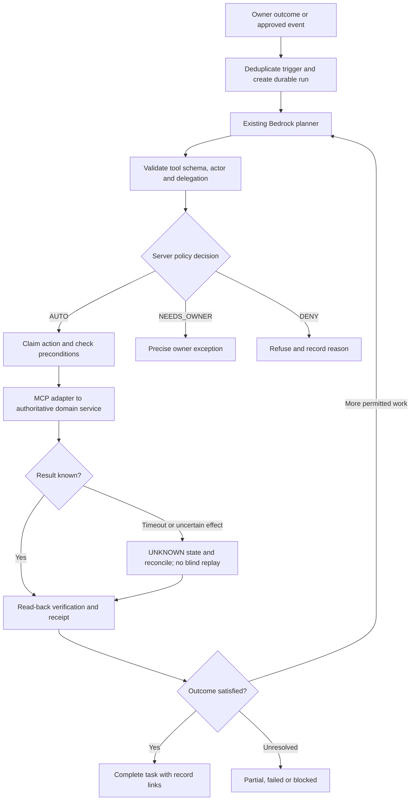

# Final workspace plan, flows and test gates — 8 October 2026

## Current basis and verification

Fresh checkout of `origin/stack` **57ff0e038ea2b810922ef8e6da4bc81921abba50**, on separate branch `codex/workspace-rescan-20261008`. The October 7 research branch remains preserved; this plan supersedes stale findings using the latest source and newly collected AWS metadata. No production source, infrastructure, authentication or provider settings changed during this rescan.

Source inventory: **141 route patterns = 105 workspace + 36 public**; **108 navigation entries, nine current top-level sidebar sections, seven current Settings groups**. Scanned the TypeScript import/API graph across every route; all registered paths resolve. Parsed all **81 handler.py** source files. Live discovery in account 775261844268/us-east-1: **75 Lambdas, 376 API routes, 76 integrations, 84 tables, 73 metric alarms, zero composite alarms, 16 log metric filters, zero Step Functions state machines**. All integration Lambda targets exist. API authorization types are **374 NONE, one JWT, one AWS_IAM**; NONE does not negate handler authentication or webhook signatures.

AWS capture started **8 October 2026, 04:56 IST** (2026-10-07T23:26:53Z). Amplify stack job **1429 SUCCEED**, source commit exactly matches 57ff0e03. This proves reported deployment success, not every authenticated journey. Sampled live aliases: MCP **10**, internal AI **38**, action group **28**, new catalog-sync **2**, service-requests **2**. SEO-tools has no alias in its current metadata; an unqualified integration can be intentional. Classic Bedrock agent remains NOT_PREPARED. Staff Cognito now reports **OPTIONAL MFA**, customer pool **OFF** with all three WhatsApp custom-auth triggers present. This differs from October 7's OFF staff snapshot; OPTIONAL alone does not prove whether a particular account sees a challenge. Do not change either pool during this plan; staff password-only testing and customer OTP behavior require separate acceptance verification.

## What changed since the prior audit

| Prior finding | Fresh status | Remaining work |
|---|---|---|
| Eight broken external SEO route patterns | Removed from current source; old external client removed | SEO Tools still contains separate URL/token diagnostics; defer/remove unsupported controls and check old deep-link behavior |
| Two large inbox implementations | WhatsApp page now a wrapper over common Inbox with channel preset | Preserve standalone/embedded URLs and parity; performance remains an issue |
| Working editorial workflow poorly discoverable | Content is now a top-level sidebar section | Consolidate stage components/local navigation; preserve workflow permissions |
| Dead attribution/catalog browser components | Removed from current source diff | Verify remaining helpers/contracts before admitting catalog operations |
| Catalog sync lacked dedicated service | New deployed `wecare-meta-catalog-sync`; alias 2 and source/tests present | Surface truthful sync state, reconciliation and deletion safeguards |
| Checkout/order/security work lacked newer contracts | Substantial upstream changes in basket, order, invoice and document handling | Keep authoritative payment checks and data-access regressions in release gates |
| Inbox offered unsupported transcription | Transcription helper/button removed from active common Inbox | Do not restore until a real contract is implemented |
| MCP backend deployment lag | Still live version 10 | Exact-artifact persistence deployment/rollback remains required |
| Flow completion short key / partner caches / SEO audit claims | Still visible in current stack; PR243 remains OPEN | Rebase/review existing fix work, test current tree and release separately |

Do not count the resolved duplicate inbox/external SEO pages as new implementation work. The existing source reduction is eight workspace route patterns (113 → 105), with public patterns unchanged. Target destination counts below are further design goals, not claimed deletions.

## Confirmed outstanding priorities

1. **Release baseline is red.** Diagnose/fix the identified CI failures before promoting a redesign. Local passing subsets do not override failing full workflows.
2. **Flow completion storage defaults to the short display reference** (`flow_completion.py` assigns `sub_id = ... or reference`); pending PR243 addresses collision-safe identity. Keep display reference separate from physical dedup key.
3. **Partner token caches remain unbounded in warm environments** (`partner_tokens.py` `_token_cache`). Fix expiry/invalidation through current reviewed source, not credential rotation.
4. **Schedule cancellation still calls DELETE `/scheduled/{id}`**, while current gateway inventory does not contain that item route. Align with the supported handler contract and require explicit successful cancellation.
5. **Configuration saves can report success after false results**: Welcome/Auto Response ignore `updateSystemConfig`'s boolean. Require confirmed save and read-back; preserve drafts on error.
6. **Billing still fabricates estimates on fetch failure**. Remove the current-looking fallback. Keep Cost Explorer removed/disabled.
7. **Service-request staff management remains missing**: new handler owns customer `/services/my-requests`, while staff orders read legacy Flow submissions. Add a distinct staff list/detail/assignment contract with record lineage.
8. **Paging and performance remain weak**: legacy orders consume a single DynamoDB page; common Inbox fetches up to 2000 messages every 15 seconds. Add cursor/thread/summary reads and shared visibility-aware caching.
9. **Query-filter sidebar state remains incorrect**: Layout compares pathname to query-containing paths. Use pathname plus selected query, with one active child.
10. **Product audit links still use `/product-page/{slug}`** instead of `/shop/[slug]`. Resolve canonical URLs from the product model.
11. **MCP/agent execution is not durable autonomous work**: READ/refusal machinery exists; APPLY tools remain disabled, worker delegation is absent, audit receipts fail open, and no durable coordinator is deployed.
12. **Monitoring lacks explicit log filters for signature/smoke rejection strings** in the 16 returned filters. Existing general errors and DLQ alarms do exist. Add focused coverage only after inspecting metric/emission and delivery contracts; do not describe all DLQ monitoring as absent.

Static source-contract findings are reproducible observations, not demonstrations of unauthorized live access. Do not guess Meta thread-control endpoints, delete messages by approximate revoke correlation, or restore native payments. Embedded Signup is already component/API-wired; provider consent/configuration readiness is a distinct gate.

## Final information architecture

Target **14 primary destinations**: Home + eight work areas + five Settings sections. This does not mean 14 physical route files. Keep role-specific account views, deep-linked details, stage URLs and legacy redirects as needed.

```text
WECARE.DIGITAL                      Search / commands | Ask agent | Account
Home                               Logo / workspace entry
Daily work
  Inbox                            All channels / Assigned / Unread / Delivery issues
  Contacts                         People / Segments / Contact 360
  Campaigns                        Drafts / Scheduled / Templates / Delivery / Insights
  Service Ops                      Requests / Orders / Appointments / Documents / Responses
  Payments                         Ledger / Invoices / Reconciliation
  Catalog                          Products / Collections / Channel mapping / Sync state
  Work                             Tasks / Agent runs / Needs owner / History
  Content                          Posts / Production / Pages / Supported SEO
Settings (fixed bottom)
  Your account | Integrations | Channels | Automation & AI | Platform
```

Content is role-filtered. Platform is Admin-only. Search and actions use the same capability registry as navigation; backend checks remain authoritative. Preserve WhatsApp Accounts/Identity/Groups/Webhooks/Calling under Channels; keep customer AI separate from internal AI, and Flow design separate from operational responses. Marketing spend/send, PIN/number migration, financial mutations, provider retirement and credential replacement stay outside current agent policy.

Inner-page pattern: **header + local tabs + saved filters + paged resource list + selected detail + verified contextual actions**. Conversation uses three panes; complex editors retain real routes; simple actions use dialogs. On mobile show one pane at a time. Errors, empty results, expired sessions, forbidden actions and unconfigured providers are distinct. URLs preserve filters/tabs/selection and Back behavior. Do not keep hidden tabs polling.

## Phase plan with exit gates

| Phase | Scope and deliverables | Exit gate |
|---|---|---|
| 0 Baseline | Fix current CI contract/layout/workflow issues; investigate Wix mass-removal evidence; rebase pending correctness changes | Exact source SHA has required checks green; blocked provider scope stays visible; guard is not bypassed |
| 1 Correctness | Flow key, expiring caches, SEO claim lifecycle, schedule cancellation, save/read-back, truthful billing, canonical product URLs | Collision/retry/stale-data/error-state regressions pass; release artifact and rollback recorded |
| 2 Contracts | Staff request queue/detail; order/thread cursor APIs; delivery inspection; ledger/catalog sync read state | Actor/record scope, verb/payload/pagination tests pass; no browser direct table access |
| 3 Shared shell | Capability registry; role-aware menus/search; shared index/detail/settings components; current-route migration map | Every preserved capability reachable; keyboard/mobile/Back/empty/error tests pass |
| 4 Domain consolidation | Service Ops responses, Campaign/template workflow, Payments/Catalog detail, Content stages; polish already unified Inbox | Feature parity and measured task-flow/performance improvement; old URL consumers retained or redirected |
| 5 Agent/MCP | Effective tool catalog; worker role/delegation; connection recovery; durable read runs; safe internal-write executor | Revocation/cross-workspace/duplicate/crash/receipt failure tests pass; autonomous eligible tasks verified |
| 6 Release and retire | Shadow/canary workflow packs, monitoring, user-journey tests, rollback drills; cleanup obsolete implementations | Real outcome receipts and required checks; only evidenced retirement, no inferred AWS deletion |

Order: **0 → 1 → 2 → 3 → 4 → 5 → 6**. Phase 3 UI scaffolding can overlap Phase 2 after contracts stabilize; Phase 5 read-only runtime can be built alongside domain migration, but autonomous writes cannot bypass the earlier correctness gates. These are dependencies and measurable gates, not unsupported calendar estimates.

## Flow diagram 1: staff operational work



Example: Service Ops → select website paid request → inspect order/payment linkage → assign internal owner → verify persisted assignment. Customer `/services/my-requests` is not used as a staff-wide listing. The new view links source records rather than merging unrelated schemas or adding a second financial writer.

## Flow diagram 2: unattended internal agent



Run states: QUEUED → PLANNING → RUNNING → VERIFYING → COMPLETED, plus WAITING_FOR_OWNER, BLOCKED_AUTH, RETRY_WAIT, PARTIAL, FAILED and CANCELLED. Closing the browser must not stop the run. Renewable workload credentials and server-held workspace delegation replace browser-token reuse. Provider consent can expire/revoke; persistent access means controlled renewal/reconnection, not immortality.

Prefer on-demand Lambda/domain tools with Step Functions Standard coordination where durable waits/retries are needed. Its workflow guarantees do not make external effects exactly once; every effect requires claims and reconciliation. Reuse existing Bedrock loop instead of adopting another platform before measured requirements justify it. References: [AWS workflow types](https://docs.aws.amazon.com/step-functions/latest/dg/choosing-workflow-type.html), [MCP authorization, supported 2025-11-25 specification](https://modelcontextprotocol.io/specification/2025-11-25/basic/authorization).

## Flow diagram 3: customer purchase boundary

```text
Customer website / WhatsApp cart handoff
  → WhatsApp OTP and customer identity
  → Website basket/checkout and authoritative payment verification
  → Bound order/service records, deduplicated finalization
  → Private website receipt/document and customer order status
  → Staff source-aware queue and internal follow-up
```

Keep website-only purchase/receipt policy. A paid webhook is not permission for a second charge; an agent's prose is not proof of an invoice/order. Staff authentication, provider account management and customer OTP must remain distinct. WhatsApp-origin order/coupon/document behavior from recent upstream changes stays in regression coverage.

## Test diagram and release gates

```text
Freeze source SHA + capture current deployment/rollback
              │
              ▼
Source / capability checks
  Routes and links / role menus / tool schema / backend owners
              │
              ▼
Unit and failure-path tests
  Collision / stale cache / missing record / failed save / duplicate claims
              │
              ▼
API contract and authorization tests
  Verb + payload / scope / wrong actor / cursors / revocation
              │
              ▼
UI integration and accessibility
  Real error states / Back / filters / keyboard / mobile / shared inbox parity
              │
              ▼
Agent resilience and policy simulation
  Crash / retry / unknown effect / injection / missing receipt / stop / budgets
              │
              ▼
Exact-artifact staging + inert live checks
  Deployment aliases / unauthenticated refusal / authorized bounded reads
              │
              ▼
Eligible shadow runs → restricted canary → verify receipts and rollback
              │
              ▼
Release only when required gates pass
```

Test acceptance matrix is `final-workspace-test-matrix-20261008.csv`. Required cases include source reachability, privilege isolation, true error states, collision safety, concurrent updates, cursor continuity, provider scope, worker revocation, duplicate events, crash after effect, prompt injection, cost cap, cancellation, mobile focus and canonical product URLs. Treat planned cases as planned; passing existing catalog/agent tests is not proof of future durable agent execution.

## Tests executed in this rescan

- **538 Python tests passed**: module-home reachability, agent governance/plans/surfaces/approvals/drafts/approval route/UI truth, new Meta catalog sync core/handler/IAM contracts.
- **411 Python tests passed**: basket checkout, no-second-charge WhatsApp orders, customer order/service contracts, receipt/document privacy, invoice numbering and secure files.
- **245 frontend tests passed in nine files**: Navigation, MCP Connections/Playground, Inbox reply WABA/payment sender, Orders and Select/Date/Color controls.
- **81 handler sources AST-parsed**; **all registered paths and integration targets resolved**. Whitespace/inventory/plan coverage validation is recorded separately.

Total local executed subset: **949 Python + 245 frontend = 1194 passed**. Frontend reused the existing dependency runtime (Vitest 5.0.2); this was not a fresh lockfile install. No full local application build/full test suite, signed-in page-by-page browser run, provider grant test or all-service IAM certification was performed. No model/provider side effects or live credentials were read.

## Current GitHub Actions diagnosis at 57ff0e03

| Workflow | Observed cause | Final-plan action |
|---|---|---|
| Route auth, run 37642256904 | Full Python job reports 1 failed, 9186 passed, 7 skipped, 3 xfailed; FAQ assertion rejects `/shop/` because it checks page files without its deployed redirect | Align test to real public route/redirect contract; do not invent an index page |
| Sync Gastronomy quality branch, run 37642257164 | Checkout cannot find branch/tag `gastronomy-quality` | Decide whether obsolete sync should skip absent branch or be retired; pending CI cleanup already addresses this pattern |
| Build and test, run 37642257188 | Two typography assertions: `/vault/ .srp-title` uses 21px versus section-heading 40px contract | Correct heading semantics/style or documented exception; rerun full workflow |
| CodeQL, run 37642256959 | Improved incremental analysis failed; runner message lists disk constraints as a possible cause | Treat as scanner execution failure, investigate configuration/caching/resources; disk shortage not proven and no exploit implied |
| Wix catalogue sync, run 37701000433 | Safeguard stops 12 of 22 product removals in one fetch | Verify upstream scope/deletion evidence; preserve guard; do not approve mass removal from a scan report |

The local subset is green while these current workflows are red. Neither successful Amplify deployment nor failed CodeQL execution supersedes the required release checks. CI log evidence was read-only. Links use `https://github.com/wecare-digital/wecare-digital/actions/runs/<run-id>`.

## Cost and cleanup rules

Measure payload/read/model/job/log cost before claiming savings. Reuse authoritative services, indexed reads, on-demand workers, bounded output tokens, sensible log retention and shared fetching. Fewer pages do not automatically reduce AWS bills. Keep Cost Explorer removed, WAF removed and Security Hub excluded per owner policy. Secrets/SIP retirement remains separate evidence and decision work; no prior cost estimate or deletion approval is refreshed by this metadata scan.

## Deliverables and limits

- Full route/import/API static evidence: `workspace-page-inventory-20261008.json` and CSV, saved in task outputs rather than committed generated bulk.
- Sanitized current AWS metadata/call records: `workspace-rescan-aws-20261008.json`.
- All **105 current workspace routes** mapped to final destinations in `workspace-final-route-map-20261008.csv`; customer/public patterns stay separate.
- This final plan, three workflow diagrams, test diagram and acceptance matrix.

The scan is comprehensive for current source route inventory and targeted for runtime metadata, source contracts and relevant regression suites. It does not claim successful end-to-end certification of all screens or provider features. Existing PR243/244 remain open at inspection; merge/rebase and production deployment are separate work, not performed in this research request.
