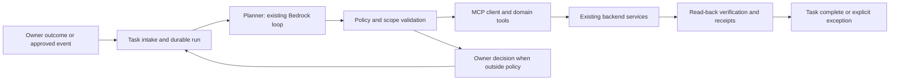

# Internal workspace agent: phased autonomous operation

Requested by the owner on 7 October 2026. Status: researched implementation plan; no autonomous production actions enabled. Build on `codex/workspace-audit-redesign-20261007`, keeping production `stack` separate. This extends the workspace audit and redesign in draft PR244.

## Intended outcome

The existing internal agent becomes the workspace's operational worker. An owner gives an outcome or enables a bounded recurring workflow once. The agent gathers context, makes a plan, executes permitted tools, verifies the result, records evidence, and closes the task. Ordinary eligible work must continue after the browser closes and must not require a human to click through pages or approve each step.

“Complete agent mode” means completing the entire eligible workflow, including failures and reconciliation. It does not mean treating model output as permission. Initial provider consent, revoked access, unresolved business decisions and actions outside the owner's policy remain explicit exceptions. Current repository prohibitions on payment mutations, ad activation, provider retirement, credential replacement and live-send flag activation remain in force.

## Existing implementation, checked first

| Component | Evidence | Reuse and gap |
|---|---|---|
| Workspace assistant | `src/components/FloatingAgent.tsx`, `src/components/dashboard/tabs/InternalChatTab.tsx` | Existing entry points; converge on one run/task interface rather than creating another assistant. |
| Internal AI settings | `src/pages/workspace/settings/internal-agent.tsx`, `/ai/internal/config` in `ai-config-management/handler.py` | Real GET/PUT configuration; static tool/default lists include actions the governed executor refuses. Replace with the server's effective capability catalog. |
| Active AI loop | `ai-generate-response/handler.py`: `_handle_internal`, `_internal_converse_with_tools`, `_execute_internal_tool` | Bedrock Converse with local function dispatch, five loop iterations by default. It does not dispatch through `src/lib/workspace-mcp.ts` or the workspace MCP protocol. A bounded HTTP conversation is not a durable task runner. |
| Tool governance | `shared/lambda_utils/agent/governance.py` | READ/PLAN/APPLY classification, per-tool refusal and subtractive kill switches. All APPLY entries remain disabled. Preserve the enforcement boundary when adding a policy-aware executor. |
| Plans and approvals | `shared/lambda_utils/agent/{plans,drafts,approvals}.py`, chat pending plans, `/ai/approvals` | Server-held plan hashes and approval records already exist. Approval currently does not enable execution. Exact plans must remain bound to their arguments, actor and catalog version. |
| Receipts | `shared/lambda_utils/agent/receipts.py` | Existing audit receipts are useful for refusals but fail open. The module explicitly says real side effects need a durable claim before execution and confirmation afterwards. |
| Workspace MCP | `ai/workspace-mcp/handler.py`, `src/lib/workspace-mcp.ts`, `docs/workspace-mcp.md` | Eight source tools: connection list/authorize/verify, provider read, AWS/GitHub status, bounded code-job submit/status. This is not yet an MCP catalog for every workspace operation. |
| MCP authentication | `owner_identity` in the MCP handler | Accepts the exact `wecare-admin` IAM user or validated staff Admin access tokens. No general worker-role identity/delegation path. Provider grants are keyed by this owner identity. A worker must not impersonate staff or fabricate JWT gateway claims. |
| Code jobs | `code_job_submit`, `code_job_status` | Narrow public-component patch workflow, gated dispatch; no production deployment. Do not extend it into unrestricted shell, repository, or cloud control. |

Live metadata in account **775261844268 / us-east-1**, captured **2026-10-07T03:46:49Z**: `wecare-ai-generate-response:live` is version **38**, `wecare-workspace-mcp:live` **10**, and `wecare-agent-action-group:live` **28**. The separate Bedrock agent `4UUQYFWX64` is **NOT_PREPARED**. There are **zero Step Functions state machines** and **10 SQS queues** in this region; names correspond to current messaging/blog/dead-letter pipelines, not a dedicated agent-run queue. Queue configuration/triggers were not audited here. Lambda list metadata reports the AI response function's unqualified timeout as 120 seconds; this is not a measurement of alias-version configuration. No models were invoked and no customer/provider data or secret values were read.

These checks establish resource state, not binary parity between deployed code and repository source. Phase 0 must verify exact deployed artifacts and integration targets before releasing anything.

## Recommended architecture

Reuse the custom Converse loop, existing Lambda services, and workspace MCP. Add a durable coordinator and a policy-enforced MCP client/tool adapter. A separate managed-agent migration is optional and is not a prerequisite. Compare AgentCore only if isolation, session duration or operational requirements justify its extra platform cost.

Use Step Functions **Standard** for durable multi-step coordination, bounded retries and waits. Its workflow execution semantics do not make external sends exactly once: each side-effect tool still needs its own idempotency claim and provider reconciliation. Use on-demand Lambda workers; add a dedicated queue only where buffering/concurrency needs justify it. Do not reuse bulk-message queues as an agent command queue. Keep deterministic event handling outside the model when no reasoning is needed.

The agent should call narrow domain tools through MCP, not manipulate the website's DOM. The UI observes tasks and exceptions. Codex desktop GitHub/AWS plugin authorizations are separate from the product's runtime MCP access; installing a desktop plugin does not connect the deployed workspace agent.

## Phase 0 — establish the capability and deployment baseline

**Deliverables:** one server-owned capability registry containing canonical operation IDs, aliases, input schemas, owner service, scope, READ/PLAN/APPLY class, deployment version, policy eligibility and truthful availability. Generate the settings/chat catalog from this registry. Record the differences between internal tools and MCP tools. Verify current API dispatch, auth, exact live aliases and rollback artifacts. Reconcile the pending MCP persistence deployment with the already merged source before relying on it.

Replace displayed-but-disabled controls and misleading all-enabled defaults with effective policy state. Check the approval UI's second-factor wording against actual handler behavior and the owner's staff password-only testing decision; do not silently re-enable MFA or change customer WhatsApp OTP.

**Exit gate:** every visible tool maps to a real, authenticated backend operation or an explicit unavailable reason; settings and model tools agree with execution. Existing READ/refusal/plan tests remain green. Nothing is enabled merely by editing a settings checkbox.

## Phase 1 — connect the internal agent to MCP

**Deliverables:** server-side MCP client with `initialize`, negotiated protocol version, `tools/list`, schema validation and `tools/call`. Prefer the same governed adapter for local domain tools and MCP tools. Handle both transport errors and MCP `isError`; reject unknown tools, extra arguments, cross-workspace IDs and unsafe URLs. Discover only allowlisted servers and pin the reviewed tool/schema versions.

Add a narrowly scoped workload IAM role path to the IAM endpoint and handler. Bind the authenticated worker to a server-held workspace delegation record with grant ID, owner, permitted providers/accounts/tools, expiry, policy version and revocation status. Check delegation on each action. Never accept an arbitrary owner ID or policy from model arguments. Review IAM trust, execute-api resource scope and existing grant ownership together; changing only the ARN allowlist is insufficient.

Reuse encrypted grant custody and provider adapters. Add refresh/reconnect status and recovery where each provider supports it. Authenticate the worker with renewable workload credentials, rather than keeping a staff browser token alive. Provider OAuth and system-user semantics are provider-specific: perpetual authorization cannot be promised. Store references, not credentials, in plans and model context.

**Exit gate:** an authorized read succeeds for the intended workspace/provider; another workspace, revoked delegation, wrong audience/principal, expired grant and changed tool schema are denied. Closing the staff browser does not terminate valid delegated work. Meta authorization/admission blockers remain visible and do not prevent unrelated providers from working.

## Phase 2 — persistent tasks and unattended read workflows

**Deliverables:** task intake and run/status/cancel APIs, durable task/run records, coordinator, worker leases and checkpoints. Start with bounded reads: summarize unread inbox items, identify stalled tasks/service requests, inspect failed deliveries, check connection health and prepare daily operational summaries. No outbound sends or mutations in this release.

Run lifecycle: `QUEUED → PLANNING → RUNNING → VERIFYING → COMPLETED`, with `WAITING_FOR_OWNER`, `BLOCKED_AUTH`, `RETRY_WAIT`, `FAILED`, `CANCELLED` and `PARTIAL` explicitly represented. Completion requires the outcome predicate and evidence, not a model's success sentence. Persist each step before proceeding; resume from committed checkpoints after a worker crash. A cancellation stops future steps and reconciles any in-flight effects.

**Exit gate:** a run survives browser closure, duplicate input delivery and worker restart; exhausted retries become a visible failure; no work disappears at Lambda timeout. Staff membership/policy revocation prevents further work. Scheduled workflows use declared cadence and data scope; no indiscriminate polling/scanning.

## Phase 3 — automatic internal operations under standing policy

**Deliverables:** policy grants approved once by the owner for named routine workflows. Add a separate executor behind the existing refusal boundary for individually reviewed operations: task creation/assignment, non-destructive task status changes, internal notes, and bounded contact-field corrections through their authoritative services. Do not enable all legacy APPLY branches as a batch.

Policy evaluation returns `AUTO`, `NEEDS_OWNER`, or `DENY`. An AUTO decision is server-generated evidence bound to policy version, actor/workspace, exact plan hash, record versions and limits. Require record existence, allowed fields, optimistic concurrency and a durable action claim before mutation. Read back and compare expected fields afterwards. An agent must not edit identity/provenance fields outside an explicit policy or mark an unrelated task done.

**Exit gate:** representative workflows finish without per-step approval; duplicate delivery causes one mutation; stale data/policy changes cause re-plan or refusal; unavailable receipt storage fails closed before the effect; every success has independently checked evidence.

## Phase 4 — end-to-end operational workflow coverage

**Deliverables:** capability packs for the audited workspace areas: Inbox, Contacts, Campaigns, Service Ops/Forms, Payments, Catalog/Store, Tasks, Content/SEO, Integrations and Platform. Each pack declares trigger, allowed outcome, tool chain, completion evidence, dependency failures, recovery and cost limits. See `internal-agent-capability-matrix-20261007.csv` for the initial scope.

Begin with internal task/triage flows and drafts. Customer-facing messages or calls require a separately authorized future messaging policy, provider consent/template/window checks, recipient scope, rate/volume limits and a proven claim/send/reconcile path. Current live-send restrictions remain enforced. Payment capture/refund/configuration, ad activation/budget changes, provider/phone retirement, credential replacement and production deletion stay unavailable under the present project policy. The agent may prepare a reviewable plan and gather evidence for permitted owner decisions.

**Exit gate:** each capability pack passes contract, authorization, duplicate/retry, verification and exception tests before being admitted. Dependency failures stay local to the affected workflow. Existing customer order/cart WhatsApp OTP and payment behavior remain unchanged.

## Phase 5 — agent-first workspace and sidebar

**Deliverables:** use the existing Tasks area as the central **Agent work** queue, with Overview, Running, Completed, Failed/Blocked and Needs owner filters. A run detail displays the requested outcome, policy, plan, current step, timestamps, verified result, source-record links and retry/cancel controls. Add a single command entry to the current assistant surfaces; task creation returns a run ID immediately.

Settings → Automation & AI contains connection health, allowed workflows, schedules, budgets and stop controls. Keep ordinary record pages for inspection/manual correction. Apply the short sidebar proposal from the workspace audit; avoid separate menus for each MCP server, agent prompt or backend Lambda. Owner intervention should be limited to meaningful exceptions, not operational clicks.

**Exit gate:** the owner can request an outcome, leave, return and inspect the final evidence; blocked access identifies the exact reconnect action; accessibility/mobile and role tests pass; user-facing completion/error states agree with durable backend state.

## Phase 6 — shadow testing, rollout and measured autonomy

**Deliverables:** replay sanitized representative workflows in shadow mode, compare expected plans without effects, then pilot internal reversible writes. Run adversarial cases: instructions embedded in customer messages/tool results, ambiguous contacts, changed records, revoked grants, unknown tools, provider timeouts, duplicate events, crash after effect, missing receipts and cost-limit exhaustion. Pilot one reviewed capability pack at a time; keep subtractive per-workflow/global stop controls.

Track verified completion rate, owner intervention rate, incorrect mutations, duplicate effects, recovery time, tool/model spend and record-read counts. Proposed initial release gate: 50 representative internal workflow cases, zero unauthorized effects, zero duplicate effects, 100% completed runs carrying verifiable receipts, and at least 90% completion without intervention among eligible cases. These are targets, not current measurements; report blocked/ineligible work separately. Exact test mix and limits must be selected during implementation.

**Exit gate:** deployment artifacts and rollback are captured, monitoring covers failures and stalled leases, canary results satisfy the agreed gates, and rollback/stop behavior is tested. Do not claim complete workspace autonomy while any capability pack lacks an admitted backend tool or required provider authorization.

## Runtime contract and recovery rules

Persist `runId`, workspace/actor/delegation IDs, trigger deduplication key, outcome predicate, policy/catalog versions, plan hash, state, step number, lease/fencing token, timestamps, attempts, deadlines and budget consumed. Store sensitive content in scoped storage references; exclude raw tokens, secrets and unnecessary customer text from logs/prompts.

Each action stores an immutable argument hash, idempotency key, preconditions, provider/service request ID and evidence. Claim with conditional writes before effects. If a provider times out after accepting an action, record `UNKNOWN` and reconcile by request ID; never blindly resend. Retry only documented transient failures with backoff and bounded attempts. Missing/ambiguous evidence gives PARTIAL/FAILED, not COMPLETED. Staff grant removal and the emergency stop block new effects while allowing necessary reconciliation.

No shell or unrestricted AWS/GitHub tool is exposed to the model. Provider text, retrieved documents, patches and customer messages are untrusted data, not authority. Tool outputs cannot grant permissions or change the system's policy. Account remains 775261844268 and deployment region us-east-1.

## Cost and delivery sequencing

Reuse existing configuration, conversation and audit infrastructure where contracts fit; add durable run/action storage where the current fail-open audit sink cannot enforce execution. Reuse existing domain services instead of duplicating CRUD writers. Start with on-demand compute, bounded indexed reads, small explicit model output limits and deterministic event routing. Add per-run token/tool/read caps, daily workspace spend limits and reserved concurrency; never invoke a model continuously just to check whether work exists.

Estimate monthly incremental cost from measured runs × model input/output usage, workflow transitions, Lambda duration/requests, database reads/writes and log/storage retention. No numerical saving or new platform budget is claimed without workload measurements. A new managed agent, vector store, container or gateway is not required for the initial phases.

Implement in order: **0 → 1 → 2 → 3 → 4 → 5 → 6**. UI scaffolding in phase 5 can proceed alongside phase 2 once task contracts stabilize. Each production phase rediscovers live resources and has its own exact-tree tests/release record. Existing pending production approval blocks do not become approved through this plan.

## Research sources and evidence limits

- AWS [Converse tool-use flow](https://docs.aws.amazon.com/bedrock/latest/userguide/tool-use-inference-call.html) explains model tool requests and application-supplied results. The policy/verification design above is our architectural recommendation, not a property automatically supplied by Converse.
- AWS [Standard versus Express workflows](https://docs.aws.amazon.com/step-functions/latest/dg/choosing-workflow-type.html) supports durable Standard coordination and the execution-semantics distinction. External action idempotency remains an application responsibility.
- MCP [authorization specification, 2025-06-18](https://modelcontextprotocol.io/specification/2025-06-18/basic/authorization) describes HTTP resource authorization and audience binding. This is a versioned reference, not a claim that it is the latest protocol version; negotiate the version supported by this workspace.
- `docs/execution/internal-agent-live-metadata-20261007.json` contains this turn's successful metadata API evidence. No signed-in agent/MCP execution, provider consent flow, complete IAM simulation or deployed code download was performed.
