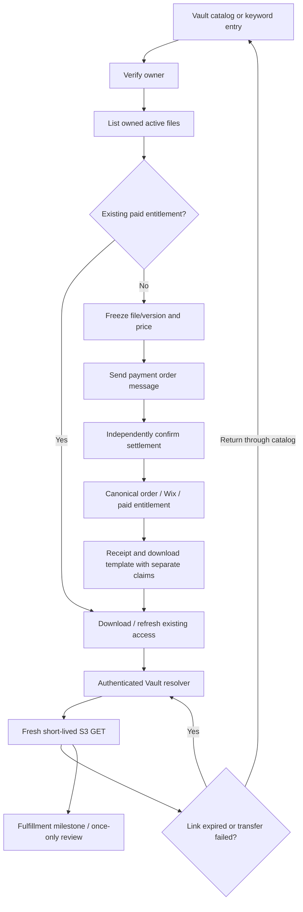

# Vault payment, delivery and renewable downloads — audit and implementation handoff

Status: **PARTIALLY COMPLETE — implementation specified, not activated**.
Observed 9 October 2026. Source checkpoint e9e377ce01598877af867da16b989abd6ea40234; previous exact-commit CI green and Amplify1503 SUCCEED. Fresh source fetch has no divergence. This follow-up changes documentation only: no new charge, provider settings, customer sends, entitlement writes, release activation or Lambda deployment.

## 1. Customer journey and message order

Vault remains one catalog service, not a new Flow and not a public listing of private customer files. The customer sees a short product description: “Access and download your documents.” Wix variant dcff995e-448c-493a-9259-f6a82ccdc2b4 supplies ₹49; load/freeze actual server pricing and applicable fee before payment.

1. Customer selects Vault in the WhatsApp catalog or sends the Vault keyword.
2. Verify permanent customer identity and current trusted WhatsApp/contact binding.
3. List only active customer-owned private files. For a previously paid file, show Download/Refresh access and its existing order number; do not create another purchase.
4. For an unpaid file, freeze the selected file/version, Wix variant and quote on a logical intent/payment attempt. A generic catalog cart without a bound private file must prompt selection, not charge blindly.
5. Send wecarepay_wa order-details message. This is a payment request, not proof of capture or a final receipt.
6. Independently confirm the exact provider payment, amount, currency, reference and owner. Create/reuse canonical paid order and idempotent Wix writeback.
7. Resolve/create the paid file entitlement once. Preserve the customer-visible order number and request/file association.
8. Resolve/send the existing canonical receipt through its own delivery claim.
9. Send wecare_default_download to the same verified customer. Its Access Vault button points to the stable authenticated file entry.
10. Customer signs in if needed; server verifies owner, paid entitlement, file version/status and revocation before issuing a fresh short-lived S3 GET.
11. Optionally send an actual document attachment only under a verified message-window/approved DOCUMENT-template contract. The IMAGE-header download template cannot carry a PDF header.
12. Schedule a deduplicated review follow-up after the chosen fulfillment milestone. Failure to send the review never invalidates payment/download access.

Receipt and download have independent idempotency/recovery states. A receipt-send failure must not indefinitely block paid access. Record each operation and reconcile rather than re-charge.



## 2. Freshly verified current facts

| Component | Current observation | Meaning |
|---|---|---|
| Business API | live89, r+k6k2WhMDaNbYzFfax39Zi/1e/ckqg8ad891fvCu3E= | Prior diagnostic repair remains live; unchanged in this follow-up |
| Secure Files | live34, 6l0bIzOc/6StE2ttnhIEhZdIlSnks/PllJdyYTlRnZ8= | Ownership and bounded link primitives deployed |
| Checkout | live41, kfqE0FcwNlzWfzpA2asO9hi8NU27YHouMTixzHFT1F8= | Preserve concurrent checkout work |
| Web signed URL | DOWNLOAD_URL_TTL_SECONDS=60 | Current URL duration, not duration of paid entitlement |
| WhatsApp direct link | environment21600; source clamp60–900 | Effective source limit900 seconds; raw environment value is stale |
| Legacy grant | GRANT_TTL_SECONDS=1800 | Legacy payment grants contain expiresAt |
| DownloadGrantsTable | TTL ENABLED on expiresAt | A paid-entitlement record must not accidentally inherit ephemeral/legacy expiry semantics |
| Deterministic Wix Vault grant | source paid=true, consumed=false, no expiresAt | Financial owner/file association exists; renewal still absent |
| Dynamic download template gate | unset/off | Approved template availability is not enabled automation |
| Legacy independent secure-file payment | SECURE_FILES_PAYMENT_ENABLED=false | Do not enable a second payment path to work around missing native delivery |
| Native/writeback gates | unset/off | End-to-end customer purchase remains gated |

Fresh IAM-only readiness read confirms these three templates are APPROVED in en:
- wecarepay_wa —1783774039408860; IMAGE header, ORDER_DETAILS button “Review and Pay”.
- wecare_default_download —1410998911012572; IMAGE header, URL button “Access Vault”, URL https://wecare.digital/vault/?file={{1}}.
- wecare_leave_review —1801972550682516; IMAGE header, FLOW button bound to published review1578178897413815.

No actual customer send was made. Source/private-file path inspection and template approval do not certify delivered PDF or download on a handset.

## 3. Exact template contract

Approved download body: “📄 Your document is ready — tap below to download!”
Footer: WECARE.DIGITAL.
Button: Access Vault.

The URL button variable must contain the validated file identifier only. For example, a non-secret file pointer file_abc produces https://wecare.digital/vault/?file=file_abc. This pointer locates the file; it does not authorize download. Do not put an S3 signed URL, grant secret, Cognito sub or arbitrary redirect into this placeholder.

Existing internal sender contract:

```json
{
  "contactId": "<server-resolved-current-contact>",
  "recipientPhone": "<verified-account-phone>",
  "phoneNumberId": "<verified-owning-business-sender>",
  "isTemplate": true,
  "templateName": "wecare_default_download",
  "templateParams": [],
  "headerImageUrl": "<approved-public-brand-image>",
  "templateUrlButton": {
    "index": 0,
    "suffix": "<validated-owned-file-id>"
  }
}
```

The sender builds a Cloud API URL button with sub_type=url, index0 and a text suffix. Match the approved template exactly; it has no BODY variables. Payment details separately contain the selected Vault item, authoritative total and stable reference. Do not substitute a raw S3 hostname for the approved Vault base URL.

Current paid_vault.py sends wecare_share_pdf while the dynamic flag is off; when on, it selects wecare_default_download. wecare_share_pdf has an IMAGE header, so actual PDF delivery is a separate document message, gated by last inbound time. Legacy secure-files delivery uses wd_file_delivery; this follow-up did not confirm that legacy template’s live format/approval. Do not interchange these contracts.

## 4. New confirmed audit gaps

VAULT-01 / P1 / CONFIRMED: _redeem and _redeem_after_reconcile consume the paid grant before the client performs the S3 GET. A URL expiring or transfer failing does not undo consumed. _customer_list exposes paidGrantId only when unconsumed; the UI offers support for already-paid access. Automatic same-purchase renewal through catalog/Vault is not implemented. Some failure responses still instruct “Please pay again.” That conflicts with the requested no-second-charge recovery.

VAULT-02 / P2 / CONFIRMED: legacy send_download_link text claims the S3 URL can be used once. An S3 presigned GET can be used repeatedly until expiry; only the application grant consumption is one-time. It does not prove bytes were downloaded. Correct wording and telemetry are required.

VAULT-03 / P2 / CONFIRMED: the legacy helper comment assumes paying opens the free-form customer-service window. The native paid_vault path checks lastInboundMessageAt, but payment itself must not be used as universal window evidence. Use approved templates outside the current inbound-message window; do not force a plain message retry.

VAULT-04 / P2 / CONFIRMED: catalog owned-file selection excludes paid files and purchase preparation rejects them. That is correct protection against a second charge, but it needs a separate paid access/resume branch. Returning through the same catalog must show paid downloads instead of only refusing or hiding them.

VAULT-05 / P2 / CONFIG DRIFT: raw direct-link TTL is21600 while handler34 clamps900. This is not proof of a six-hour link exposure; preserve the runtime bound and reconcile the environment/documentation in a separately guarded config change.

## 5. Paid entitlement versus temporary transport

Paid entitlement is durable authorization for one purchased file/version under the active retention/revocation policy. It must retain canonical order/payment proof and permanent owner. A temporary download token/URL is transport authorization, with expiry, issuance ID and limited scope. Download sessions may expire or be rate-limited without erasing financial entitlement.

“Always return through catalog” means a stable re-entry for the existing paid file while it remains available and authorized. It does not promise infinite storage retention or access after revocation/deletion. An intentionally new file/version/service may require a distinct purchase, visibly explained; link expiry alone never does.

Proposed resolver contract (implementation pending):
1. Authenticate current account; read current contact, file and paid association consistently.
2. Resolve canonical paid order/payment reference, not a client-provided paid=true.
3. Reject foreign/deleted/recreated-owner/revoked/inactive/missing evidence with a generic unavailable response; offer supported reconciliation without a new charge.
4. If entitlement valid, issue a new short-lived download session. Deduplicate client retry by request ID; rate-limit renewal. Do not reset consumed on an old grant globally.
5. Generate fresh S3 GET at the moment of download, retaining current60-second web TTL unless a reviewed usability test justifies a bounded adjustment.
6. Keep raw URLs out of logs/analytics, use HTTPS, no-store and appropriate referrer protection, validate Content-Disposition filename and content type.
7. Show expired-link recovery in the authenticated Vault page and keyword/catalog route. No payment provider call, new order, Wix payment write, invoice creation or GST advance in renewal.
8. Define telemetry precisely: URL_ISSUED is not DOWNLOAD_COMPLETED. Current downloadCount increments when a URL is issued; rename/migrate interpretation or add explicit transfer evidence without pretending the existing counter proves a completed download.

A raw S3 URL is a bearer capability. A forwarded raw URL may work until expiry; opening the stable Vault pointer must require the correct account. URL expiry cannot revoke a previously downloaded PDF or an already delivered WhatsApp attachment.

## 6. Implementation work packages in order

| Step | Files/components | Required implementation | Acceptance / proof |
|---|---|---|---|
| V1 | vault_access.py, secure-files handler, table schema/IaC | Separate durable paid authorization from ephemeral grant/download sessions; preserve existing payment evidence and legacy migration | Captured/paid file still renewable after URL expiry, original grant consumption and TTL cleanup; no ownership transfer |
| V2 | secure-files resolver/list and API client | Owner-bound renewal/status API; expose paid access even after old session consumed; precise rejection/recovery errors | No provider/payment calls; foreign/disabled/revoked denial; duplicate retry converges; bounded rate limits |
| V3 | VaultFilePurchase.tsx, catalog_services.py, keyword routing | Same Vault catalog returns unpaid purchase or paid download branch; remove one-download/pay-again misleading text; preserve selected-file sign-in return | Correct same WhatsApp identity on web/native; expiry/failure gets Refresh access; no second ₹49 intent |
| V4 | paid_vault.py and outbound/legacy helpers | Match approved download template; safe verified-recipient/window handling; classify accepted/delivered/unknown/rejected | Approved IMAGE URL contract; no raw S3 suffix; no plain message outside window; unknown send held |
| V5 | checkout/provider settlement/Wix writeback/invoice | Complete independent settlement and canonical order/writeback; receipt and access each independently recoverable | Double tap/event dedup; paid precedence; receipt failure does not block entitlement; no duplicate Wix order/invoice |
| V6 | CRM/Orders projections and review follow-up | File/order/payment/entitlement/session/delivery state visible; review after explicit fulfillment milestone | Website+WhatsApp same order number/UUID; no raw tokens; distinct send/download states; dedup review |
| V7 | durable catalog approval queue/API readback | Four paid product mappings, six shared artwork assets, both WABAs/new dataset verification | Revision-approved exact apply; no private file catalog entries; no synthetic Purchase; safe stock gate |
| V8 | exact packages and guarded deployment | Hash/revision checks, preserve members and auth/permissions; captures/refunds/secrets excluded | Focused/full gates, candidate deny/read-only smoke, immutable version, alias rollback, no blind old-package overlay |
| V9 | owner-paid QA | Supported account link for +918100640044; owner completes payment | Actual ₹49 journey, receipt, approved link, completed download, expiry and catalog re-entry without another charge |

Paid service engineering is not finished by approval of a template or a test-only resolver. Update all status records after each package and keep remaining work precise.

## 7. Required test matrix

- Unpaid owned file: selected file/variant/quote fixed before payment; receipt and download only after exact verified settlement.
- Existing paid file: first download, second visit, expired URL, interrupted/restarted transfer, consumed prior grant and old TTL-deleted session all renew the same entitlement without a new charge.
- Catalog re-entry/keyword/website link: same owner/file/version shows Download; a generic Vault cart has no silent arbitrary-file selection.
- Foreign file, same phone/new Cognito sub, deleted/recreated contact, revoked file/grant, wrong version/payment amount/reference: deny, no tokens, no provider effects.
- Double tap, two concurrent renewals, duplicate/delayed settlement: no second order/reference/entitlement; new temporary sessions only under explicit bounded policy.
- Receipt failure, download notification failure, missing PDF derivative, stale CLAIMED or SEND_UNKNOWN, provider timeout and closed message window: preserve paid state, expose reconciliation, no blind retry/charge.
- Forwarded stable link requires correct account; forwarded raw S3 URL is explicitly a short-lived bearer URL, not falsely “single use”.
- Test URL_ISSUED separately from actual completed download; an already saved attachment cannot be revoked by expiring the source URL.
- Document template format and chosen sender/WABA verified live before sending; test current consent/window/opt-out contracts.
- Customer sees same canonical order/customer UUID on website and WhatsApp; internal Wix IDs remain internal.

Current follow-up verification:121 existing targeted tests pass. No implementation test for renewable paid access exists yet because that behavior is not implemented. Prior full suite results remain historical evidence of e9e377ce, not proof of this proposed renewal feature.

## 8. Storage, privacy and cost

Reuse wecare-digital-get; keep files in registered private secure/u or secure/d paths. Public4096px artwork lives under o/catalog/services/{slug}/v1/image-4096.png. No new bucket or per-customer catalog product is needed.

Retain encryption at rest, TLS, Block Public Access/private origin guard, least-privilege owner-checked access and private-prefix edge denial. Signed URLs grant temporary access, not public bucket permission. Renewing access causes additional storage requests and downloads/data transfer; retained object versions/derivatives also consume storage. Do not introduce version proliferation or repeatedly copy the same PDF to issue a new link. Current charges depend on region/storage class/transfer volume; no account-wide cost estimate was performed here.

## 9. Primary research references

- [AWS S3 presigned URLs](https://docs.aws.amazon.com/AmazonS3/latest/userguide/using-presigned-url.html): time-limited bearer access, repeatable until expiry, temporary-credential lifetime may shorten expiry; a running transfer may continue past expiry but a restart after expiry fails.
- [AWS S3 security best practices](https://docs.aws.amazon.com/AmazonS3/latest/userguide/security-best-practices.html): private access, encryption and permission boundaries.
- [S3 pricing](https://aws.amazon.com/s3/pricing/): requests/storage/transfer costs; no invented rupee estimate.
- [Meta URL button parameter reference](https://whatsapp.github.io/WhatsApp-Nodejs-SDK/api-reference/types/button_parameter_object/): dynamic suffix appended to approved prefix. This older SDK reference describes parameter semantics; actual current approved template was independently read through Graph.
- [WhatsApp Business Messaging Policy](https://whatsappbusiness.com/policy/): inbound user messages govern24-hour free-form window; approved templates outside it.

## 10. Safe continuation / rollback

This follow-up is documentation and read-only inspection only. There is no new production rollback. Prior diagnostic rollback remains89→88 with fresh alias revision, only if that change itself fails.

For future renewal repair: capture current secure-files34 and other live hashes/alias revisions again; package from actual current deployment, add only reviewed modules, publish immutable candidate, verify denial/renewal offline then guarded live alias move. Rollback code must not destroy paid entitlement/payment evidence; retain compatibility so old code cannot demand another payment for already-purchased access. Keep native gates closed until V1–V9 are proven.

## ChatGPT Vault V1/V2 production update — 2026-10-09 11:04 UTC

Status: **PARTIALLY COMPLETE** — Vault V1/V2 engineering is deployed; real owner/customer payment and recovery QA is still required before customer-facing gates may open.

- Source checkpoint before handoff docs: `3b9faffd3686c0c5be51a8f046592a8c4680087c`.
- Implemented durable non-TTL `VAULT_ENTITLEMENT` records, separate TTL `VAULT_DOWNLOAD_SESSION` records, lazy migration of historical paid/consumed grants, website **Download / Refresh Access**, and native paid-file refresh routing.
- Transport expiry/interruption no longer consumes the financial purchase; every refresh rechecks permanent customer identity, file ownership/status and active entitlement.
- Verified-payment finalization now creates/links entitlement once. Duplicate webhook/idempotency behavior remains pinned by tests.
- Vault review invitation moved from payment/notification time to the first authenticated download-session milestone and uses persisted `vaultReviewStatus` duplicate suppression.
- Production deploy: `wecare-secure-files` **v35**, SHA `TsxFbPJSg+w+LQ6FOKJfvb/HP5j6x0Ldx/4Fk5e9yF0=`, rollback **v34**; `wecare-whatsapp-business-api` **v92**, SHA `vdj3fItIrPi3Hb3x4PthvTDpyC01yDVG88cwtx+pFfQ=`, rollback **v91**. Both `live` aliases match `$LATEST`, State Active, LastUpdateStatus Successful.
- Release controls remain closed: `SECURE_FILES_PAYMENT_ENABLED=false`; `VAULT_DYNAMIC_DOWNLOAD_TEMPLATE_ENABLED`, `WHATSAPP_CATALOG_SERVICES_ENABLED`, `WIX_WRITEBACK_ENABLED`, `WIX_ECOM_WRITE_CONFIRMED` unset.
- Tests: full Python **10,376 passed / 7 skipped / 3 xfailed**; focused Vault deploy suite **124 passed**; frontend **126 files / 1,607 passed / 2 skipped**; production build and typecheck PASS; lint **0 errors / 191 warnings**. The known Contact map check remains report-only at 12/13.
- Fresh live provider readback after deploy: Submit Flow `1107164111921876` PUBLISHED; templates `wecarepay_wa` `1783774039408860`, `wecare_default_download` `1410998911012572`, and `wecare_leave_review` `1801972550682516` all APPROVED. Download URL contract remains `https://wecare.digital/vault/?file={{1}}` with authoritative `fileId`.
- Fresh Wix V3 readback: product `df976a0a-f582-4535-b2e1-d532f348bd27` revision 5; Submit ₹99 `e9f0...`, Amendment ₹99 `864f...`, Drop Docs ₹350 `db166...`, Vault ₹49 `dcff...`, all visible/in stock.
- No real customer message or payment was sent in this implementation session. Owner QA must prove ₹49 settlement → canonical order/Wix where enabled → entitlement → authenticated download → expiry/interruption → refresh with **no second charge** before opening customer-facing release gates.


## ChatGPT Orders/catalog production update — 2026-10-09 12:50 UTC

Status remains **PARTIALLY COMPLETE**. Vault V1/V2 remains deployed and closed for owner QA; this phase deployed the next backend-only increments without opening customer-facing gates.

- Current reconciled source checkpoint before this documentation update: `8109471f74e09dcef4958d34343f9ca923ac740a`.
- Orders/customer profile: backend-owned contextual actions and owner-scoped support handling are now deployed in `wecare-whatsapp-business-api:live` **v93**, SHA `erEMzmiJg7rNjwU1iTb+vR1aEQ4FDTjqfAfSW5lujAQ=`; rollback **v92**.
- Meta catalog sync: exact approved-plan hash interlock is deployed in `wecare-meta-catalog-sync:live` **v8**, SHA `he0Y8MPVNwBY4r2dZnD5cEEvIfkwVHsd6j+kUex4fNQ=`; rollback **v7**. Runtime remains fail-closed: `META_CATALOG_SYNC_ENABLED=false`, `META_CATALOG_SYNC_DRY_RUN=true`, `META_CATALOG_SYNC_FORCE_OUT_OF_STOCK=true`, approval hash unset.
- Fresh Meta readback through live Business API: Submit Flow `1107164111921876` PUBLISHED with validation_errors=[]; `wecarepay_wa` `1783774039408860`, `wecare_default_download` `1410998911012572`, and `wecare_leave_review` `1801972550682516` remain APPROVED. Orders `2167802357142172`, Amendment `3678132465672138`, Drop Docs `1211063631104445`, Shipments `849713848195607` remain DRAFT with validation_errors=[].
- Fresh Wix Catalog V3 readback: product `df976a0a-f582-4535-b2e1-d532f348bd27` revision 5, visible/in stock. Exact variants/prices confirmed: Submit ₹99 `e9f0eb8b-ca76-4b4f-b00c-be909c02bb2b`; Amendment ₹99 `864fc9a7-c326-4b4d-b0e5-6dc0ea5b764b`; Drop Docs ₹350 `db166bc8-a763-41ec-9f65-0f718f18155a`; Vault ₹49 `dcff995e-448c-493a-9259-f6a82ccdc2b4`.
- Deployment was preceded by focused regression tests in the one-shot workflow; the deployment completed SUCCESS. Temporary workflow and exact-scope OIDC role were deleted afterward.
- Customer release remains closed. No real customer payment, send, Flow publication, Meta catalog item write, Wix order writeback, or synthetic Purchase event was performed.
