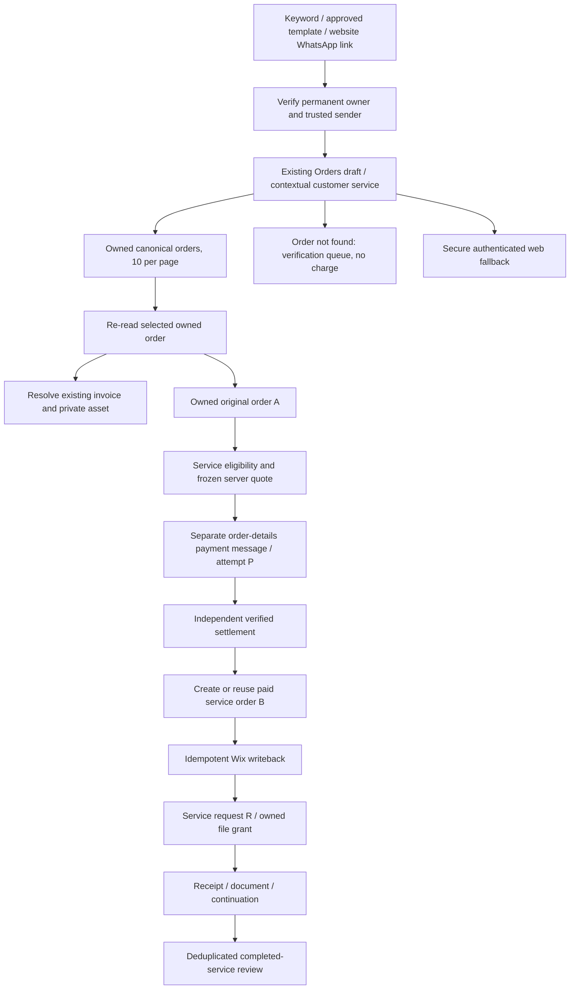

# WhatsApp customer service architecture — current checkpoint, 9 October 2026

Status: **PARTIALLY COMPLETE**. This is a hybrid destination architecture with explicit implementation boundaries. Audit baseline: d03ac81dfda8d1a5da461f01b4005559b2a3ada4; Business API diagnostic repair subsequently deployed as live89. Nine scoped Lambdas and seven financial/service tables were inspected. This does not certify the whole AWS account.

## Current implementation and safe customer entry

Reuse Orders draft **2167802357142172** rather than create another overlapping hub. It contains eight screens, profile summary, owned order pagination/detail, missing-order help and existing-invoice copy actions. Meta reports DRAFT and zero validation errors. It is not a published, fully routed customer-service hub. Submit Request **1107164111921876** and Review **1578178897413815** are PUBLISHED. Amendment, Drop Docs and Shipments design/legacy drafts remain drafts. Vault requires no separate Flow.

Trusted inbound sender/contact starts an expiring opaque session. Each action rechecks the permanent verified Cognito owner and trusted phone association. Customer-visible UUID is distinct from permanent Cognito sub; caller-selected phone, UUID or order number is never ownership proof. QA contact for +918100640044 currently lacks checkoutCustomerId and customerUuid. Repair through supported account verification, never by fabricating identifiers or matching a recreated contact on phone alone.

Profile summary exposes only the requested minimum. Name/address edits use current-owner conditional writes; phone and UUID remain immutable. Email verification and complex/sensitive recovery retain secure website fallback. Account summary is not permission to broadcast full addresses in ordinary chat.

The lower paid-service sequence is the release contract, not a claim that every native step is complete. Native-service, Wix writeback and dynamic Vault flags remain unset/off; Drop Docs attachment flag is false. Payment configuration is active on both WABAs; activation is separate from completed fulfillment.

## Canonical ownership and record model

| Record | Authority / role | Customer presentation |
|---|---|---|
| Permanent owner | Verified Cognito sub plus trusted contact binding | Public Customer UUID, never internal sub |
| A: original order | Singular OrderTable, customer-owned | Existing public order number |
| B: service purchase | New paid service order after independently confirmed payment | Separate website-style public order number |
| P: attempt / provider reference | PaymentAttemptsTable, frozen price and stable reference | Current pending/paid/recovery state |
| R: request | ServiceRequestsTable or FlowSubmission verification intake | Request number/status concerning A, linked to B/P |
| Wix mapping | WixOrderIds and canonical external-order completion fields | Wix IDs stay internal |
| Invoice | InvoicesTable / InvoiceAssetsTable existing financial identity | Receipt/invoice copy, no new financial invoice |
| File / grant | Secure-files record, permanent owner and paid entitlement | Authorized download/document delivery |

A missing or ambiguous A must not be replaced with B. Missing-order intake saves a verification item with public customer UUID and explicit awaiting_order_verification status/tags, without a charge. Service-specific projection and native action binding still need completion. Contact deletion/recreation must not transfer old order/file ownership to a new permanent account; guarded history/reconciliation remains authoritative.

## Services, keywords and release boundaries

| Entry | Price source | Current native status | Required next work |
|---|---|---|---|
| Orders / Customer ID | Utility | Owned text routing and Orders draft adapter exist | Verified QA identity, draft route/publish readiness, contextual actions |
| Submit Request | Wix variant ₹99 | Published paid-detail Flow; native orchestration gated | Verified A/B/P/R, terminal retry/resume, writeback and actual QA |
| Request Amendment | Wix variant ₹99 | Drafts exist | Eligibility/target binding and paid continuation contract |
| Drop Docs | Wix variant ₹350 | Drafts; encrypted picker and attachment gate closed | Validate account picker protocol; decrypt/register owned private media and CRM projection |
| Vault | Wix variant ₹49 | Secure ownership/payment/grant primitives; repayment guard deployed | Native selection, enabled safe writeback/delivery, actual paid QA |
| Shipments | No paid SKU invented | Utility design draft | Owned tracking contract and QA |
| Leave Review | Utility | Published review Flow / approved template | Verify automatic milestone and duplicate suppression in real journey |

Keywords are entry points into verified server state, not proof of ownership/payment. Website buttons may send a keyword into WhatsApp; such a link does not directly bypass the message-routing/session process to launch a native Flow. Preserve existing working review entry and website routes.

## Files, images and delivery

Six 4096px catalog artworks use the existing bucket **wecare-digital-get** under **o/catalog/services/{slug}/v1/image-4096.png** (letter o). Slugs: submit-request, request-amendment, drop-docs, vault, shipments, leave-review. The four paid Wix variants propose these artwork URLs; utility actions have no invented price.

Private incoming media is under secure/u/whatsapp/incoming/; service material under secure/u/service-requests/ and secure/u/dropdocs/; delivery under secure/d/. Existing invoice assets use secure/stack/invoices/wecare-digital-&lt;reference&gt;.png. Customer uploads must be decrypted, validated, registered against owner/order/request and tagged before staff use. The current encrypted picker contract is not certified, so keep attachment activation closed. Never put customer documents under public artwork folders.

Bucket uses private OAC access; deployed origin-response edge function rejects secure/ prefix. A real private-key metadata-based anonymous probe returned302 to homepage and did not serve the object. OAC bucket policy alone does not prove viewer privacy; preserve the edge guard. Signed URLs are temporary bearer grants, not permanent identity.

Existing-invoice copy rechecks selected owned order → reference → single authoritative invoice → private IMAGE asset; sends only to the server-derived verified recipient using the approved template. Conditional per-customer/order/UTC-day claim prevents repeat sends. Accepted send is not delivery proof. No invoice generation, new GST number, capture/refund or customer send occurred in this audit.

## Catalog automation and deployment

Fresh catalog **1457045652952851** has zero current items; sync live7 can read it and proposes four Wix variants with no blocks and applied0. Sync remains disabled/dry-run/out-of-stock. Build a durable per-revision proposal/approval/apply/readback queue; do not mistake read-only proposals for approved applied products. Both-WABA attachment and dataset connection remain live verification work. Dataset **4554612361454941** is the only intended new dataset; configured source is not proof of delivered/matched events. Do not emit synthetic Purchase to hide warnings.

Scoped deployment: Business API89, secure-files34, service-requests5, catalog-sync7, checkout41, profile10, orders7, inbound92, messages-read29. Preserve concurrent newer work and compare revision/hash before every change. Immediate diagnostic rollback is89→88 with a fresh alias revision. No provider payment settings, published Flow content, financial records or release flags were changed here.

## Latest Vault implementation boundary

Owner now requires repeated same-catalog access to the existing paid file when a temporary URL expires or download fails. This is NOT IMPLEMENTED: current consumed grant permits one redemption, paid re-entry directs to support, and catalog selection excludes paid files. Separate durable paid entitlement from short-lived sessions; preserve no-second-charge and permanent-owner checks. Approved template points to authenticated Vault/?file=<fileId>, which must resolve a fresh private S3 URL. Read vault-payment-download-implementation.md and xcodex-new-session-full-prompt.md for V1–V9 and exact acceptance tests. Link expiry does not revoke the payment or a saved PDF.

## ChatGPT Vault V1/V2 production update — 2026-10-09 11:04 UTC

Status: **PARTIALLY COMPLETE** — Vault V1/V2 engineering is deployed; real owner/customer payment and recovery QA is still required before customer-facing gates may open.

- Source checkpoint before handoff docs: `3b9faffd3686c0c5be51a8f046592a8c4680087c`.
- Implemented durable non-TTL `VAULT_ENTITLEMENT` records, separate TTL `VAULT_DOWNLOAD_SESSION` records, lazy migration of historical paid/consumed grants, website **Download / Refresh Access**, and native paid-file refresh routing.
- Transport expiry/interruption no longer consumes the financial purchase; every refresh rechecks permanent customer identity, file ownership/status and active entitlement.
- Verified-payment finalization now creates/links entitlement once. Duplicate webhook/idempotency behavior remains pinned by tests.
- Vault review invitation moved from payment/notification time to the first authenticated download-session milestone and uses persisted `vaultReviewStatus` duplicate suppression.
- Production deploy: `wecare-secure-files` **v35**, SHA `TsxFbPJSg+w+LQ6FOKJfvb/HP5j6x0Ldx/4Fk5e9yF0=`, rollback **v34**; `wecare-whatsapp-business-api` **v92**, SHA `vdj3fItIrPi3Hb3x4PthvTDpyC01yDVG88cwtx+pFfQ=`, rollback **v91**. Both `live` aliases match `$LATEST`, State Active, LastUpdateStatus Successful.
- Release controls remain closed: `SECURE_FILES_PAYMENT_ENABLED=false`; `VAULT_DYNAMIC_DOWNLOAD_TEMPLATE_ENABLED`, `WHATSAPP_CATALOG_SERVICES_ENABLED`, `WIX_WRITEBACK_ENABLED`, `WIX_ECOM_WRITE_CONFIRMED` unset.
- Tests: full Python **10,376 passed / 7 skipped / 3 xfailed**; focused Vault deploy suite **124 passed**; frontend **126 files / 1,607 passed / 2 skipped**; production build and typecheck PASS; lint **0 errors / 191 warnings**. The known Contact map check remains report-only at 12/13.
- Fresh live provider readback after deploy: Submit Flow `1107164111921876` PUBLISHED; templates `wecarepay_wa` `1783774039408860`, `wecare_default_download` `1410998911012572`, and `wecare_leave_review` `1801972550682516` all APPROVED. Download URL contract remains `https://wecare.digital/vault/?file={{1}}` with authoritative `fileId`.
- Fresh Wix V3 readback: product `df976a0a-f582-4535-b2e1-d532f348bd27` revision 5; Submit ₹99 `e9f0...`, Amendment ₹99 `864f...`, Drop Docs ₹350 `db166...`, Vault ₹49 `dcff...`, all visible/in stock.
- No real customer message or payment was sent in this implementation session. Owner QA must prove ₹49 settlement → canonical order/Wix where enabled → entitlement → authenticated download → expiry/interruption → refresh with **no second charge** before opening customer-facing release gates.

## ChatGPT Orders/catalog production update — 2026-10-09 12:50 UTC

Status remains **PARTIALLY COMPLETE**. Vault V1/V2 remains deployed and closed for owner QA; this phase deployed the next backend-only increments without opening customer-facing gates.

- Current reconciled source checkpoint before this documentation update: `8109471f74e09dcef4958d34343f9ca923ac740a`.
- Orders/customer profile: backend-owned contextual actions and owner-scoped support handling are now deployed in `wecare-whatsapp-business-api:live` **v93**, SHA `erEMzmiJg7rNjwU1iTb+vR1aEQ4FDTjqfAfSW5lujAQ=`; rollback **v92**.
- Meta catalog sync: exact approved-plan hash interlock is deployed in `wecare-meta-catalog-sync:live` **v8**, SHA `he0Y8MPVNwBY4r2dZnD5cEEvIfkwVHsd6j+kUex4fNQ=`; rollback **v7**. Runtime remains fail-closed: `META_CATALOG_SYNC_ENABLED=false`, `META_CATALOG_SYNC_DRY_RUN=true`, `META_CATALOG_SYNC_FORCE_OUT_OF_STOCK=true`, approval hash unset.
- Fresh Meta readback through live Business API: Submit Flow `1107164111921876` PUBLISHED with validation_errors=[]; `wecarepay_wa` `1783774039408860`, `wecare_default_download` `1410998911012572`, and `wecare_leave_review` `1801972550682516` remain APPROVED. Orders `2167802357142172`, Amendment `3678132465672138`, Drop Docs `1211063631104445`, Shipments `849713848195607` remain DRAFT with validation_errors=[].
- Fresh Wix Catalog V3 readback: product `df976a0a-f582-4535-b2e1-d532f348bd27` revision 5, visible/in stock. Exact variants/prices confirmed: Submit ₹99 `e9f0eb8b-ca76-4b4f-b00c-be909c02bb2b`; Amendment ₹99 `864fc9a7-c326-4b4d-b0e5-6dc0ea5b764b`; Drop Docs ₹350 `db166bc8-a763-41ec-9f65-0f718f18155a`; Vault ₹49 `dcff995e-448c-493a-9259-f6a82ccdc2b4`.
- Deployment was preceded by focused regression tests in the one-shot workflow; the deployment completed SUCCESS. Temporary workflow and exact-scope OIDC role were deleted afterward.
- Customer release remains closed. No real customer payment, send, Flow publication, Meta catalog item write, Wix order writeback, or synthetic Purchase event was performed.
