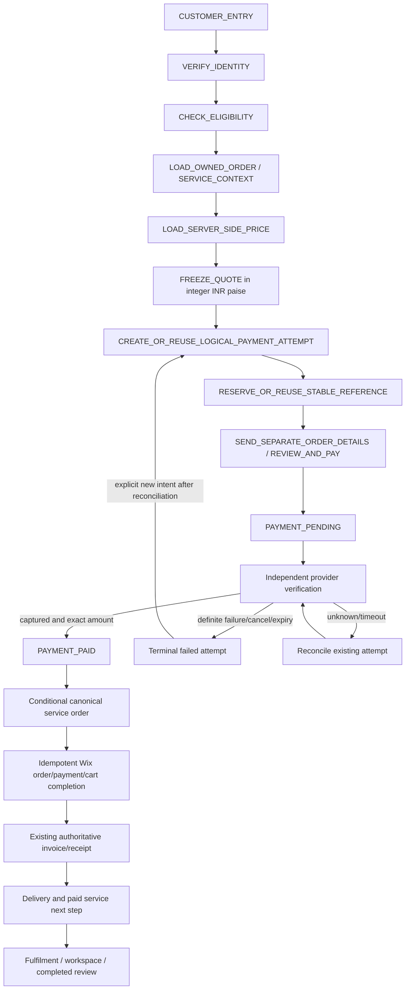

# WhatsApp payment state machine — 9 October 2026

Status: **PARTIALLY COMPLETE**. Existing source contracts are verified by tests; the complete native customer resume/action surface and an owner-paid end-to-end journey remain unverified. This artifact specifies both current primitives and required orchestration. Proposed labels such as reconciliation_required or INVOICE_SEND_FAILED must not be mistaken for already persisted enum values.

Current readback: Business API89, checkout41, secure-files34, service-requests5. Native-service/Wix writeback/dynamic Vault gates remain off. Payment check/list return200 with two active configurations on each WABA; retired raw diagnostics now return410. Payment inside a native Flow is not certified for this account. See xcodex-current-state.json for scoped proof.

## What happens when a customer starts a paid service from WhatsApp?

The current catalog service source supports Submit Request and Vault. Native release gates are closed. The safe sequence is:

An order-details message is a payment request, not proof of settlement or a final tax invoice. Payment is currently a separate message/provider step followed by a service Flow; account support for payment embedded in Flow is NOT VERIFIED.

## Authorities and invariants

- **Identity:** trusted sender/contact plus the existing permanent Cognito subject. No caller-selected phone, customer UUID or order number can authorize access.
- **Quote:** server-loaded Wix price, selected variant, currency, allowed quantity, taxes/fees and expiry frozen on the attempt/session. Integer paise; no browser price or floating-point sum is authoritative.
- **Attempt:** PaymentAttemptsTable, key paymentAttemptId; `customerId`, stable `referenceId`, configuration, amount and retry lineage. TTL stays disabled to preserve financial evidence. Actual enums: CREATED, PAYMENT_READINESS_CHECKED, PAYMENT_REQUEST_SENT, PAYMENT_PENDING, PAYMENT_PAID, PAYMENT_FAILED, PAYMENT_CANCELLED, PAYMENT_EXPIRED.
- **Order:** canonical singular OrderTable, permanent customer partition and separately reserved public order identity. Failed/unpaid attempts have no final paid order number. CommerceKeys conditional claims converge duplicate financial events.
- **Provider:** independently verified captured settlement, exact provider payment/order/reference/currency/amount. A browser success screen, Meta message acceptance or webhook payload alone cannot prove capture.
- **Paid precedence:** PAYMENT_PAID rank100 outranks failure/cancel/expiry; conditional rank writes reject a late backwards event. Financial success is immutable through downstream failure.
- **Service context:** persistent catalog/Flow session and service request/entitlement association. A/B/P/R are separate: original owned order A; new paid service order B; attempt/payment P; actual request R concerning A.
- **Delivery:** invoice delivery claim and persisted message result, separate from invoice identity and financial state. An accepted send differs from delivered/read. Unknown delivery must be reconciled before repeating a charge or side effect.

The source has these authority/idempotency primitives. A durable customer-facing projection covering every recovery state, the complete contextual service hub and paid-service selected-order resume UI remain required engineering. The current Orders draft includes owned selection/detail, profile and existing-invoice copy; it is not yet published or customer-certified.

## Start and pending states

| State | Authoritative database state | paymentAttemptId / reference | Order state | Customer-facing message | Allowed retry | New attempt allowed? | Idempotency key | Staff reconciliation |
|---|---|---|---|---|---|---|---|---|
| CUSTOMER_ENTRY / VERIFY_IDENTITY | Trusted identity; no financial row until permanent owner confirmed | None yet | No B | “Verify your account to continue” | Identity verification only | No | Inbound message ID / verified session | Required for legacy/ambiguous owner; never auto-transfer |
| CHECK_ELIGIBILITY / LOAD_CONTEXT | Owned A if selected; eligible service and current gates | None until eligible | A unchanged; no B | Service available or explicit secure fallback | Re-read state | No if closed/foreign/ineligible | Customer + service + logical intent | Gate/catalog/contract mismatch goes to staff |
| FREEZE_QUOTE / CREATED | Frozen server quote; attempt CREATED | One new P / reserved stable reference | No paid B | Show service/total before payment | Reuse unexpired quote/intent | Only first logical intent | Opaque service/session token + P | Required on quote/reference inconsistency |
| PAYMENT_READINESS_CHECKED | Provider/template/Flow readiness verified, enum readiness_checked | Same P / same reference | No paid B | “Ready to review and pay” | Recheck readiness without repricing existing intent | No | P + frozen quote version | Required if provider readiness contradicted |
| PAYMENT_REQUEST_SENT | P records sent result/message association | Same P / same reference | No paid B | “Review and pay” | Delivery retry subject to known send result/window | No | P + reference + payment-message operation | Unknown send requires provider/message reconciliation |
| PAYMENT_PENDING | P pending/in-flight | Same P / same reference | No final paid B | “Payment is pending. We are checking it.” | Provider status check/resume existing request | No | Provider payment/reference + P | On prolonged pending or conflicting readback |

## Outcomes, re-entry and provider events

| State | Authoritative database state | paymentAttemptId / reference | Order state | Customer-facing message | Allowed retry | New attempt allowed? | Idempotency key | Staff reconciliation |
|---|---|---|---|---|---|---|---|---|
| PAYMENT_SUCCEEDED | Provider-confirmed exact capture; P PAYMENT_PAID | Same P / same reference retained | Create/reuse B once; A unchanged | “Payment received; preparing your service” | Only downstream work | No | Provider payment + reference; order reservation | If captured amount/reference/customer mismatch, quarantine; do not fulfil |
| PAYMENT_FAILED | Definitive verified failure; P PAYMENT_FAILED, retain reason | Old P/reference retained; retry uses new P/reference + retryOf | No paid B | “Payment failed — no order created” | Explicit customer retry after reconciliation | Yes, one new logical retry | retryOf + new intent/attempt | Required if contradictory late capture appears |
| PAYMENT_CANCELLED | Definitive provider cancellation; P PAYMENT_CANCELLED | Preserve old P/reference; new lineage on retry | No paid B | “Payment cancelled — no order created” | Explicit retry | Yes after definitive provider result | retryOf + new intent | On ambiguous cancellation/capture |
| PAYMENT_EXPIRED | Verified unpaid expiry; P PAYMENT_EXPIRED | Old evidence retained; fresh quote/new P/reference on retry | No paid B | “Payment request expired” | Reload price and explicitly restart | Yes after confirming no capture | retryOf + new quote intent | If provider still pending/unknown, do not treat expired UI as final |
| PAYMENT_UNKNOWN | No definitive settlement; keep in-flight state and separate reconciliation reason | Same P/reference | No new paid B without proof | “We are checking your payment. Please do not pay again.” | Provider reconciliation | No | Existing P/provider reference | Yes after bounded checks/timeout; proposed persistent unknown projection pending |
| CUSTOMER_ABANDONED | Preserve existing attempt/session; abandonment does not prove failure | Same P/reference | No paid B unless capture verified later | On return, show saved current status | Resume or reconcile | No merely because customer left | Logical session + P | Only stale/ambiguous provider state |
| CUSTOMER_RETURNS_LATER | Re-read P, canonical order and service completion/entitlement | Same P/ref for in-flight/paid; new lineage only after definitive failure | Paid B reused; unfinished R resumes | “Resume payment”, “Checking payment”, or “Continue your paid service” | Appropriate current step | No for pending/paid; conditional for final failure | P/B/R + operation | Paid orphan/downstream failure to staff |
| CUSTOMER_TAPS_PAY_TWICE | Conditional same logical intent returns existing P | Same P / same reference | No duplicate B | Return the existing payment request/status | Resume existing attempt | No | Session/cart intent + P | Only if competing references already exist |
| PAYMENT_MESSAGE_RESENT | Delivery operation separate from settlement | Same P / same reference | Unchanged | Existing request/status, not another charge | Retry definite delivery failure under messaging contract | No | P + reference + delivery operation | Required for unknown delivery or stale claim |
| PROVIDER_WEBHOOK_DUPLICATED | Verify signature/readback; monotonic/conditional claims deduplicate | Same P/ref/provider payment | Same B | No repeated financial/invoice/service side effects | Re-enter idempotent finalization only | No | Provider event/payment identity + financial reservation | Alert on mismatched duplicate facts |
| PROVIDER_WEBHOOK_DELAYED | Read current P; capture may outrank earlier local failed/expired state | Same P/ref; do not discard old evidence | Reconcile/create same B once captured | Latest verified status; paid dominates failure | Reconcile downstream | No if old payment captured | Provider payment/reference + P | Mandatory if a later retry also captured; never auto-refund |
| PROVIDER_TIMEOUT | Timeout is uncertainty, not proof of decline | Same P/ref | No new B without verified capture | “Payment status is being checked” | Bounded provider checks/backoff | No | Existing P/provider read operation | Required after bounded retries; manual verification before new charge |

## Captured payment followed by failed work

In every row below, **P remains PAYMENT_PAID; the attempt/reference/provider payment are unchanged; a new payment attempt is forbidden**. The recovery projection must carry the failed stage and retry lineage. Staff/operator tooling must show “paid, reconciliation required” rather than “payment failed.”

| State | Authoritative database state | paymentAttemptId / reference | Order state | Customer-facing message | Allowed retry | New attempt allowed? | Idempotency key | Staff reconciliation |
|---|---|---|---|---|---|---|---|---|
| PAYMENT_SUCCEEDED_BUT_ORDER_FAILED | P paid + financial reservation/finalization failure | Same P/ref | B absent/incomplete; never mint another public number to evade claim | “Payment received; order confirmation is being completed” | Resume conditional canonical finalization | No | Verified payment/reference + reserved order identity | Required until one canonical B exists |
| PAYMENT_SUCCEEDED_BUT_WIX_FAILED | P paid + canonical B + failed/missing Wix completion fields | Same P/ref | B paid; Wix external order/payment/cart incomplete | “Payment received; processing your order” | Resume idempotent Wix external-order/payment/cart stages | No | B + provider payment + Wix completion operation | Required on unknown external result; read back before repeat |
| PAYMENT_SUCCEEDED_BUT_INVOICE_FAILED | P/B paid + missing/failed invoice generation | Same P/ref | B retained, no replacement service order | “Payment received; invoice is being prepared” | Resolve deterministic existing invoice/claim; render same financial identity | No | Reference + provider payment / invoice ID | Required for missing accounting identity or stale financial claim |
| PAYMENT_SUCCEEDED_BUT_INVOICE_SEND_FAILED | P/B/invoice retained + definite delivery failure | Same P/ref | B unchanged | “Payment received; your invoice is available in Orders” | Resend existing invoice with delivery operation; secure web fallback | No | Existing invoice ID + channel + resend request | Unknown/stale CLAIMED state must be reconciled; accepted ≠ delivered |
| PAYMENT_SUCCEEDED_BUT_FLOW_INVITE_FAILED | P/B paid + pending paid-service invitation/session | Same P/ref | B paid; R details pending | “Your service is paid. Continue without paying again.” | Invite/reopen same authorized paid session | No | B + paid session + invitation operation | Required if identity/window/token cannot be established |
| PAYMENT_SUCCEEDED_BUT_FULFILMENT_FAILED | P/B paid + failed R/service/file-entitlement stage | Same P/ref | B retained; service incomplete | “Your paid service needs attention; support is reviewing it” | Resume R or owned entitlement fulfilment | No | B/R/file + fulfilment operation | Required until corrected; no unauthorized refund/charge |

## Invoice resend and paid resume acceptance tests

Get Invoice must select the authoritative existing financial invoice and asset. Rendering a missing asset for that same invoice is permitted through the authorized engine; creating a second invoice or advancing a new GST number is not. Native existing-invoice copy is implemented: resolve the selected owned canonical order and authoritative existing invoice/private asset, use the server-derived verified recipient and approved IMAGE template, and conditionally claim one copy per customer/order/UTC day. Delivery on a real handset remains unverified. Do not assume every indefinite send can be retried automatically. Keep payment state independent.

Paid Submit Request resumes the same paid B/session and completes R about A without charging again. Paid Vault access verifies the permanent owner, active file and grant/revocation; it does not convert a failed entitlement write into another payment. Completed review suppresses another automatic invitation.

Release tests must simulate double taps, delivery retries, delayed/duplicated provider events, pending/unknown/cancel/expiry, exact amount mismatch, same-phone/new-sub, foreign A/B/R/file, late capture after a new retry, every downstream failure and owner-visible paid recovery. Current primitive tests and exact ZIP tests do not certify that every projected state is already implemented or rendered in WhatsApp.

## Latest Vault implementation boundary

Owner now requires repeated same-catalog access to the existing paid file when a temporary URL expires or download fails. This is NOT IMPLEMENTED: current consumed grant permits one redemption, paid re-entry directs to support, and catalog selection excludes paid files. Separate durable paid entitlement from short-lived sessions; preserve no-second-charge and permanent-owner checks. Approved template points to authenticated Vault/?file=<fileId>, which must resolve a fresh private S3 URL. Read vault-payment-download-implementation.md and xcodex-new-session-full-prompt.md for V1–V9 and exact acceptance tests. Link expiry does not revoke the payment or a saved PDF.

## ChatGPT Vault V1/V2 production update — 2026-10-09 11:04 UTC

Status: **PARTIALLY COMPLETE** — Vault V1/V2 engineering is deployed; real owner/customer payment and recovery QA is still required before customer-facing gates may open.

- Source checkpoint before handoff docs: `3b9faffd3686c0c5be51a8f046592a8c4680087c`.
- Implemented durable non-TTL `VAULT_ENTITLEMENT` records, separate TTL `VAULT_DOWNLOAD_SESSION` records, lazy migration of historical paid/consumed grants, website **Download / Refresh Access**, and native paid-file refresh routing.
- Transport expiry/interruption no longer consumes the financial purchase; every refresh rechecks permanent customer identity, file ownership/status and active entitlement.
- Verified-payment finalization now creates/links entitlement once. Duplicate webhook/idempotency behavior remains pinned by tests.
- Vault review invitation moved from payment/notification time to the first authenticated download-session milestone and uses persisted `vaultReviewStatus` duplicate suppression.
- Production deploy: `wecare-secure-files` **v35**, SHA `TsxFbPJSg+w+LQ6FOKJfvb/HP5j6x0Ldx/4Fk5e9yF0=`, rollback **v34**; `wecare-whatsapp-business-api` **v92**, SHA `vdj3fItIrPi3Hb3x4PthvTDpyC01yDVG88cwtx+pFfQ=`, rollback **v91**. Both `live` aliases match `$LATEST`, State Active, LastUpdateStatus Successful.
- Release controls remain closed: `SECURE_FILES_PAYMENT_ENABLED=false`; `VAULT_DYNAMIC_DOWNLOAD_TEMPLATE_ENABLED`, `WHATSAPP_CATALOG_SERVICES_ENABLED`, `WIX_WRITEBACK_ENABLED`, `WIX_ECOM_WRITE_CONFIRMED` unset.
- Tests: full Python **10,376 passed / 7 skipped / 3 xfailed**; focused Vault deploy suite **124 passed**; frontend **126 files / 1,607 passed / 2 skipped**; production build and typecheck PASS; lint **0 errors / 191 warnings**. The known Contact map check remains report-only at 12/13.
- Fresh live provider readback after deploy: Submit Flow `1107164111921876` PUBLISHED; templates `wecarepay_wa` `1783774039408860`, `wecare_default_download` `1410998911012572`, and `wecare_leave_review` `1801972550682516` all APPROVED. Download URL contract remains `https://wecare.digital/vault/?file={{1}}` with authoritative `fileId`.
- Fresh Wix V3 readback: product `df976a0a-f582-4535-b2e1-d532f348bd27` revision 5; Submit ₹99 `e9f0...`, Amendment ₹99 `864f...`, Drop Docs ₹350 `db166...`, Vault ₹49 `dcff...`, all visible/in stock.
- No real customer message or payment was sent in this implementation session. Owner QA must prove ₹49 settlement → canonical order/Wix where enabled → entitlement → authenticated download → expiry/interruption → refresh with **no second charge** before opening customer-facing release gates.

## ChatGPT Orders/catalog production update — 2026-10-09 12:50 UTC

Status remains **PARTIALLY COMPLETE**. Vault V1/V2 remains deployed and closed for owner QA; this phase deployed the next backend-only increments without opening customer-facing gates.

- Current reconciled source checkpoint before this documentation update: `8109471f74e09dcef4958d34343f9ca923ac740a`.
- Orders/customer profile: backend-owned contextual actions and owner-scoped support handling are now deployed in `wecare-whatsapp-business-api:live` **v93**, SHA `erEMzmiJg7rNjwU1iTb+vR1aEQ4FDTjqfAfSW5lujAQ=`; rollback **v92**.
- Meta catalog sync: exact approved-plan hash interlock is deployed in `wecare-meta-catalog-sync:live` **v8**, SHA `he0Y8MPVNwBY4r2dZnD5cEEvIfkwVHsd6j+kUex4fNQ=`; rollback **v7**. Runtime remains fail-closed: `META_CATALOG_SYNC_ENABLED=false`, `META_CATALOG_SYNC_DRY_RUN=true`, `META_CATALOG_SYNC_FORCE_OUT_OF_STOCK=true`, approval hash unset.
- Fresh Meta readback through live Business API: Submit Flow `1107164111921876` PUBLISHED with validation_errors=[]; `wecarepay_wa` `1783774039408860`, `wecare_default_download` `1410998911012572`, and `wecare_leave_review` `1801972550682516` remain APPROVED. Orders `2167802357142172`, Amendment `3678132465672138`, Drop Docs `1211063631104445`, Shipments `849713848195607` remain DRAFT with validation_errors=[].
- Fresh Wix Catalog V3 readback: product `df976a0a-f582-4535-b2e1-d532f348bd27` revision 5, visible/in stock. Exact variants/prices confirmed: Submit ₹99 `e9f0eb8b-ca76-4b4f-b00c-be909c02bb2b`; Amendment ₹99 `864fc9a7-c326-4b4d-b0e5-6dc0ea5b764b`; Drop Docs ₹350 `db166bc8-a763-41ec-9f65-0f718f18155a`; Vault ₹49 `dcff995e-448c-493a-9259-f6a82ccdc2b4`.
- Deployment was preceded by focused regression tests in the one-shot workflow; the deployment completed SUCCESS. Temporary workflow and exact-scope OIDC role were deleted afterward.
- Customer release remains closed. No real customer payment, send, Flow publication, Meta catalog item write, Wix order writeback, or synthetic Purchase event was performed.

## ChatGPT durable catalog approval control — 2026-10-09 13:05 UTC

Status remains **PARTIALLY COMPLETE**. This phase completed the catalog proposal/approval control plane without opening catalog sales or writing a Meta item.

- Business API production: **v94**, SHA `iqljVpqYVcJAXbuMs83Efd2aDQAW4EAAgGhQ4eAiJeY=`; rollback v93.
- Meta catalog sync production: **v9**, SHA `cdjjFw5B2v9f8kT0nAUXeBlMXInYo+eh8FNgUrW+BgM=`; rollback v8.
- New authenticated Workspace routes: `GET /wa-business/catalog-sync` (route `ktbob4d`) and `POST /wa-business/catalog-sync` (route `aqr2wkn`), both reusing the existing Business API live integration. Application auth revalidates Cognito Admin and configured Admin MFA; anonymous smoke returned HTTP 401.
- Durable exact-plan records use existing `stack-wecare-digital-AgentApprovalsTable` with namespaced key `META_CATALOG_SYNC#<sha256>`. Catalog rows omit `expiresTtl`; the Lambda role has only GetItem/PutItem/UpdateItem on that table. Scan/Delete remain denied.
- Background schedule/webhook executions cannot spend an approval. Apply requires an explicit Admin action, exact current plan, durable APPROVED state, enabled=true and dryRun=false.
- Live read-only plan: hash `19b8290495af210b94d819d2bdd3640805bd770fa640d6bb46cda46ae31064d5`; create=4, update=0, retire=0, foreign=0, blockers=[]; all desired items held out of stock.
- Release controls remain closed: enabled=false, dryRun=true, force-out-of-stock=true. Approval table item count remained 0 after smoke tests. No proposal, approval, Meta item write, Wix write, payment, customer send or synthetic event was performed.
- Focused backend security tests, TypeScript and focused Workspace tests passed before deployment. The one-shot deploy workflow and temporary OIDC role were deleted after successful verification.
